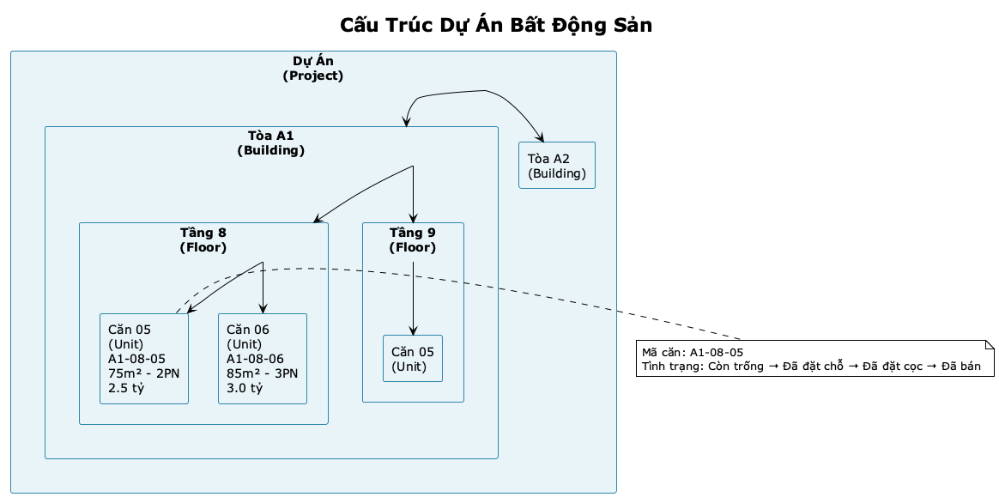

# EXECUTIVE SUMMARY
## Hệ thống Quản lý Bán Căn Hộ Dự Án

**Dự án:** Winland - Real Estate Management System  
**Phiên bản:** 3.0  
**Ngày:** January 2025  
**Đối tượng:** Khách hàng / Stakeholders

---

## 1. TỔNG QUAN DỰ ÁN

### 1.1 Giới thiệu

**Winland** là hệ thống quản lý và bán căn hộ dự án chuyên nghiệp, được thiết kế để hỗ trợ:

- **Chủ đầu tư** quản lý dự án bất động sản với hàng trăm đến hàng ngàn căn hộ
- **Đội ngũ CTV (Cộng tác viên)** bán hàng với quy trình minh bạch và tự động
- **Quản lý tập trung** tất cả giao dịch, thanh toán, và hoa hồng trong một nền tảng duy nhất

### 1.2 Bối cảnh và Vấn đề

**Thách thức hiện tại:**
- ❌ Quản lý thủ công bằng Excel → Dễ sai sót, chậm trễ
- ❌ Nhiều CTV cùng bán một căn → Xung đột, mất niềm tin
- ❌ Không theo dõi được tiến độ thanh toán → Khó quản lý dòng tiền
- ❌ Tính hoa hồng thủ công → Không minh bạch, dễ nhầm lẫn
- ❌ Thiếu báo cáo real-time → Khó ra quyết định

**Giải pháp:**
- ✅ Hệ thống tự động hóa toàn bộ quy trình từ giữ chỗ đến bán
- ✅ Lock căn hộ thông minh → Không xung đột
- ✅ Tracking thanh toán real-time với lịch trả góp tự động
- ✅ Tính hoa hồng tự động → Minh bạch, công bằng
- ✅ Dashboard và báo cáo đầy đủ → Ra quyết định nhanh chóng

---

## 2. GIÁ TRỊ MANG LẠI

### 2.1 Hiệu quả Hoạt động

| Trước | Sau |
|-------|-----|
| Quản lý Excel thủ công | Tự động hóa 100% |
| Xung đột căn hộ | Lock thông minh, không conflict |
| Tính hoa hồng thủ công | Tự động, minh bạch |
| Báo cáo hàng tuần | Real-time dashboard |
| Xử lý 50 căn/ngày | Xử lý 500+ căn/ngày |

### 2.2 Lợi ích Kinh doanh

**Cho Chủ đầu tư:**
- 📈 **Tăng tốc độ bán:** Quy trình nhanh, CTV tự phục vụ
- 💰 **Quản lý dòng tiền:** Tracking thanh toán chi tiết, lịch trả góp rõ ràng
- 📊 **Ra quyết định:** Báo cáo real-time, phân tích xu hướng
- 🎯 **Kiểm soát tốt:** Theo dõi từng căn, từng CTV, từng giao dịch

**Cho CTV:**
- 🚀 **Làm việc nhanh:** Tự tạo phiếu, upload chứng từ, không cần chờ
- 💵 **Hoa hồng minh bạch:** Xem chi tiết, yêu cầu rút tiền online
- 📱 **Tiện lợi:** Làm việc trên mobile, nhận thông báo real-time
- 📈 **Theo dõi hiệu suất:** Xem số deals, commission, ranking

---

## 3. HỆ THỐNG

### 3.1 Kiến trúc

*Hình 4: Tổng quan kiến trúc hệ thống - 3 trang quản lý, backend API, và cơ sở dữ liệu.*

**3 Portals chính:**

1. **Admin Portal** (Trang quản trị)
   - Quản lý dự án, căn hộ, người dùng
   - Duyệt các phiếu đặt chỗ, đặt cọc, yêu cầu rút hoa hồng
   - Xác nhận giao dịch thanh toán
   - Xem báo cáo và phân tích

2. **CTV Portal** (Trang cộng tác viên)
   - Xem dự án và căn hộ còn trống
   - Tạo phiếu: Giữ chỗ → Đặt chỗ → Đặt cọc
   - Tải lên chứng từ thanh toán
   - Xem hoa hồng và yêu cầu rút tiền

3. **Client Website** (Trang công khai)
   - Trang web công khai cho khách hàng
   - Xem thông tin dự án
   - Liên hệ tư vấn

### 3.2 Công nghệ

**Hệ thống Backend (Máy chủ xử lý):**
- Nền tảng NestJS (Node.js) - Xử lý nghiệp vụ
- Cơ sở dữ liệu PostgreSQL - Lưu trữ thông tin
- Công cụ Prisma - Kết nối và quản lý dữ liệu
- Xác thực bằng mã JWT - Bảo mật đăng nhập
- Giao diện API chuẩn RESTful - Kết nối các thành phần

**Hệ thống Frontend (Giao diện người dùng):**
- React 18 + Vite cho Trang Admin - Công nghệ giao diện hiện đại
- Next.js 14 cho Trang CTV và Trang công khai - Tối ưu hiệu suất
- Tailwind CSS - Thiết kế giao diện đẹp
- Responsive design - Tự động điều chỉnh trên điện thoại, máy tính bảng, máy tính

**Tính năng nổi bật:**
- Thông báo tức thì (real-time)
- Tạo file PDF tự động cho các phiếu
- Mã QR Code động cho từng giao dịch thanh toán
- Khôi phục dữ liệu (không xóa dữ liệu thật, chỉ đánh dấu)
- Lưu trữ lịch sử mọi thay đổi để kiểm tra khi cần

---

## 4. QUY TRÌNH NGHIỆP VỤ CHÍNH

### 4.1 Flow Từ Giữ Chỗ Đến Bán

*Hình 1: Quy trình từ giữ chỗ đến bán - Nhiều CTV có thể giữ chỗ cùng 1 căn, xếp hàng theo thứ tự ưu tiên khi dự án mở bán.*

### 4.2 3 Loại Phiếu

| Loại | Ràng buộc | Thanh toán | Duyệt | Đặc điểm |
|------|-----------|------------|-------|----------|
| **Giữ chỗ** | Thấp | Không | Không | Nhiều CTV cùng giữ 1 căn |
| **Booking** | Trung | 10 triệu | Có | Độc quyền 1 CTV |
| **Cọc** | Cao | 5%+ giá căn | Có | Độc quyền 1 CTV |

---

## 5. CẤU TRÚC DỮ LIỆU

### 5.1 Cấu trúc Dự án

*Hình 2: Cấu trúc phân cấp dự án - Dự án bao gồm nhiều tòa nhà, mỗi tòa có nhiều tầng, mỗi tầng có nhiều căn hộ.*

### 5.2 Modules Chính

1. **Quản lý Dự án & Căn hộ**
   - Quản lý dự án, tòa, tầng, căn hộ
   - Nhập hàng loạt từ file Excel
   - Theo dõi tình trạng tự động

2. **Giữ chỗ (Reservations)**
   - Hệ thống xếp hàng thông minh
   - Tự động hết hạn và gửi thông báo

3. **Đặt chỗ (Bookings)**
   - Tạo phiếu đặt chỗ từ giữ chỗ hoặc trực tiếp
   - Quy trình duyệt của Admin

4. **Đặt cọc (Deposits)**
   - Lịch trả góp tự động (4 đợt)
   - Theo dõi thanh toán từng đợt

5. **Giao dịch Thanh toán**
   - Ghi nhận thanh toán của khách hàng
   - Tải lên chứng từ
   - Xác nhận bởi Admin

6. **Hoa hồng (Commissions)**
   - Tự động tính khi căn hộ đã bán
   - Hỗ trợ tính theo giá thực tế hoặc giá niêm yết
   - Quy trình yêu cầu rút hoa hồng

7. **Yêu cầu Rút Hoa hồng**
   - CTV yêu cầu rút hoa hồng
   - Admin duyệt và thực hiện thanh toán

8. **Thông báo**
   - Thông báo tức thì (real-time)
   - Tích hợp Email/SMS (tùy chọn)

---

## 6. PHÂN QUYỀN NGƯỜI DÙNG

*Hình 3: Phân quyền người dùng - Super Admin có quyền tối cao, Admin quản lý vận hành, CTV bán hàng và chỉ xem thông tin của mình.*

### 6.1 SUPER_ADMIN (Quản trị viên tối cao)
- Quản lý toàn bộ hệ thống
- Cấu hình các thông số hệ thống
- Quản lý người dùng (Admin, CTV)
- Xem tất cả báo cáo và nhật ký hoạt động

### 6.2 ADMIN (Người quản lý)
- Quản lý dự án và căn hộ
- Duyệt các phiếu đặt chỗ, đặt cọc, yêu cầu rút hoa hồng
- Xác nhận giao dịch thanh toán
- Xem báo cáo và phân tích
- Quản lý CTV (kích hoạt/vô hiệu hóa tài khoản)

### 6.3 CTV (Cộng tác viên)
- Xem dự án và căn hộ còn trống
- Tạo phiếu: Giữ chỗ, Đặt chỗ, Đặt cọc
- Tải lên chứng từ thanh toán
- Xem hoa hồng của mình
- Yêu cầu rút hoa hồng
- Chỉ xem và thao tác trên thông tin của mình

### 6.4 USER/GUEST (Người dùng/Khách)
- Xem thông tin dự án công khai
- Liên hệ tư vấn

---

## 7. TÍNH NĂNG NỔI BẬT

### 7.1 Cơ chế Khóa Căn Thông minh
- Tự động khóa căn hộ khi có phiếu đặt chỗ hoặc đặt cọc
- Hệ thống xếp hàng cho các phiếu giữ chỗ
- Tránh xung đột khi nhiều CTV cùng thao tác trên một căn

### 7.2 Tính Hoa hồng Tự động
- Tự động tính hoa hồng khi căn hộ đã bán
- Hỗ trợ tính theo giá thực tế (sau chiết khấu) hoặc giá niêm yết
- Ưu tiên tỷ lệ hoa hồng: Tỷ lệ căn > Tỷ lệ dự án > Mặc định (2%)
- Có thể tính lại khi giá căn thay đổi

### 7.3 Quản lý Lịch Trả góp
- Tự động tạo 4 đợt thanh toán khi duyệt phiếu đặt cọc
- Mẫu lịch trả góp có thể tùy chỉnh
- Theo dõi từng đợt thanh toán
- Tự động cập nhật tình trạng phiếu cọc khi khách hàng thanh toán đủ tiền

### 7.4 Thông báo Ngay lập tức
- Thông báo ngay khi có phiếu đặt chỗ/đặt cọc mới (cho Admin)
- Thông báo khi giao dịch thanh toán được xác nhận (cho CTV)
- Thông báo khi có hoa hồng mới được tạo (cho CTV)
- Thông báo khi yêu cầu rút hoa hồng được duyệt hoặc từ chối (cho CTV)

### 7.5 Lưu trữ Lịch sử Thay đổi
- Ghi lại tất cả thay đổi quan trọng trong hệ thống (ai làm gì, khi nào)
- Theo dõi người thực hiện, hành động, thời điểm thực hiện
- Lưu trữ thông tin truy cập (địa chỉ IP, thiết bị sử dụng)
- Hỗ trợ kiểm tra và đối soát, tuân thủ các quy định về lưu trữ dữ liệu

---

## 8. BẢO MẬT

- 🔐 **Xác thực Bảo mật:** Mỗi người dùng có mã xác thực riêng khi đăng nhập, đảm bảo an toàn
- 🔒 **Phân quyền Chi tiết:** Mỗi vai trò (CTV, Admin, Super Admin) có quyền hạn khác nhau, kiểm soát chặt chẽ
- 🛡️ **Khôi phục Dữ liệu:** Khi xóa thông tin, hệ thống không xóa thật mà chỉ đánh dấu, có thể khôi phục lại nếu cần
- 📝 **Lưu trữ Lịch sử:** Ghi lại đầy đủ ai đã làm gì, khi nào, thay đổi từ gì sang gì, để kiểm tra và đối soát
- 🔑 **Mã hóa Mật khẩu:** Mật khẩu được mã hóa an toàn, không ai có thể đọc được kể cả quản trị viên
- ⏰ **Xác minh OTP:** Xác minh danh tính qua tin nhắn SMS (mã 6 số) khi CTV đăng ký hoặc đăng nhập

---

## 9. HỖ TRỢ VÀ BẢO HÀNH

### 9.1 Triển khai Hệ thống
- Hệ thống có thể được cài đặt và chạy trên:
  - Máy chủ đám mây (AWS, Azure, GCP) - Khuyến nghị
  - Máy chủ tại công ty (On-premise)
  - Máy chủ ảo (VPS/VDS)

### 9.2 Sao lưu & Khôi phục
- Tự động sao lưu dữ liệu hàng ngày để đảm bảo an toàn
- Có thể khôi phục dữ liệu về một thời điểm bất kỳ trong quá khứ
- Có kế hoạch khôi phục nhanh chóng nếu có sự cố

### 9.3 Hỗ trợ
- Tài liệu kỹ thuật đầy đủ cho đội ngũ IT
- Tài liệu hướng dẫn sử dụng cho người dùng cuối
- Tài liệu hướng dẫn đào tạo
- Hỗ trợ kỹ thuật khi cần

---

## 10. ROADMAP

### Phase 1: Tính năng Cốt lõi (Hoàn thành)
- ✅ Xác thực và phân quyền người dùng
- ✅ Quản lý dự án và căn hộ
- ✅ Giữ chỗ, đặt chỗ, đặt cọc
- ✅ Giao dịch thanh toán
- ✅ Hoa hồng và yêu cầu rút tiền
- ✅ Hệ thống thông báo
- ✅ Trang tổng quan và báo cáo

### Phase 2: Tính năng Mở rộng (Tương lai)
- 📱 Ứng dụng điện thoại (iOS/Android)
- 💬 Tích hợp chat/hỗ trợ trực tuyến
- 📧 Thông báo qua Email/SMS
- 🔔 Thông báo đẩy trên điện thoại
- 📊 Phân tích nâng cao và báo cáo chi tiết
- 🤖 Gợi ý thông minh bằng AI

---

## 11. LIÊN HỆ

**Technical Support:**
- Email: support@winland.com
- Phone: 1900-xxxx

**Business Inquiries:**
- Email: business@winland.com
- Phone: 1900-yyyy

---

**Document Version:** 1.0  
**Last Updated:** January 2025
