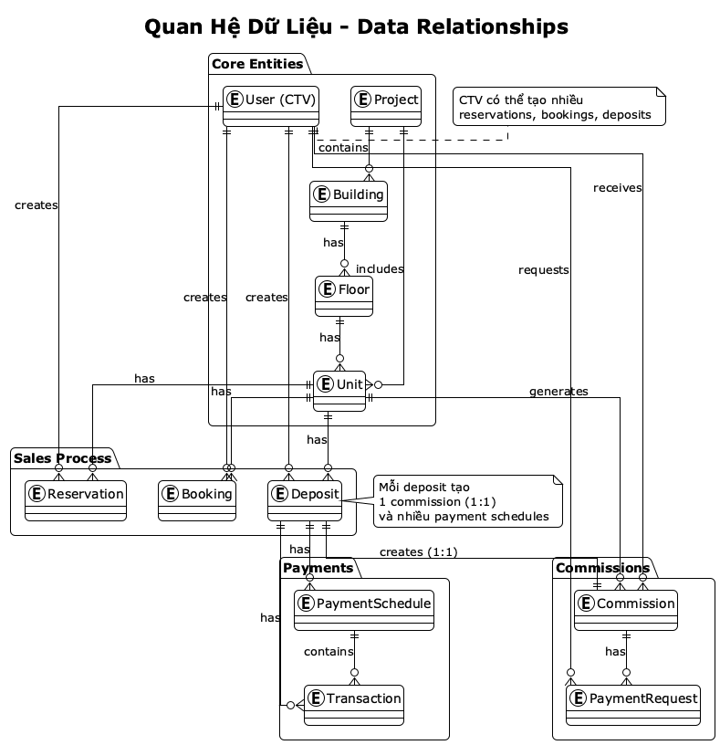

# DATA DICTIONARY
## Hệ thống Quản lý Bán Căn Hộ Dự Án - Winland

**Document ID:** DD-WINLAND-001  
**Version:** 1.0  
**Date:** January 2025

---

## TABLE OF CONTENTS

1. [Overview](#1-overview)
2. [Core Entities](#2-core-entities)
3. [User & Authentication](#3-user--authentication)
4. [Projects & Units](#4-projects--units)
5. [Sales Process](#5-sales-process)
6. [Payments & Commissions](#6-payments--commissions)
7. [System Configuration](#7-system-configuration)

---

## 1. OVERVIEW

Data Dictionary này mô tả chi tiết tất cả các entities, fields, và relationships trong hệ thống Winland.

**Conventions:**
- **PK** = Primary Key
- **FK** = Foreign Key
- **UQ** = Unique
- **REQ** = Required (NOT NULL)
- **OPT** = Optional (NULL allowed)

---

## 2. CORE ENTITIES

### 2.1 User (users)

**Mô tả:** Người dùng hệ thống (Admin, CTV, Super Admin)

| Field | Type | Constraints | Description | Example |
|-------|------|-------------|-------------|---------|
| id | UUID | PK | User ID | `550e8400-e29b-41d4-a716-446655440000` |
| phone | String(20) | UQ, OPT | Số điện thoại (CTV) | `0912345678` |
| email | String(255) | UQ, OPT | Email (Admin) | `admin@winland.com` |
| password | String(255) | REQ | Password (hashed) | `$2b$10$...` |
| fullName | String(100) | REQ | Họ tên đầy đủ | `Nguyễn Văn A` |
| avatar | String(500) | OPT | URL avatar | `https://...` |
| role | Enum | REQ, Default: CTV | Vai trò | `CTV`, `ADMIN`, `SUPER_ADMIN`, `USER` |
| isActive | Boolean | REQ, Default: true | Trạng thái active | `true` |
| totalDeals | Integer | REQ, Default: 0 | Tổng số deals đã làm (CTV) | `25` |
| deletedAt | DateTime | OPT | Soft delete timestamp | `2025-01-15 10:30:00` |
| createdAt | DateTime | REQ | Ngày tạo | `2025-01-01 08:00:00` |
| updatedAt | DateTime | REQ | Ngày cập nhật | `2025-01-15 10:30:00` |

**Relationships:**
- `bookings` → Booking[] (CTV tạo bookings)
- `deposits` → Deposit[] (CTV tạo deposits)
- `reservations` → Reservation[] (CTV tạo reservations)
- `commissions` → Commission[] (CTV nhận commissions)
- `paymentRequests` → PaymentRequest[] (CTV tạo payment requests)

**Business Rules:**
- CTV: Sử dụng phone để login
- Admin: Sử dụng email để login
- Soft delete: Không xóa dữ liệu, chỉ đánh dấu deletedAt

---

### 2.2 Project (projects)

**Mô tả:** Dự án bất động sản

| Field | Type | Constraints | Description | Example |
|-------|------|-------------|-------------|---------|
| id | UUID | PK | Project ID | `...` |
| name | String(255) | REQ | Tên dự án | `Vinhomes Grand Park` |
| code | String(50) | UQ, REQ | Mã dự án | `VGP` |
| status | Enum | REQ, Default: UPCOMING | Trạng thái | `UPCOMING`, `OPEN`, `CLOSED` |
| developer | String(255) | REQ | Chủ đầu tư | `Vinhomes` |
| location | String(255) | REQ | Vị trí | `Quận 9, TP.HCM` |
| address | String(500) | REQ | Địa chỉ chi tiết | `123 Đường ABC` |
| district | String(100) | REQ | Quận/Huyện | `Quận 9` |
| city | String(100) | REQ | Thành phố | `TP.HCM` |
| latitude | Float | OPT | Vĩ độ | `10.8418` |
| longitude | Float | OPT | Kinh độ | `106.8097` |
| totalArea | Float | OPT | Tổng diện tích (m²) | `50000` |
| totalBuildings | Integer | OPT | Số tòa | `5` |
| totalUnits | Integer | OPT | Tổng số căn | `500` |
| priceFrom | Float | OPT | Giá từ (VNĐ) | `2000000000` |
| priceTo | Float | OPT | Giá đến (VNĐ) | `5000000000` |
| description | Text | OPT | Mô tả | `Dự án cao cấp...` |
| amenities | Text | OPT | Tiện ích (JSON) | `["Hồ bơi", "Gym"]` |
| images | Text | OPT | Hình ảnh (JSON array) | `["url1", "url2"]` |
| masterPlan | String(500) | OPT | Sơ đồ tổng thể (URL) | `https://...` |
| floorPlan | String(500) | OPT | Sơ đồ tầng (URL) | `https://...` |
| openDate | DateTime | OPT | Ngày mở bán | `2025-03-01 08:00:00` |
| commissionRate | Float | REQ, Default: 2.0 | Tỷ lệ hoa hồng mặc định (%) | `2.5` |
| createdBy | UUID | REQ, FK → User | Người tạo | `...` |
| deletedAt | DateTime | OPT | Soft delete | - |
| createdAt | DateTime | REQ | Ngày tạo | - |
| updatedAt | DateTime | REQ | Ngày cập nhật | - |

**Relationships:**
- `creator` → User (Admin tạo project)
- `buildings` → Building[] (Các tòa trong dự án)
- `units` → Unit[] (Các căn trong dự án)

**Business Rules:**
- Status flow: `UPCOMING → OPEN → CLOSED`
- Code phải unique
- Commission rate được dùng làm default cho units (nếu unit không có rate riêng)

---

### 2.3 Building (buildings)

**Mô tả:** Tòa/Block trong dự án

| Field | Type | Constraints | Description | Example |
|-------|------|-------------|-------------|---------|
| id | UUID | PK | Building ID | - |
| projectId | UUID | REQ, FK → Project | Dự án | - |
| code | String(50) | REQ | Mã tòa | `A1`, `B2` |
| name | String(255) | REQ | Tên tòa | `Tòa A1` |
| floors | Integer | REQ | Số tầng | `20` |
| description | Text | OPT | Mô tả | - |
| deletedAt | DateTime | OPT | Soft delete | - |
| createdAt | DateTime | REQ | Ngày tạo | - |
| updatedAt | DateTime | REQ | Ngày cập nhật | - |

**Relationships:**
- `project` → Project
- `floorsData` → Floor[] (Các tầng)
- `units` → Unit[] (Các căn)

**Business Rules:**
- Code phải unique trong project (có thể trùng giữa các project)
- Unique constraint: (projectId, code)

---

### 2.4 Floor (floors)

**Mô tả:** Tầng trong tòa

| Field | Type | Constraints | Description | Example |
|-------|------|-------------|-------------|---------|
| id | UUID | PK | Floor ID | - |
| buildingId | UUID | REQ, FK → Building | Tòa | - |
| number | Integer | REQ | Số tầng | `8` |
| deletedAt | DateTime | OPT | Soft delete | - |
| createdAt | DateTime | REQ | Ngày tạo | - |
| updatedAt | DateTime | REQ | Ngày cập nhật | - |

**Relationships:**
- `building` → Building
- `units` → Unit[]

**Business Rules:**
- Number phải unique trong building
- Unique constraint: (buildingId, number)

---

### 2.5 Unit (units)

**Mô tả:** Căn hộ

| Field | Type | Constraints | Description | Example |
|-------|------|-------------|-------------|---------|
| id | UUID | PK | Unit ID | - |
| projectId | UUID | REQ, FK → Project | Dự án | - |
| buildingId | UUID | REQ, FK → Building | Tòa | - |
| floorId | UUID | REQ, FK → Floor | Tầng | - |
| code | String(50) | UQ, REQ | Mã căn | `A1-08-05` |
| unitNumber | String(20) | REQ | Số căn | `05` |
| unitTypeId | UUID | OPT, FK → UnitType | Loại căn | - |
| status | Enum | REQ, Default: AVAILABLE | Trạng thái | `AVAILABLE`, `RESERVED_BOOKING`, `DEPOSITED`, `SOLD` |
| price | Float | REQ | Giá bán (VNĐ) | `2500000000` |
| area | Float | REQ | Diện tích (m²) | `75.5` |
| bedrooms | Integer | OPT | Số phòng ngủ | `2` |
| bathrooms | Integer | OPT | Số phòng tắm | `2` |
| direction | String(50) | OPT | Hướng | `Đông Nam` |
| balcony | Boolean | REQ, Default: false | Có ban công | `true` |
| view | String(100) | OPT | View | `Sông` |
| description | Text | OPT | Mô tả | - |
| floorPlanImage | String(500) | OPT | Sơ đồ căn | `https://...` |
| images | Text | OPT | Hình ảnh (JSON array) | - |
| commissionRate | Float | OPT | Tỷ lệ hoa hồng (%) | `2.5` |
| soldAt | DateTime | OPT | Ngày bán | - |
| deletedAt | DateTime | OPT | Soft delete | - |
| createdAt | DateTime | REQ | Ngày tạo | - |
| updatedAt | DateTime | REQ | Ngày cập nhật | - |

**Relationships:**
- `project` → Project
- `building` → Building
- `floor` → Floor
- `unitType` → UnitType
- `bookings` → Booking[]
- `deposits` → Deposit[]
- `reservations` → Reservation[]
- `commissions` → Commission[]

**Business Rules:**
- Code format: `{BuildingCode}-{FloorNumber}-{UnitNumber}` (VD: A1-08-05)
- Status flow: `AVAILABLE → RESERVED_BOOKING → DEPOSITED → SOLD`
- Commission rate: Unit rate > Project rate > Default (2%)
- soldAt: Set khi status = SOLD

---

## 3. USER & AUTHENTICATION

### 3.1 OTP (otps)

**Mô tả:** OTP codes cho authentication

| Field | Type | Constraints | Description | Example |
|-------|------|-------------|-------------|---------|
| id | UUID | PK | OTP ID | - |
| phone | String(20) | REQ | Số điện thoại | `0912345678` |
| code | String(6) | REQ | Mã OTP | `123456` |
| purpose | String(50) | REQ | Mục đích | `REGISTER`, `LOGIN`, `RESET_PASSWORD` |
| attempts | Integer | REQ, Default: 0 | Số lần thử | `2` |
| expiresAt | DateTime | REQ | Hết hạn | `2025-01-15 10:35:00` |
| verifiedAt | DateTime | OPT | Đã verify | - |
| createdAt | DateTime | REQ | Ngày tạo | - |

**Business Rules:**
- Code: 6 số
- Expires: 5 phút sau khi tạo
- Max attempts: 3 lần
- Rate limit: 3 OTP/giờ/SĐT

---

## 4. PROJECTS & UNITS

### 4.1 UnitType (unit_types)

**Mô tả:** Loại căn hộ

| Field | Type | Constraints | Description | Example |
|-------|------|-------------|-------------|---------|
| id | UUID | PK | UnitType ID | - |
| name | String(100) | UQ, REQ | Tên loại | `2PN`, `3PN`, `Studio` |
| description | Text | OPT | Mô tả | - |
| deletedAt | DateTime | OPT | Soft delete | - |
| createdAt | DateTime | REQ | Ngày tạo | - |
| updatedAt | DateTime | REQ | Ngày cập nhật | - |

---

## 5. SALES PROCESS

### 5.1 Reservation (reservations)

**Mô tả:** Phiếu giữ chỗ

| Field | Type | Constraints | Description | Example |
|-------|------|-------------|-------------|---------|
| id | UUID | PK | Reservation ID | - |
| code | String(50) | UQ, REQ | Mã phiếu | `RSV-20250115-001` |
| unitId | UUID | REQ, FK → Unit | Căn hộ | - |
| ctvId | UUID | REQ, FK → User | CTV | - |
| customerName | String(100) | REQ | Tên khách hàng | `Nguyễn Văn A` |
| customerPhone | String(20) | REQ | SĐT khách hàng | `0912345678` |
| customerEmail | String(255) | OPT | Email khách hàng | - |
| status | Enum | REQ, Default: ACTIVE | Trạng thái | `ACTIVE`, `YOUR_TURN`, `COMPLETED`, `MISSED`, `CANCELLED`, `EXPIRED` |
| priority | Integer | REQ, Default: 1 | Thứ tự trong queue | `1`, `2`, `3` |
| reservedUntil | DateTime | REQ | Hết hạn | `2025-01-16 10:30:00` |
| extendCount | Integer | REQ, Default: 0 | Số lần gia hạn | `0`, `1` |
| depositDeadline | DateTime | OPT | Deadline đặt cọc (khi YOUR_TURN) | - |
| cancelledReason | String(500) | OPT | Lý do hủy | - |
| notes | Text | OPT | Ghi chú | - |
| deletedAt | DateTime | OPT | Soft delete | - |
| createdAt | DateTime | REQ | Ngày tạo | - |
| updatedAt | DateTime | REQ | Ngày cập nhật | - |

**Relationships:**
- `unit` → Unit
- `ctv` → User

**Business Rules:**
- Chỉ tạo cho project status = UPCOMING
- Nhiều CTV có thể giữ chỗ cùng 1 căn
- Priority: First-come-first-served
- Status flow: `ACTIVE → YOUR_TURN → COMPLETED/MISSED`

---

### 5.2 Booking (bookings)

**Mô tả:** Phiếu booking (đặt chỗ có thanh toán)

| Field | Type | Constraints | Description | Example |
|-------|------|-------------|-------------|---------|
| id | UUID | PK | Booking ID | - |
| code | String(50) | UQ, REQ | Mã phiếu | `BOK-20250115-001` |
| unitId | UUID | REQ, FK → Unit | Căn hộ | - |
| ctvId | UUID | REQ, FK → User | CTV | - |
| customerName | String(100) | REQ | Tên khách hàng | - |
| customerPhone | String(20) | REQ | SĐT khách hàng | - |
| customerEmail | String(255) | OPT | Email khách hàng | - |
| bookingAmount | Float | REQ | Số tiền booking (VNĐ) | `10000000` |
| paymentMethod | String(50) | REQ, Default: BANK_TRANSFER | Phương thức thanh toán | `BANK_TRANSFER` |
| paymentProof | Text | OPT | Chứng từ (JSON array URLs) | - |
| status | Enum | REQ, Default: PENDING_APPROVAL | Trạng thái | `PENDING_APPROVAL`, `CONFIRMED`, `CANCELLED`, `EXPIRED` |
| expiresAt | DateTime | REQ | Hết hạn | `2025-01-17 10:30:00` |
| approvedBy | UUID | OPT, FK → User | Admin duyệt | - |
| approvedAt | DateTime | OPT | Ngày duyệt | - |
| cancelledReason | String(500) | OPT | Lý do hủy | - |
| refundAmount | Float | OPT | Số tiền hoàn lại | `5000000` |
| notes | Text | OPT | Ghi chú | - |
| deletedAt | DateTime | OPT | Soft delete | - |
| createdAt | DateTime | REQ | Ngày tạo | - |
| updatedAt | DateTime | REQ | Ngày cập nhật | - |

**Relationships:**
- `unit` → Unit
- `ctv` → User
- `approver` → User (Admin)

**Business Rules:**
- Yêu cầu Admin approval
- Expires sau 48 giờ (configurable)
- Auto-expire → Unit trở về AVAILABLE
- Penalty khi cancel: 50% (configurable)

---

### 5.3 Deposit (deposits)

**Mô tả:** Phiếu cọc

| Field | Type | Constraints | Description | Example |
|-------|------|-------------|-------------|---------|
| id | UUID | PK | Deposit ID | - |
| code | String(50) | UQ, REQ | Mã phiếu | `DEP-20250115-001` |
| unitId | UUID | REQ, FK → Unit | Căn hộ | - |
| ctvId | UUID | REQ, FK → User | CTV | - |
| customerName | String(100) | REQ | Tên khách hàng | - |
| customerPhone | String(20) | REQ | SĐT khách hàng | - |
| customerEmail | String(255) | OPT | Email khách hàng | - |
| customerIdCard | String(20) | REQ | CMND/CCCD | `123456789012` |
| customerAddress | String(500) | REQ | Địa chỉ | - |
| depositAmount | Float | REQ | Số tiền cọc (VNĐ) | `125000000` |
| depositPercentage | Float | REQ | Tỷ lệ cọc (%) | `5.0` |
| depositDate | DateTime | REQ | Ngày cọc | `2025-01-15` |
| paymentMethod | String(50) | REQ | Phương thức | `BANK_TRANSFER` |
| paymentProof | Text | OPT | Chứng từ | - |
| contractUrl | String(500) | OPT | Link hợp đồng | - |
| finalPrice | Float | OPT | Giá thực tế (sau chiết khấu) | `2400000000` |
| status | Enum | REQ, Default: PENDING_APPROVAL | Trạng thái | `PENDING_APPROVAL`, `CONFIRMED`, `COMPLETED`, `CANCELLED`, `OVERDUE` |
| approvedBy | UUID | OPT, FK → User | Admin duyệt | - |
| approvedAt | DateTime | OPT | Ngày duyệt | - |
| cancelledBy | UUID | OPT, FK → User | Admin hủy | - |
| cancelledReason | String(500) | OPT | Lý do hủy | - |
| refundAmount | Float | OPT | Số tiền hoàn lại | - |
| notes | Text | OPT | Ghi chú | - |
| deletedAt | DateTime | OPT | Soft delete | - |
| createdAt | DateTime | REQ | Ngày tạo | - |
| updatedAt | DateTime | REQ | Ngày cập nhật | - |

**Relationships:**
- `unit` → Unit
- `ctv` → User
- `approver` → User (Admin)
- `canceller` → User (Admin)
- `paymentSchedules` → PaymentSchedule[]
- `transactions` → Transaction[]
- `commissions` → Commission (1:1)

**Business Rules:**
- Minimum: 5% giá căn (configurable)
- Yêu cầu Admin approval
- Khi approve → Tự động tạo 4 đợt thanh toán
- Khi tất cả đợt paid → Status = COMPLETED, Unit = SOLD

---

### 5.4 PaymentSchedule (payment_schedules)

**Mô tả:** Lịch trả góp

| Field | Type | Constraints | Description | Example |
|-------|------|-------------|-------------|---------|
| id | UUID | PK | Schedule ID | - |
| depositId | UUID | REQ, FK → Deposit | Phiếu cọc | - |
| installment | Integer | REQ | Đợt số | `1`, `2`, `3`, `4` |
| name | String(100) | REQ | Tên đợt | `Đợt 1 - Cọc` |
| percentage | Float | REQ | Tỷ lệ (%) | `5.0`, `30.0` |
| amount | Float | REQ | Số tiền (VNĐ) | `125000000` |
| dueDate | DateTime | OPT | Ngày đến hạn | `2025-02-15` |
| status | Enum | REQ, Default: PENDING | Trạng thái | `PENDING`, `PAID`, `OVERDUE` |
| paidAmount | Float | REQ, Default: 0 | Số tiền đã thanh toán | `125000000` |
| paidAt | DateTime | OPT | Ngày thanh toán | - |
| deletedAt | DateTime | OPT | Soft delete | - |
| createdAt | DateTime | REQ | Ngày tạo | - |
| updatedAt | DateTime | REQ | Ngày cập nhật | - |

**Relationships:**
- `deposit` → Deposit
- `transactions` → Transaction[]

**Business Rules:**
- Tự động tạo 4 đợt khi approve deposit
- Đợt 1 (Cọc): Đã thanh toán khi approve
- Đợt 2-4: Có dueDate
- Status = PAID khi paidAmount >= amount
- Auto-update status khi có transaction confirm

---

## 6. PAYMENTS & COMMISSIONS

### 6.1 Transaction (transactions)

**Mô tả:** Giao dịch thanh toán

| Field | Type | Constraints | Description | Example |
|-------|------|-------------|-------------|---------|
| id | UUID | PK | Transaction ID | - |
| depositId | UUID | REQ, FK → Deposit | Phiếu cọc | - |
| paymentScheduleId | UUID | OPT, FK → PaymentSchedule | Đợt thanh toán | - |
| amount | Float | REQ | Số tiền (VNĐ) | `375000000` |
| paymentDate | DateTime | REQ | Ngày thanh toán | `2025-01-15` |
| paymentMethod | String(50) | REQ | Phương thức | `BANK_TRANSFER` |
| paymentProof | Text | OPT | Chứng từ (JSON array) | - |
| transactionRef | String(100) | OPT | Mã tham chiếu | `FT240115001` |
| status | Enum | REQ, Default: PENDING_CONFIRMATION | Trạng thái | `PENDING_CONFIRMATION`, `CONFIRMED`, `CANCELLED` |
| confirmedAt | DateTime | OPT | Ngày xác nhận | - |
| notes | Text | OPT | Ghi chú | - |
| deletedAt | DateTime | OPT | Soft delete | - |
| createdAt | DateTime | REQ | Ngày tạo | - |
| updatedAt | DateTime | REQ | Ngày cập nhật | - |

**Relationships:**
- `deposit` → Deposit
- `paymentSchedule` → PaymentSchedule

**Business Rules:**
- Yêu cầu Admin confirmation
- Khi confirm → Update payment schedule paidAmount
- Nếu tất cả schedules paid → Deposit = COMPLETED, Unit = SOLD

---

### 6.2 Commission (commissions)

**Mô tả:** Hoa hồng CTV

| Field | Type | Constraints | Description | Example |
|-------|------|-------------|-------------|---------|
| id | UUID | PK | Commission ID | - |
| unitId | UUID | REQ, FK → Unit | Căn hộ | - |
| ctvId | UUID | REQ, FK → User | CTV | - |
| depositId | UUID | UQ, REQ, FK → Deposit | Phiếu cọc | - |
| amount | Float | REQ | Số tiền hoa hồng (VNĐ) | `50000000` |
| rate | Float | REQ | Tỷ lệ (%) | `2.0` |
| calculationBase | String(50) | REQ, Default: final_price | Cơ sở tính | `final_price`, `list_price` |
| basePrice | Float | REQ | Giá dùng để tính | `2500000000` |
| status | Enum | REQ, Default: PENDING | Trạng thái | `PENDING`, `APPROVED`, `PAID` |
| paidAt | DateTime | OPT | Ngày thanh toán | - |
| deletedAt | DateTime | OPT | Soft delete | - |
| createdAt | DateTime | REQ | Ngày tạo | - |
| updatedAt | DateTime | REQ | Ngày cập nhật | - |

**Relationships:**
- `unit` → Unit
- `ctv` → User
- `deposit` → Deposit (1:1)
- `paymentRequests` → PaymentRequest[]

**Business Rules:**
- Tự động tạo khi unit = SOLD
- Formula: `amount = basePrice × rate / 100`
- basePrice: finalPrice (ưu tiên) hoặc listPrice
- Rate: Unit rate > Project rate > Default (2%)
- Có thể tính lại nếu status = PENDING

---

### 6.3 PaymentRequest (payment_requests)

**Mô tả:** Yêu cầu rút hoa hồng

| Field | Type | Constraints | Description | Example |
|-------|------|-------------|-------------|---------|
| id | UUID | PK | PaymentRequest ID | - |
| commissionId | UUID | REQ, FK → Commission | Hoa hồng | - |
| ctvId | UUID | REQ, FK → User | CTV | - |
| amount | Float | REQ | Số tiền yêu cầu (VNĐ) | `50000000` |
| bankName | String(100) | OPT | Tên ngân hàng | `Vietcombank` |
| bankAccount | String(50) | OPT | Số tài khoản | `1234567890` |
| bankAccountName | String(100) | OPT | Tên chủ TK | `NGUYEN VAN A` |
| status | Enum | REQ, Default: PENDING | Trạng thái | `PENDING`, `APPROVED`, `REJECTED`, `PAID` |
| requestedAt | DateTime | REQ | Ngày yêu cầu | - |
| approvedBy | UUID | OPT, FK → User | Admin duyệt | - |
| approvedAt | DateTime | OPT | Ngày duyệt | - |
| rejectedReason | String(500) | OPT | Lý do từ chối | - |
| notes | Text | OPT | Ghi chú | - |
| deletedAt | DateTime | OPT | Soft delete | - |
| createdAt | DateTime | REQ | Ngày tạo | - |
| updatedAt | DateTime | REQ | Ngày cập nhật | - |

**Relationships:**
- `commission` → Commission
- `ctv` → User
- `approver` → User (Admin)

**Business Rules:**
- Chỉ tạo cho commission status = PENDING
- Minimum amount: 10 triệu (configurable)
- Khi approve → Commission status = APPROVED
- Khi mark PAID → Commission status = PAID

---

## 7. SYSTEM CONFIGURATION

### 7.1 SystemConfig (system_configs)

**Mô tả:** Cấu hình hệ thống

| Field | Type | Constraints | Description | Example |
|-------|------|-------------|-------------|---------|
| id | UUID | PK | Config ID | - |
| key | String(100) | UQ, REQ | Key | `commission_default_rate` |
| value | Text | REQ | Value (JSON string) | `"2.5"` |
| type | String(20) | REQ | Loại | `number`, `string`, `boolean`, `json` |
| label | String(255) | REQ | Label hiển thị | `Tỷ lệ hoa hồng mặc định (%)` |
| category | String(50) | REQ | Category | `COMMISSION`, `RESERVATION` |
| description | Text | OPT | Mô tả | - |
| editableBy | String(20) | REQ | Ai được edit | `ADMIN`, `SUPER_ADMIN` |
| createdAt | DateTime | REQ | Ngày tạo | - |
| updatedAt | DateTime | REQ | Ngày cập nhật | - |

**Common Config Keys:**
- `commission_default_rate`: Tỷ lệ hoa hồng mặc định
- `commission_calculation_base`: `final_price` hoặc `list_price`
- `reservation_duration_hours`: Thời gian giữ chỗ (24, 48, 72...)
- `booking_amount`: Số tiền booking (10 triệu)
- `deposit_min_percentage`: Tỷ lệ cọc tối thiểu (5%)
- `bank_account_number`: Số TK ngân hàng
- `bank_account_name`: Tên chủ TK

---

## 8. STATUS ENUMS

### 8.1 UnitStatus
- `AVAILABLE`: Còn trống
- `RESERVED_BOOKING`: Đã được booking
- `DEPOSITED`: Đã đặt cọc
- `SOLD`: Đã bán

### 8.2 ProjectStatus
- `UPCOMING`: Sắp mở bán
- `OPEN`: Đang mở bán
- `CLOSED`: Đã đóng bán

### 8.3 ReservationStatus
- `ACTIVE`: Đang giữ chỗ
- `YOUR_TURN`: Đến lượt đặt cọc
- `COMPLETED`: Đã hoàn thành (đã đặt cọc)
- `MISSED`: Bỏ lỡ cơ hội
- `CANCELLED`: Đã hủy
- `EXPIRED`: Hết hạn

### 8.4 BookingStatus
- `PENDING_APPROVAL`: Chờ duyệt
- `CONFIRMED`: Đã duyệt
- `CANCELLED`: Đã hủy
- `EXPIRED`: Hết hạn

### 8.5 DepositStatus
- `PENDING_APPROVAL`: Chờ duyệt
- `CONFIRMED`: Đã duyệt
- `COMPLETED`: Đã hoàn thành (đã thanh toán đủ)
- `CANCELLED`: Đã hủy
- `OVERDUE`: Quá hạn

### 8.6 TransactionStatus
- `PENDING_CONFIRMATION`: Chờ xác nhận
- `CONFIRMED`: Đã xác nhận
- `CANCELLED`: Đã hủy

### 8.7 CommissionStatus
- `PENDING`: Chờ yêu cầu thanh toán
- `APPROVED`: Đã duyệt yêu cầu
- `PAID`: Đã thanh toán

### 8.8 PaymentRequestStatus
- `PENDING`: Chờ duyệt
- `APPROVED`: Đã duyệt
- `REJECTED`: Từ chối
- `PAID`: Đã thanh toán

### 8.9 PaymentScheduleStatus
- `PENDING`: Chờ thanh toán
- `PAID`: Đã thanh toán
- `OVERDUE`: Quá hạn

---

## 9. RELATIONSHIPS SUMMARY

*Hình 1: Sơ đồ quan hệ dữ liệu - Thể hiện mối quan hệ giữa các entity trong hệ thống từ User, Project, Unit đến các giao dịch và hoa hồng.*

**Tóm tắt quan hệ:**

**User (CTV):**
- Tạo Reservations, Bookings, Deposits
- Nhận Commissions
- Tạo PaymentRequests

**Project:**
- Chứa Buildings → Floors → Units
- Có thể có Units trực tiếp

**Unit:**
- Có thể có nhiều Reservations, Bookings, Deposits
- Tạo Commission khi đã bán

**Deposit:**
- Có 1 Commission (1:1)
- Có nhiều PaymentSchedules
- Có nhiều Transactions

---

**Document End**
