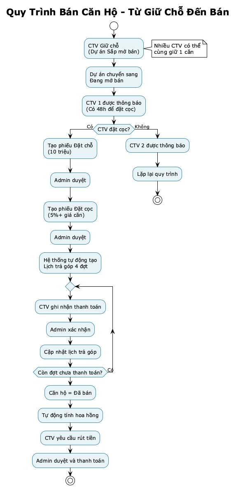
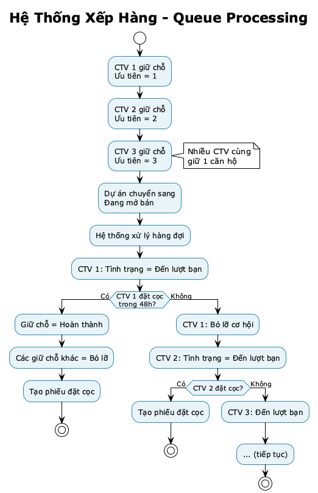
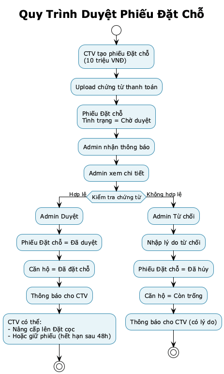
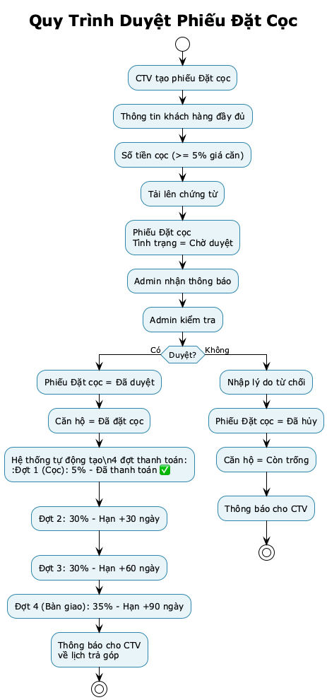
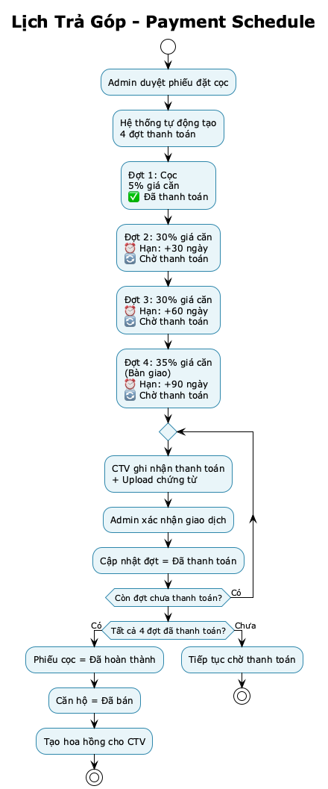
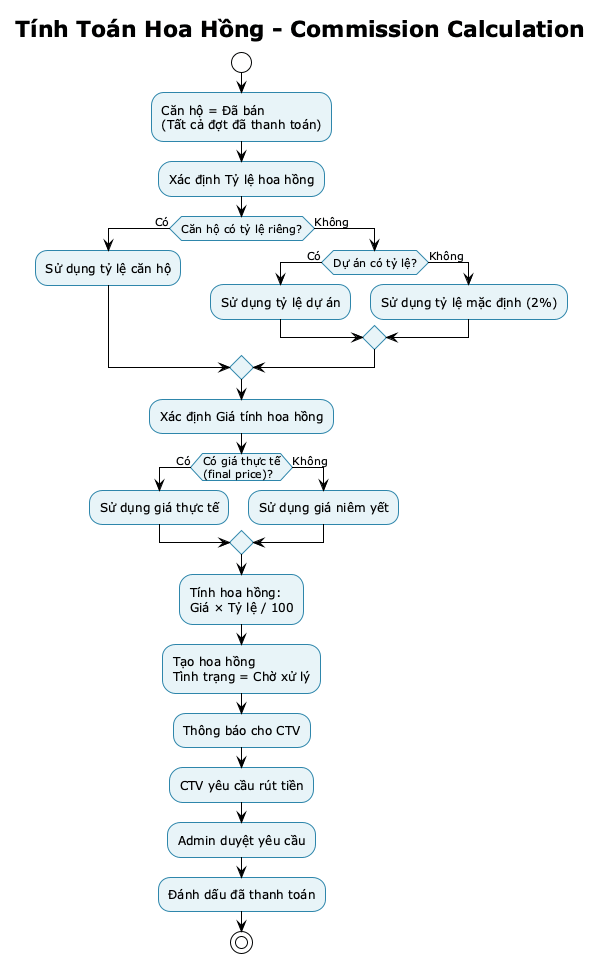
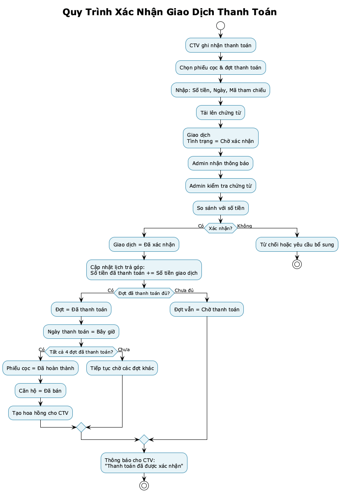
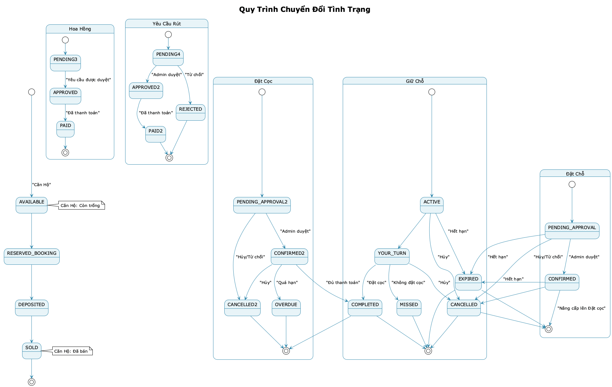

# BUSINESS PROCESS FLOWS
## Hệ thống Quản lý Bán Căn Hộ Dự Án - Winland

**Document ID:** BPF-WINLAND-001  
**Version:** 1.0  
**Date:** January 2025

---

## TABLE OF CONTENTS

1. [Flow 1: Quy trình Từ Giữ Chỗ Đến Bán](#1-flow-1-quy-trình-từ-giữ-chỗ-đến-bán)
2. [Flow 2: Queue Processing (Xử lý Hàng đợi)](#2-flow-2-queue-processing)
3. [Flow 3: Booking Approval Workflow](#3-flow-3-booking-approval-workflow)
4. [Flow 4: Deposit & Payment Schedule](#4-flow-4-deposit--payment-schedule)
5. [Flow 5: Commission & Payment Request](#5-flow-5-commission--payment-request)
6. [Flow 6: Transaction Confirmation](#6-flow-6-transaction-confirmation)

---

## 1. FLOW 1: QUY TRÌNH TỪ GIỮ CHỖ ĐẾN BÁN

### 1.1 Process Overview

*Hình 1: Quy trình bán căn hộ từ giữ chỗ đến bán - Chi tiết các bước từ khi CTV giữ chỗ đến khi căn hộ được bán và hoa hồng được thanh toán.*

### 1.2 Detailed Steps

**Bước 1: Giữ Chỗ (Reservation)**
- ✅ CTV tạo phiếu giữ chỗ cho căn trong dự án "Sắp mở bán"
- ✅ Hệ thống xếp vào hàng đợi (ưu tiên = số lượng giữ chỗ + 1)
- ✅ Tình trạng căn hộ vẫn là "Còn trống" (cho phép CTV khác giữ chỗ)

**Bước 2: Dự án Chuyển Sang Mở Bán**
- ✅ Admin thay đổi giai đoạn dự án: "Sắp mở bán" → "Đang mở bán"
- ✅ Hệ thống tự động xử lý hàng đợi:
  - CTV đầu tiên (ưu tiên = 1) → Tình trạng = "Đến lượt bạn"
  - Thông báo CTV: "Đến lượt bạn đặt cọc căn X"
  - Hạn chót: Bây giờ + 48 giờ

**Bước 3: CTV Đặt Cọc**
- ✅ CTV tạo phiếu Đặt cọc (hoặc Đặt chỗ trước)
- ✅ Hệ thống cập nhật:
  - Tình trạng giữ chỗ = "Hoàn thành"
  - Các giữ chỗ khác = "Bỏ lỡ cơ hội"
  - Tình trạng đặt cọc = "Chờ duyệt"

**Bước 4: Admin Duyệt Đặt cọc**
- ✅ Admin duyệt phiếu đặt cọc
- ✅ Hệ thống tự động:
  - Tình trạng đặt cọc = "Đã duyệt"
  - Tạo 4 đợt thanh toán
  - Tình trạng căn hộ = "Đã đặt cọc"

**Bước 5: Thanh Toán**
- ✅ CTV ghi nhận từng đợt thanh toán
- ✅ Admin xác nhận giao dịch
- ✅ Hệ thống cập nhật lịch trả góp

**Bước 6: Hoàn Thành & Tạo Hoa hồng**
- ✅ Khi tất cả đợt đã thanh toán:
  - Tình trạng đặt cọc = "Đã hoàn thành"
  - Tình trạng căn hộ = "Đã bán"
  - Hoa hồng tự động được tạo (tình trạng = "Chờ xử lý")

---

## 2. FLOW 2: QUEUE PROCESSING

### 2.1 Queue Logic

*Hình 2: Hệ thống xếp hàng - Khi nhiều CTV cùng giữ chỗ một căn, hệ thống sẽ xếp theo thứ tự ưu tiên và thông báo lần lượt khi dự án mở bán.*

### 2.2 Cronjob Processing

**Lịch chạy:** Chạy mỗi 15 phút

**Logic:**
1. Tìm tất cả phiếu giữ chỗ với tình trạng = "Đến lượt bạn"
2. Kiểm tra: Hạn chót đặt cọc < bây giờ?
3. Nếu có → Cập nhật tình trạng = "Bỏ lỡ cơ hội"
4. Tìm phiếu giữ chỗ tiếp theo (ưu tiên + 1)
5. Cập nhật tình trạng = "Đến lượt bạn"
6. Thông báo CTV mới

---

## 3. FLOW 3: BOOKING APPROVAL WORKFLOW

*Hình 2a: Quy trình duyệt phiếu đặt chỗ - CTV tạo phiếu với chứng từ, Admin kiểm tra và duyệt hoặc từ chối.*

---

## 4. FLOW 4: DEPOSIT & PAYMENT SCHEDULE

*Hình 2b: Quy trình duyệt phiếu đặt cọc - Khi được duyệt, hệ thống tự động tạo lịch trả góp 4 đợt.*

### 4.1 Payment Schedule Template

*Hình 3: Lịch trả góp 4 đợt - Tự động tạo khi phiếu đặt cọc được duyệt, gồm đợt cọc và 3 đợt còn lại theo thời hạn.*

**Mẫu Lịch Trả góp Mặc định (4 đợt):**
- Đợt 1 (Cọc): 5% - Thanh toán ngay khi duyệt
- Đợt 2: 30% - Sau 30 ngày
- Đợt 3: 30% - Sau 60 ngày
- Đợt 4 (Bàn giao): 35% - Khi bàn giao căn

**Có thể tùy chỉnh:** Admin có thể thay đổi mẫu lịch trả góp trong phần Cấu hình Hệ thống

---

## 5. FLOW 5: COMMISSION & PAYMENT REQUEST

*Hình 4: Quy trình tính hoa hồng và thanh toán - Tự động tính khi căn hộ đã bán, CTV yêu cầu rút tiền và Admin duyệt thanh toán.*

---

## 6. FLOW 6: TRANSACTION CONFIRMATION

*Hình 5: Quy trình xác nhận giao dịch thanh toán - Admin xác nhận từng giao dịch, hệ thống tự động cập nhật lịch trả góp và tạo hoa hồng khi đủ điều kiện.*

### 6.1 Atomic Transaction (Giao dịch Nguyên tử)

**Giao dịch Nguyên tử (Atomic Transaction) là gì?**

Giao dịch Nguyên tử là một cơ chế đảm bảo rằng **tất cả các bước cập nhật thông tin phải được thực hiện hoàn toàn, hoặc không thực hiện bước nào cả** (Tất cả hoặc Không gì cả).

**Tại sao quan trọng?**

Khi Admin xác nhận một giao dịch thanh toán, hệ thống cần thực hiện nhiều thao tác cùng lúc:
1. Cập nhật tình trạng giao dịch = "Đã xác nhận"
2. Cập nhật số tiền đã thanh toán trong lịch trả góp
3. Kiểm tra xem tất cả đợt đã thanh toán chưa
4. Nếu đủ → Cập nhật phiếu cọc = "Đã hoàn thành", Căn hộ = "Đã bán", và tạo hoa hồng

**Nếu không dùng cơ chế này:**

❌ **Vấn đề:** Giả sử hệ thống đã cập nhật giao dịch nhưng chưa kịp cập nhật lịch trả góp thì bị lỗi → Dữ liệu không khớp nhau:
- Giao dịch = "Đã xác nhận" ✅
- Lịch trả góp vẫn = "Chờ thanh toán" ❌ (Sai!)
- Căn hộ vẫn = "Đã đặt cọc" thay vì "Đã bán" ❌ (Sai!)

→ Dẫn đến báo cáo sai, hoa hồng tính sai, căn hộ không được đánh dấu đã bán.

**Với Giao dịch Nguyên tử:**

✅ **Giải pháp:** Tất cả các bước phải hoàn thành cùng lúc, nếu có bất kỳ bước nào lỗi → Hệ thống tự động **quay lại trạng thái ban đầu** để đảm bảo dữ liệu luôn khớp nhau, không bị lệch.

**Ví dụ thực tế:**

Khi Admin xác nhận giao dịch 375 triệu cho đợt 2:
- ✅ Bước 1: Giao dịch = "Đã xác nhận"
- ✅ Bước 2: Đợt 2: Số tiền đã thanh toán += 375 triệu
- ✅ Bước 3: Kiểm tra: Tất cả 4 đợt đã thanh toán? → Có
- ✅ Bước 4: Phiếu cọc = "Đã hoàn thành"
- ✅ Bước 5: Căn hộ = "Đã bán"
- ✅ Bước 6: Tạo hoa hồng cho CTV

**Nếu bước 5 hoặc 6 lỗi (ví dụ: máy chủ bị lỗi):** Hệ thống tự động quay lại, tất cả các bước 1-4 cũng bị hủy, dữ liệu giữ nguyên như ban đầu. Admin có thể thử lại sau.

**Tóm lại:** Giao dịch Nguyên tử đảm bảo **dữ liệu luôn khớp nhau** - mọi thay đổi phải hoàn thành 100% hoặc không thay đổi gì cả, tránh tình trạng dữ liệu bị lệch, không đồng bộ, gây ra sai sót trong báo cáo và tính toán.

---

## 7. BUSINESS RULES SUMMARY

### 7.1 Status Transitions

*Hình 6: Quy trình chuyển đổi tình trạng - Tất cả các trạng thái và cách chuyển đổi của các entity trong hệ thống.*

**Chi tiết các tình trạng:**

**Căn Hộ (Unit):**
- Còn trống → Đã đặt chỗ → Đã đặt cọc → Đã bán

**Giữ Chỗ (Reservation):**
- Đang giữ chỗ → Đến lượt bạn → Hoàn thành/Bỏ lỡ/Hết hạn/Đã hủy

**Đặt Chỗ (Booking):**
- Chờ duyệt → Đã duyệt → (nâng cấp lên Đặt cọc) / Đã hủy / Hết hạn

**Đặt Cọc (Deposit):**
- Chờ duyệt → Đã duyệt → Đã hoàn thành / Đã hủy / Quá hạn

**Hoa Hồng (Commission):**
- Chờ xử lý → Đã duyệt → Đã thanh toán

**Yêu Cầu Rút Tiền (Payment Request):**
- Chờ duyệt → Đã duyệt → Đã thanh toán / Từ chối

### 7.2 Auto Actions

**Tác vụ Tự Động (Chạy theo lịch):**
- ⏰ **Mỗi 15 phút:** Tự động hết hạn các phiếu giữ chỗ/đặt chỗ đã quá thời hạn
- ⏰ **Mỗi 15 phút:** Xử lý hàng đợi (CTV đến lượt nhưng không đặt cọc → Chuyển sang CTV tiếp theo)
- ⏰ **Mỗi giờ:** Xử lý các đợt thanh toán quá hạn
- ⏰ **Mỗi ngày:** Dọn dẹp các phiếu đặt chỗ/đặt cọc đã hết hạn

**Tự Động Kích Hoạt:**
- ✅ Hoa hồng được tạo tự động khi căn hộ = "Đã bán"
- ✅ Lịch trả góp được tạo tự động khi phiếu đặt cọc được duyệt
- ✅ Tình trạng căn hộ tự động đồng bộ khi phiếu đặt chỗ/đặt cọc bị hủy

---

## APPENDIX: BPMN Diagrams

Xem các file diagram:
- `docs/diagrams/bpmn-reservation-process.puml`
- `docs/diagrams/bpmn-booking-to-deposit.puml`
- `docs/diagrams/deposit-to-sold.puml`
- `docs/diagrams/commission-calculation.puml`

---

**Document End**
