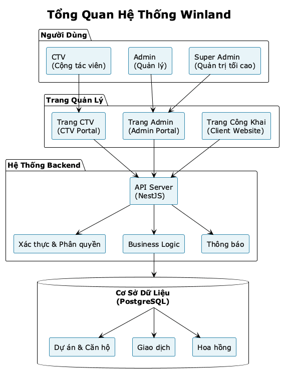

# SYSTEM ARCHITECTURE OVERVIEW
## Hệ thống Quản lý Bán Căn Hộ Dự Án - Winland

**Document ID:** SA-WINLAND-001  
**Version:** 1.0  
**Date:** January 2025

---

## TABLE OF CONTENTS

1. [Architecture Overview](#1-architecture-overview)
2. [System Components](#2-system-components)
3. [Technology Stack](#3-technology-stack)
4. [Database Architecture](#4-database-architecture)
5. [API Architecture](#5-api-architecture)
6. [Security Architecture](#6-security-architecture)
7. [Deployment Architecture](#7-deployment-architecture)

---

## 1. ARCHITECTURE OVERVIEW

### 1.1 High-Level Architecture



*Hình 1: Kiến trúc tổng quan hệ thống - Từ client layer đến database, thể hiện các thành phần chính và luồng dữ liệu.*

### 1.2 Architecture Patterns

**Monorepo Structure:**
- Shared code trong `packages/shared`
- Multiple apps trong `apps/`
- Turborepo for build orchestration

**Layered Architecture:**
- **Presentation Layer:** React/Next.js frontends
- **API Layer:** NestJS RESTful API
- **Business Logic Layer:** Services trong backend
- **Data Access Layer:** Prisma ORM

**Microservices-ready:**
- Modular backend structure
- Có thể tách thành microservices nếu cần scale

---

## 2. SYSTEM COMPONENTS

### 2.1 Frontend Applications

#### Admin Portal (`apps/admin`)
- **Framework:** React 18 + Vite
- **UI Library:** shadcn/ui, Tailwind CSS
- **State Management:** React Query
- **Routing:** React Router
- **Purpose:** Quản lý dự án, căn hộ, users, duyệt phiếu

#### CTV Portal (`apps/ctv-portal`)
- **Framework:** Next.js 14 (App Router)
- **UI Library:** shadcn/ui, Tailwind CSS
- **State Management:** React Query
- **API Routes:** Next.js API routes (serverless functions)
- **Purpose:** CTV bán hàng, tạo phiếu, xem hoa hồng

#### Client Website (`apps/client`)
- **Framework:** Next.js 14
- **Purpose:** Trang công khai cho khách hàng

### 2.2 Backend Services

#### API Server (`apps/backend`)
- **Framework:** NestJS
- **ORM:** Prisma
- **Database:** PostgreSQL
- **Authentication:** JWT
- **Features:**
  - RESTful API
  - Role-based access control
  - Business logic services
  - Cronjobs (scheduled tasks)
  - Audit logging

### 2.3 Shared Package

#### `packages/shared`
- Type definitions
- Constants
- Utilities
- Common types

---

## 3. TECHNOLOGY STACK

### 3.1 Frontend

| Component | Technology | Purpose |
|-----------|-----------|---------|
| **Admin Portal** | React 18 + Vite | Fast development & build |
| **CTV Portal** | Next.js 14 | SSR, API routes, SEO |
| **Styling** | Tailwind CSS | Utility-first CSS |
| **UI Components** | shadcn/ui | Reusable components |
| **Forms** | React Hook Form + Zod | Form validation |
| **State** | React Query | Server state management |
| **Routing** | React Router / Next.js Router | Client-side routing |

### 3.2 Backend

| Component | Technology | Purpose |
|-----------|-----------|---------|
| **Framework** | NestJS | Enterprise Node.js framework |
| **Language** | TypeScript | Type safety |
| **ORM** | Prisma | Type-safe database access |
| **Database** | PostgreSQL | Relational database |
| **Authentication** | JWT | Token-based auth |
| **Validation** | class-validator | DTO validation |
| **Scheduling** | @nestjs/schedule | Cronjobs |

### 3.3 DevOps & Tools

| Component | Technology | Purpose |
|-----------|-----------|---------|
| **Package Manager** | npm | Dependency management |
| **Monorepo** | Turborepo | Build orchestration |
| **Version Control** | Git | Source control |
| **Linting** | ESLint | Code quality |
| **Formatting** | Prettier | Code formatting |

---

## 4. DATABASE ARCHITECTURE

### 4.1 Database Design

**PostgreSQL** với các bảng chính:

```
users
  ├─ reservations
  ├─ bookings
  ├─ deposits
  ├─ commissions
  └─ payment_requests

projects
  ├─ buildings
  │   └─ floors
  │       └─ units
  │           ├─ reservations
  │           ├─ bookings
  │           ├─ deposits
  │           └─ commissions

deposits
  ├─ payment_schedules
  │   └─ transactions
  └─ commissions
      └─ payment_requests
```

### 4.2 Key Features

**Indexes:**
- Composite indexes cho common queries
- Full-text search indexes
- Performance optimization

**Soft Delete:**
- Tất cả entities có `deletedAt` field
- Không xóa dữ liệu thật, chỉ đánh dấu
- Có thể khôi phục nếu cần

**Audit Trail:**
- `audit_logs` table track mọi thay đổi
- Record: Who, What, When, Old/New values

---

## 5. API ARCHITECTURE

### 5.1 RESTful Design

**Endpoints Structure:**
```
/api
  /auth
    /register-ctv
    /login-ctv
    /login-admin
    /send-otp
  /projects
    GET /              # List
    GET /:id           # Detail
    POST /             # Create
    PATCH /:id         # Update
  /units
    GET /
    GET /:id
    POST /
    POST /bulk-import
  /reservations
  /bookings
  /deposits
  /transactions
  /commissions
  /payment-requests
  /users
```

### 5.2 Authentication Flow

```
Client → POST /auth/login
        ↓
   Server validates
        ↓
   Generate JWT token
        ↓
   Return token
        ↓
Client stores token
        ↓
Client includes token in requests:
   Authorization: Bearer {token}
```

### 5.3 Authorization

**Role-Based Access Control (RBAC):**
- Guards check JWT token
- Guards check user role
- Endpoints protected by `@Roles()` decorator

---

## 6. SECURITY ARCHITECTURE

### 6.1 Authentication

- ✅ **JWT Tokens:** Stateless authentication
- ✅ **Password Hashing:** Bcrypt (salt rounds: 10)
- ✅ **OTP Verification:** 6 digits, expires 5 minutes
- ✅ **Rate Limiting:** Prevent brute force

### 6.2 Authorization

- ✅ **Role-Based:** SUPER_ADMIN, ADMIN, CTV, USER
- ✅ **Resource Ownership:** CTV chỉ access data của mình
- ✅ **Guards:** Route-level and method-level protection

### 6.3 Data Protection

- ✅ **HTTPS:** Required in production
- ✅ **Input Validation:** class-validator on all DTOs
- ✅ **SQL Injection Prevention:** Prisma parameterized queries
- ✅ **XSS Protection:** React auto-escaping
- ✅ **CORS:** Configured for allowed origins

### 6.4 Audit & Compliance

- ✅ **Audit Logs:** Track all important changes
- ✅ **Soft Delete:** No data loss
- ✅ **Backup:** Daily automatic backups

---

## 7. DEPLOYMENT ARCHITECTURE

### 7.1 Development Environment

```
┌─────────────────────────────────────────┐
│  Developer Machine                      │
│                                         │
│  Frontend: localhost:5173 (Admin)      │
│  Frontend: localhost:3000 (CTV)        │
│  Backend:  localhost:3002              │
│  Database: localhost:5432 (PostgreSQL) │
└─────────────────────────────────────────┘
```

### 7.2 Production Architecture (Recommended)

```
┌─────────────────────────────────────────────────┐
│  Load Balancer / CDN                           │
│  (CloudFlare, AWS CloudFront)                  │
└─────────────┬───────────────────────────────────┘
              │
      ┌───────┴───────┐
      │               │
┌─────▼─────┐   ┌─────▼─────┐
│ Frontend  │   │ Frontend  │
│ (Admin)   │   │ (CTV)     │
│ Vercel/   │   │ Vercel/   │
│ Netlify   │   │ Netlify   │
└─────┬─────┘   └─────┬─────┘
      │               │
      └───────┬───────┘
              │
      ┌───────▼───────┐
      │   API Server  │
      │   (NestJS)    │
      │   AWS/GCP/Azure│
      └───────┬───────┘
              │
      ┌───────▼───────┐
      │   PostgreSQL  │
      │   (Managed DB)│
      │   AWS RDS/    │
      │   GCP SQL     │
      └───────────────┘
```

### 7.3 Scalability

**Horizontal Scaling:**
- Frontend: Stateless, có thể scale dễ dàng
- Backend: Stateless API, có thể scale với load balancer
- Database: Read replicas cho queries

**Vertical Scaling:**
- Database: Tăng RAM, CPU
- API Server: Tăng instance size

---

## 8. INTEGRATION POINTS

### 8.1 External Services

**SMS Service (OTP):**
- Provider: Twilio, AWS SNS, hoặc custom
- API: Send OTP codes
- Rate limiting: 3 OTP/giờ/SĐT

**Email Service (Optional):**
- Provider: SendGrid, AWS SES
- Purpose: Notifications, reports

**Storage Service (Optional):**
- Provider: AWS S3, Cloudinary
- Purpose: Store images, documents

### 8.2 Future Integrations

- 📧 Email notifications
- 📱 Push notifications (Firebase)
- 💳 Payment gateway (Stripe, VNPay)
- 📄 E-contract signing (DocuSign)

---

## 9. PERFORMANCE OPTIMIZATION

### 9.1 Frontend

- ✅ Code splitting
- ✅ Lazy loading
- ✅ Image optimization
- ✅ Caching (React Query)

### 9.2 Backend

- ✅ Database indexes
- ✅ Query optimization (Prisma)
- ✅ Pagination
- ✅ Caching (Redis - future)

### 9.3 Database

- ✅ Composite indexes
- ✅ Connection pooling
- ✅ Query optimization

---

## 10. MONITORING & LOGGING

### 10.1 Logging

**Backend:**
- Structured logging
- Error tracking
- Audit logs

**Frontend:**
- Error boundaries
- Console logging (dev only)

### 10.2 Monitoring (Future)

- Application Performance Monitoring (APM)
- Error tracking (Sentry)
- Uptime monitoring
- Performance metrics

---

**Document End**

**For detailed technical documentation, see:** Technical Architecture Document
