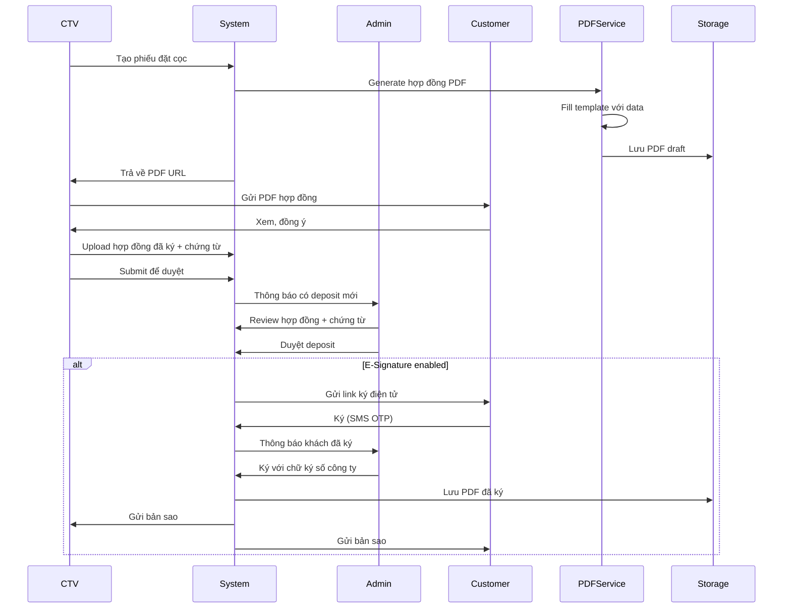
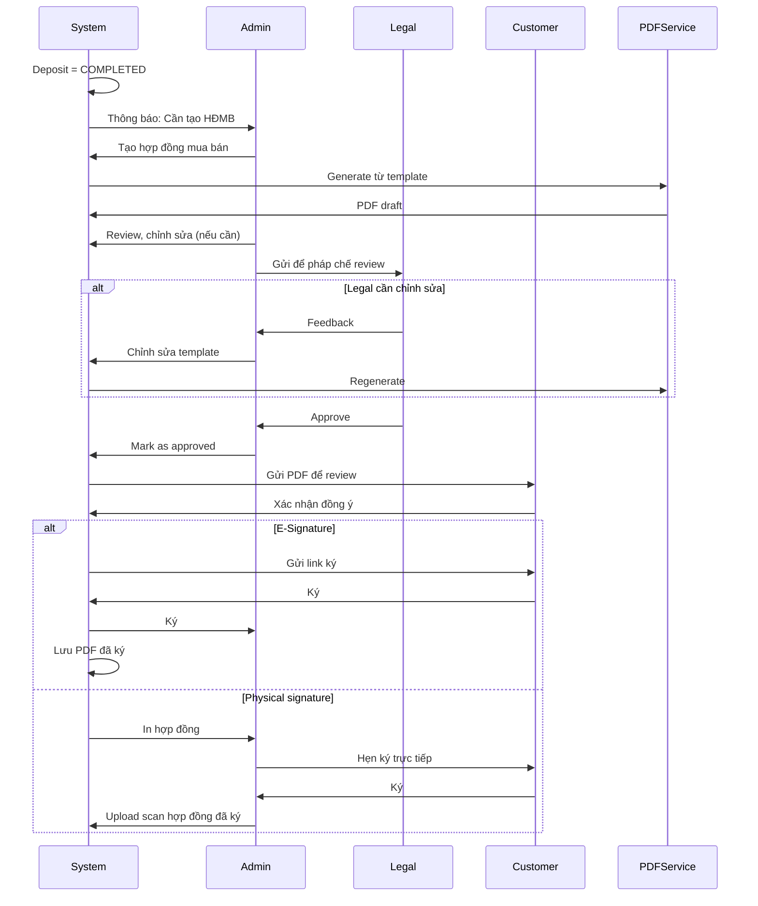

# ĐỀ XUẤT TÍNH NĂNG PDF, HỢP ĐỒNG VÀ TÀI LIỆU
## Hệ thống Quản lý Bán Căn Hộ Dự Án - Winland

**Document ID:** PDF-WINLAND-001  
**Version:** 1.1  
**Date:** January 2025  
**Last Updated:** January 2025  
**Mục đích:** Đề xuất các tính năng PDF, hợp đồng và tài liệu pháp lý cho hệ thống

---

## EXECUTIVE SUMMARY

Tài liệu này đề xuất hệ thống PDF generation hoàn chỉnh cho Winland, bao gồm:

**📋 Tính năng chính:**
- 6 loại PDF: Reservation, Booking, Deposit Contract, Transaction Receipt, Payment Schedule, Commission Report
- Template management system với version control
- QR Code integration cho thanh toán
- E-Signature support (tương lai)
- Báo cáo và thống kê

**✅ Trạng thái hiện tại:**
- API endpoints: ✅ Hoàn thành
- Service structure: ✅ Hoàn thành  
- QR Code service: ✅ Hoàn thành
- PDF generation logic: ⚠️ Placeholder (cần implement Puppeteer/PDFKit)
- Template engine: ❌ Chưa có

**📅 Timeline:**
- Phase 1 (MVP): 4-6 tuần - Foundation và core templates
- Phase 2: 6-8 tuần - Advanced features
- Phase 3: 8-10 tuần - E-Signature và optimization

**🔧 Công nghệ đề xuất:**
- Puppeteer (HTML → PDF) hoặc PDFKit
- Handlebars template engine
- AWS S3 / Google Cloud Storage
- Tích hợp với QR Code service hiện có

---

## TABLE OF CONTENTS

1. [Tổng quan Hiện trạng](#1-tổng-quan-hiện-trạng)
2. [Đề xuất Tính năng PDF](#2-đề-xuất-tính-năng-pdf)
3. [Đề xuất Hợp đồng và Tài liệu Pháp lý](#3-đề-xuất-hợp-đồng-và-tài-liệu-pháp-lý)
4. [Quy trình và Workflow](#4-quy-trình-và-workflow)
5. [Yêu cầu Kỹ thuật](#5-yêu-cầu-kỹ-thuật)
6. [Ưu tiên Triển khai](#6-ưu-tiên-triển-khai)
7. [Chi tiết Triển khai](#7-chi-tiết-triển-khai)
8. [Kết luận](#8-kết-luận)

---

## 1. TỔNG QUAN HIỆN TRẠNG

### 1.1 Tính năng PDF Hiện có

Hệ thống hiện tại đã có các tính năng PDF cơ bản:

✅ **Đã triển khai:**
- Phiếu Giữ chỗ (Reservation PDF)
- Phiếu Đặt chỗ (Booking Receipt)
- Hợp đồng Đặt cọc (Deposit Contract)
- Phiếu Giao dịch Thanh toán (Transaction Receipt)
- Lịch Trả góp (Payment Schedule)
- Báo cáo Hoa hồng (Commission Report)

✅ **Cấu trúc hiện tại:**
- PDF Service Module (Backend) - `/apps/backend/src/modules/pdf/`
- PDF Controller (API endpoints) - RESTful API
- QR Code Service - Tích hợp tạo QR code cho thanh toán
- Placeholder implementation (đang phát triển)

### 1.2 Trạng thái Triển khai

| Tính năng | Trạng thái | Ghi chú |
|-----------|------------|---------|
| API Endpoints | ✅ Hoàn thành | Đã có đầy đủ endpoints |
| PDF Service Structure | ✅ Hoàn thành | Service class với methods cơ bản |
| Database Schema | ✅ Hoàn thành | Có field `contractUrl` trong Deposit |
| QR Code Generation | ✅ Hoàn thành | Đã có QR Code Service riêng |
| PDF Generation Logic | ⚠️ Placeholder | Chưa tích hợp Puppeteer/PDFKit |
| Template Engine | ❌ Chưa có | Cần implement Handlebars/EJS |
| Cloud Storage | ❌ Chưa có | Đang dùng placeholder URL |
| Watermark | ❌ Chưa có | Cần implement |
| E-Signature | ❌ Chưa có | Chưa tích hợp |

### 1.3 API Endpoints Hiện tại

**Base URL:** `/api/pdf`

| Method | Endpoint | Mô tả | Trạng thái |
|--------|----------|-------|------------|
| GET | `/reservations/:reservationId` | Tạo PDF Phiếu Giữ chỗ | ✅ |
| GET | `/deposits/:depositId` | Tạo PDF Hợp đồng Đặt cọc | ✅ |
| GET | `/deposit/:depositId/contract` | Legacy: Tạo hợp đồng | ✅ |
| GET | `/deposit/:depositId/contract-data` | Lấy data hợp đồng (preview) | ✅ |
| GET | `/deposit/:depositId/payment-schedule` | Tạo PDF Lịch Trả góp | ✅ |
| GET | `/bookings/:bookingId` | Tạo PDF Phiếu Đặt chỗ | ✅ |
| GET | `/booking/:bookingId/receipt` | Legacy: Tạo receipt | ✅ |
| GET | `/transaction/:transactionId/receipt` | Tạo PDF Phiếu Nhận Tiền | ✅ |
| GET | `/commission-report/:ctvId` | Tạo PDF Báo cáo Hoa hồng | ✅ |

**QR Code Endpoints:** `/api/qrcode`
- GET `/qrcode/booking/:bookingId` - QR code thanh toán booking
- GET `/qrcode/deposit/:depositId` - QR code thanh toán deposit
- GET `/qrcode/transaction/:transactionId` - QR code thanh toán transaction

---

## 2. ĐỀ XUẤT TÍNH NĂNG PDF

### 2.1 Phiếu và Chứng từ

#### 2.1.1 Phiếu Giữ chỗ (Nâng cấp)

**Nội dung:**
- Header: Logo công ty, thông tin liên hệ
- Mã phiếu: RSV-YYYYMMDD-XXX
- Thông tin dự án: Tên, địa chỉ, chủ đầu tư
- Thông tin căn hộ: Mã căn, diện tích, giá, hướng, view
- Thông tin khách hàng: Họ tên, SĐT, Email, CMND/CCCD
- Thông tin CTV: Họ tên, SĐT, mã CTV
- Thời hạn hiệu lực: Từ ngày → Đến ngày (24 giờ)
- Điều khoản và điều kiện
- QR Code để xác minh phiếu
- Footer: Số điện thoại hỗ trợ, email

**Tính năng mở rộng:**
- Watermark "CHƯA THANH TOÁN" / "ĐÃ XÁC NHẬN"
- Mã QR code để khách hàng quét kiểm tra tính hợp lệ
- Chữ ký số của hệ thống (digital signature)

---

#### 2.1.2 Phiếu Đặt chỗ (Nâng cấp)

**Nội dung:**
- Tất cả thông tin từ Phiếu Giữ chỗ
- Số tiền đặt chỗ: 10,000,000 VNĐ (hoặc 0.5% giá căn)
- Thông tin thanh toán: Số tài khoản, tên ngân hàng, nội dung chuyển khoản
- QR Code thanh toán (Dynamic QR)
- Trạng thái: Chờ duyệt / Đã duyệt / Đã hủy
- Chứng từ đính kèm (nếu có)

**Tính năng mở rộng:**
- QR Code thanh toán theo chuẩn VietQR (đã có QR Code Service)
- Liên kết thanh toán online (nếu tích hợp payment gateway)
- Template email tự động gửi phiếu cho khách hàng
- Tích hợp QR Code vào PDF (embed QR image)

**Tích hợp QR Code:**
- Sử dụng endpoint: `GET /api/qrcode/deposit/:depositId`
- QR Code chứa: Mã deposit, tên khách hàng, số tiền, nội dung chuyển khoản
- Format: Base64 image (data URL) hoặc PNG file
- Embed vào PDF tại vị trí thanh toán

---

#### 2.1.3 Phiếu Nhận Tiền (Payment Receipt)

**Mục đích:** Chứng từ xác nhận đã nhận tiền từ khách hàng

**Nội dung:**
- Thông tin công ty (Bên nhận tiền)
- Thông tin khách hàng (Bên thanh toán)
- Số tiền: Bằng số + Bằng chữ
- Nội dung thanh toán: "Đặt cọc căn hộ A1-08-05 - Đợt 1"
- Mã tham chiếu ngân hàng
- Ngày giờ thanh toán
- Phương thức: Chuyển khoản / Tiền mặt
- Chữ ký người nhận (Admin)
- Mã QR code để verify

**Tính năng:**
- Tự động tạo khi Admin xác nhận giao dịch (status = CONFIRMED)
- In nhiều bản (1 cho khách, 1 lưu công ty)
- Lưu trữ lâu dài trong hệ thống
- Endpoint: `GET /api/pdf/transaction/:transactionId/receipt`
- Link với Transaction record trong database

---

#### 2.1.4 Biên bản Giao nhận Căn hộ

**Mục đích:** Xác nhận đã giao nhận căn hộ cho khách hàng

**Nội dung:**
- Thông tin căn hộ: Mã căn, tòa, tầng, diện tích
- Thông tin khách hàng
- Ngày giao nhận
- Tình trạng căn hộ khi giao: Danh sách kiểm tra (checklist)
- Phụ kiện, thiết bị đi kèm
- Khiếm khuyết (nếu có)
- Chữ ký các bên: Khách hàng, Đại diện công ty, CTV
- Ảnh đính kèm: Ảnh căn hộ khi giao

**Tính năng:**
- Template có thể tùy chỉnh theo dự án
- Chữ ký điện tử (nếu có)
- Upload ảnh trực tiếp từ điện thoại

---

### 2.2 Hợp đồng Pháp lý

#### 2.2.1 Hợp đồng Đặt cọc (Nâng cấp)

**Nội dung hiện tại:**
- Template hợp đồng cơ bản
- Điền tự động thông tin khách hàng, căn hộ
- Lịch trả góp

**Nâng cấp đề xuất:**

**Phần A: Thông tin các bên**
- Bên A: Công ty (Tên, địa chỉ, MST, đại diện)
- Bên B: Khách hàng (Họ tên, CMND/CCCD, địa chỉ, SĐT, Email)
- Bên C: CTV (Thông tin, vai trò)

**Phần B: Đối tượng hợp đồng**
- Chi tiết căn hộ: Mã, diện tích, vị trí, giá
- Diện tích sử dụng, diện tích thông thủy (nếu có)
- Đặc điểm: Hướng, view, số phòng

**Phần C: Giá và phương thức thanh toán**
- Giá căn hộ: Bằng số + Bằng chữ
- Số tiền đặt cọc: X VNĐ (X% giá căn)
- Lịch thanh toán: Bảng chi tiết 4 đợt
- Phương thức: Chuyển khoản / Tiền mặt

**Phần D: Điều khoản và cam kết**
- Điều khoản hủy hợp đồng
- Điều khoản về tiến độ
- Điều khoản về bàn giao
- Cam kết của các bên

**Phần E: Chữ ký**
- Chữ ký Bên A (Đại diện công ty) + Đóng dấu
- Chữ ký Bên B (Khách hàng)
- Chữ ký Bên C (CTV - Người chứng kiến)
- Ngày ký, địa điểm ký

**Tính năng:**
- Template pháp lý được duyệt bởi luật sư
- Có thể tùy chỉnh điều khoản theo dự án
- Hỗ trợ chữ ký số (e-signature) - Tương lai
- Version control (lưu các phiên bản hợp đồng)

---

#### 2.2.2 Hợp đồng Mua bán Căn hộ (Hợp đồng chính thức)

**Mục đích:** Hợp đồng chính thức khi khách hàng đã thanh toán đủ

**Nội dung:**

**Phần 1: Căn cứ pháp lý**
- Luật Nhà ở, Luật Kinh doanh BĐS
- Nghị định, Thông tư liên quan
- Giấy phép xây dựng, Giấy phép kinh doanh dự án

**Phần 2: Thông tin các bên**
- Bên bán: Công ty (đầy đủ thông tin pháp lý)
- Bên mua: Khách hàng (đầy đủ thông tin)
- Người đại diện (nếu có)

**Phần 3: Đối tượng hợp đồng**
- Mô tả chi tiết căn hộ
- Vị trí, ranh giới
- Diện tích (sử dụng, thông thủy, tim tường)
- Tiêu chuẩn bàn giao
- Tài sản gắn liền

**Phần 4: Giá cả và thanh toán**
- Tổng giá trị hợp đồng
- Giá đã bao gồm VAT chưa
- Lịch thanh toán chi tiết
- Hình thức thanh toán
- Phương thức xác nhận thanh toán

**Phần 5: Quyền và nghĩa vụ**
- Quyền và nghĩa vụ bên bán
- Quyền và nghĩa vụ bên mua
- Trách nhiệm vi phạm

**Phần 6: Bàn giao**
- Thời hạn bàn giao
- Điều kiện bàn giao
- Nghiệm thu và biên bản
- Bảo hành

**Phần 7: Điều khoản chung**
- Giải quyết tranh chấp
- Hiệu lực hợp đồng
- Phụ lục

**Phần 8: Chữ ký và đóng dấu**
- Chữ ký các bên
- Đóng dấu công ty
- Ngày ký, số hợp đồng

**Tính năng:**
- Tự động tạo khi Deposit = COMPLETED
- Template được phê duyệt bởi pháp chế
- Có thể chỉnh sửa trước khi ký
- Version control
- Hỗ trợ chữ ký số (ưu tiên cao)

---

#### 2.2.3 Phụ lục Hợp đồng

**Các loại phụ lục:**
1. **Phụ lục 1:** Bản vẽ căn hộ (Floor plan)
2. **Phụ lục 2:** Tiêu chuẩn vật liệu, thiết bị
3. **Phụ lục 3:** Quy định quản lý, sử dụng
4. **Phụ lục 4:** Thỏa thuận về sửa đổi, bổ sung
5. **Phụ lục 5:** Biên bản nghiệm thu

**Tính năng:**
- Đính kèm file PDF, ảnh vào hợp đồng
- Quản lý danh sách phụ lục
- Version control

---

### 2.3 Báo cáo và Thống kê

#### 2.3.1 Báo cáo Doanh số theo Dự án

**Nội dung:**
- Tổng quan dự án
- Thống kê căn hộ: Tổng số, đã bán, còn lại, đang xử lý
- Doanh thu theo tháng/quý/năm
- Biểu đồ xu hướng
- Top CTV
- Phân tích theo loại căn (1PN, 2PN, 3PN...)

**Tính năng:**
- Export PDF, Excel
- Tự động gửi email định kỳ cho ban lãnh đạo
- Template báo cáo có thể tùy chỉnh

---

#### 2.3.2 Báo cáo Hoa hồng CTV

**Nội dung:**
- Thông tin CTV
- Danh sách hoa hồng: Từng căn, số tiền, tỷ lệ, trạng thái
- Tổng hợp: Tổng đã kiếm, chờ duyệt, đã thanh toán
- Biểu đồ phân tích
- Lịch sử thanh toán

**Tính năng:**
- Export PDF cho CTV
- Gửi email tự động mỗi tháng
- In để ký xác nhận (nếu cần)

---

#### 2.3.3 Báo cáo Giao dịch

**Nội dung:**
- Tổng hợp giao dịch theo thời kỳ
- Số lượng, tổng giá trị
- Phân tích theo dự án, theo CTV
- Giao dịch chờ xác nhận
- Giao dịch đã hoàn thành

---

### 2.4 Tài liệu Hỗ trợ

#### 2.4.1 Catalog Dự án (PDF)

**Nội dung:**
- Giới thiệu dự án
- Vị trí, tiện ích
- Các loại căn hộ
- Bảng giá
- Lịch thanh toán
- Chính sách ưu đãi
- Hình ảnh dự án

**Tính năng:**
- Tự động cập nhật khi có thay đổi
- Version control
- Có thể tải về từ website công khai

---

#### 2.4.2 Hướng dẫn Thanh toán

**Nội dung:**
- Các phương thức thanh toán
- Thông tin tài khoản ngân hàng
- Hướng dẫn chuyển khoản
- Mẫu nội dung chuyển khoản
- Lưu ý và điều khoản

---

#### 2.4.3 Phiếu Yêu cầu Chỉnh sửa

**Mục đích:** Khi khách hàng yêu cầu chỉnh sửa căn hộ

**Nội dung:**
- Thông tin khách hàng, căn hộ
- Yêu cầu chỉnh sửa (mô tả chi tiết)
- Chi phí (nếu có)
- Thời hạn thực hiện
- Chữ ký xác nhận

---

## 3. ĐỀ XUẤT HỢP ĐỒNG VÀ TÀI LIỆU PHÁP LÝ

### 3.1 Quản lý Template Hợp đồng

#### 3.1.1 Hệ thống Template

**Tính năng:**
- Admin có thể upload/edit template hợp đồng
- Quản lý nhiều version của template
- Preview template trước khi sử dụng
- Variables/Placeholders tự động điền:

**Thông tin Khách hàng:**
  - `{{customerName}}` → Tên khách hàng
  - `{{customerIdCard}}` → CMND/CCCD
  - `{{customerAddress}}` → Địa chỉ
  - `{{customerPhone}}` → Số điện thoại
  - `{{customerEmail}}` → Email

**Thông tin Căn hộ:**
  - `{{unitCode}}` → Mã căn (VD: A1-08-05)
  - `{{unitPrice}}` → Giá căn (số)
  - `{{unitPriceText}}` → Giá căn (bằng chữ)
  - `{{unitArea}}` → Diện tích
  - `{{unitType}}` → Loại căn (1PN, 2PN, 3PN...)
  - `{{projectName}}` → Tên dự án
  - `{{buildingName}}` → Tên tòa
  - `{{floorNumber}}` → Số tầng

**Thông tin Tài chính:**
  - `{{depositAmount}}` → Số tiền cọc (số)
  - `{{depositAmountText}}` → Số tiền cọc (bằng chữ)
  - `{{depositPercentage}}` → Phần trăm cọc
  - `{{finalPrice}}` → Giá cuối cùng (sau chiết khấu)
  - `{{paymentSchedule}}` → Lịch trả góp (bảng HTML)
  - `{{paymentMethod}}` → Phương thức thanh toán

**Thông tin Hợp đồng:**
  - `{{contractNumber}}` → Mã hợp đồng (VD: DEP-20250115-001)
  - `{{contractDate}}` → Ngày ký (DD/MM/YYYY)
  - `{{contractDateFull}}` → Ngày ký đầy đủ (Ngày DD tháng MM năm YYYY)

**Thông tin Công ty:**
  - `{{companyName}}` → Tên công ty
  - `{{companyAddress}}` → Địa chỉ công ty
  - `{{companyTaxCode}}` → MST
  - `{{companyPhone}}` → Số điện thoại
  - `{{companyEmail}}` → Email
  - `{{companyRepresentative}}` → Đại diện công ty
  - `{{companyLogo}}` → URL logo (base64 hoặc URL)

**Thông tin CTV:**
  - `{{ctvName}}` → Tên CTV
  - `{{ctvPhone}}` → Số điện thoại CTV
  - `{{ctvEmail}}` → Email CTV

**QR Code và Thanh toán:**
  - `{{qrCode}}` → QR Code image (base64 hoặc URL)
  - `{{bankName}}` → Tên ngân hàng
  - `{{bankAccount}}` → Số tài khoản
  - `{{bankAccountName}}` → Tên chủ tài khoản
  - `{{transferContent}}` → Nội dung chuyển khoản

**Conditional Blocks (Handlebars):**
  - `{{#if hasDiscount}}...{{/if}}` → Hiển thị nếu có chiết khấu
  - `{{#each paymentSchedules}}...{{/each}}` → Loop qua lịch trả góp
  - `{{#if ctvInfo}}...{{/if}}` → Hiển thị thông tin CTV nếu có

**Quy trình:**
1. Pháp chế upload template mới (Word/HTML)
2. Admin review và approve
3. System parse template, identify variables
4. Template được lưu vào database
5. Khi generate PDF, system fill variables

---

#### 3.1.2 Approval Workflow cho Template

**Quy trình:**
1. **Draft:** Template mới, chưa được duyệt
2. **Pending Review:** Chờ pháp chế review
3. **Pending Legal Approval:** Chờ luật sư duyệt
4. **Approved:** Đã được duyệt, có thể sử dụng
5. **Deprecated:** Template cũ, không dùng nữa

**Tính năng:**
- Audit log: Ai tạo, ai sửa, ai duyệt
- Comment/Feedback trong quy trình duyệt
- So sánh version (diff)

---

### 3.2 Chữ ký Điện tử (E-Signature)

#### 3.2.1 Tích hợp Chữ ký số

**Mục đích:** Ký hợp đồng trực tuyến, không cần in giấy

**Tính năng:**
- Tích hợp với các nhà cung cấp chữ ký số:
  - FPT.eContract
  - CMC eContract
  - VNPT eContract
  - eSign.vn
- Khách hàng ký qua:
  - SMS OTP
  - Email link
  - Ứng dụng di động
- Admin ký với chữ ký số của công ty
- Lưu trữ hợp đồng đã ký (PDF có chữ ký số)

**Quy trình:**
1. System generate hợp đồng PDF
2. Gửi link ký cho khách hàng (SMS/Email)
3. Khách hàng xem, đồng ý, ký (SMS OTP)
4. Admin ký (chữ ký số công ty)
5. System hợp nhất thành PDF đã ký
6. Gửi bản sao cho tất cả các bên

---

#### 3.2.2 Lưu trữ Hợp đồng Đã ký

**Tính năng:**
- Lưu trữ lâu dài (10+ năm)
- Không thể chỉnh sửa sau khi ký
- Có thể tải về bất cứ lúc nào
- Hash/Checksum để verify tính toàn vẹn
- Backup tự động

---

### 3.3 Quản lý Tài liệu Đính kèm

#### 3.3.1 Upload Tài liệu

**Các loại tài liệu:**
- CMND/CCCD (mặt trước, mặt sau)
- Hộ chiếu
- Giấy chứng nhận đăng ký kết hôn
- Giấy ủy quyền (nếu có)
- Bản sao hợp đồng đã ký (scan)
- Chứng từ thanh toán
- Biên bản nghiệm thu
- Ảnh căn hộ

**Tính năng:**
- Upload nhiều file cùng lúc
- Kiểm tra định dạng (PDF, JPG, PNG)
- Kiểm tra kích thước (max 10MB/file)
- OCR để extract text từ CMND (tương lai)
- Virus scan

---

#### 3.3.2 Quản lý Version

**Tính năng:**
- Lưu tất cả các version của tài liệu
- So sánh version
- Restore version cũ
- Tag version (draft, final, archived)

---

## 4. QUY TRÌNH VÀ WORKFLOW

### 4.1 Quy trình Tạo và Ký Hợp đồng Đặt cọc



---

### 4.2 Quy trình Tạo Hợp đồng Mua bán Chính thức



---

## 5. YÊU CẦU KỸ THUẬT

### 5.1 Công nghệ PDF Generation

**Đề xuất:**
- **Primary:** Puppeteer (HTML → PDF)
  - Ưu điểm: Render HTML/CSS đẹp, hỗ trợ complex layout
  - Nhược điểm: Nặng, cần Chrome headless
  
- **Alternative:** PDFKit (Programmatic)
  - Ưu điểm: Nhẹ, nhanh, dễ control
  - Nhược điểm: Layout phức tạp hơn

- **Template Engine:** Handlebars hoặc EJS
  - Ưu điểm: Dễ maintain, support variables
  - Flexible cho các loại template

---

### 5.2 Storage và Hosting

**Đề xuất:**
- **Cloud Storage:** AWS S3 / Google Cloud Storage
  - Lưu trữ PDF files
  - CDN để tải nhanh
  - Backup tự động
  
- **Database:**
  - Lưu metadata (URL, version, status)
  - Lưu template content
  - Lưu audit log

---

### 5.3 Performance Requirements

| Metric | Target |
|--------|--------|
| PDF Generation Time | < 3 giây |
| File Size (typical) | < 2 MB |
| Concurrent Generation | 10+ PDFs cùng lúc |
| Storage Capacity | 100 GB+ (scalable) |

---

### 5.4 Security Requirements

- PDF files không thể chỉnh sửa sau khi generate (trừ khi có quyền)
- Watermark để chống copy/fake
- Chữ ký số để verify tính xác thực
- Access control: Chỉ người có quyền mới xem được
- Encryption khi lưu trữ (optional)
- Audit log: Ai generate, ai xem, ai tải về
- JWT Authentication: Tất cả endpoints yêu cầu authentication
- Role-based access: CTV chỉ xem được PDF của mình, Admin xem tất cả
- Signed URLs: URL PDF có thời hạn (expiry time) nếu cần
- Rate limiting: Giới hạn số lượng PDF generate mỗi phút

### 5.5 Database Schema

**Reservation Model:**
```prisma
model Reservation {
  // ... existing fields
  pdfUrl String? @map("pdf_url") // URL đến PDF phiếu giữ chỗ
}
```

**Deposit Model:**
```prisma
model Deposit {
  // ... existing fields
  contractUrl String? @map("contract_url") // URL đến PDF hợp đồng đặt cọc
  // ... other fields
}
```

**Transaction Model:**
```prisma
model Transaction {
  // ... existing fields
  receiptUrl String? @map("receipt_url") // URL đến PDF phiếu nhận tiền
  // ... other fields
}
```

**Future: PDF Template Model (đề xuất):**
```prisma
model PdfTemplate {
  id          String   @id @default(uuid())
  name        String   // Tên template (VD: "Deposit Contract v1.0")
  type        String   // Loại: RESERVATION, DEPOSIT, TRANSACTION, etc.
  content     String   // HTML/Handlebars template content
  variables   Json?    // Schema của variables
  version     Int      @default(1)
  status      TemplateStatus @default(DRAFT)
  approvedBy  String?
  approvedAt  DateTime?
  isActive    Boolean  @default(false)
  createdAt   DateTime @default(now())
  updatedAt   DateTime @updatedAt
  createdBy   String   @relation("TemplateCreator", fields: [createdById], references: [id])
  approver    User?    @relation("TemplateApprover", fields: [approvedBy], references: [id])
  
  @@unique([type, version])
  @@index([type, status])
}

enum TemplateStatus {
  DRAFT
  PENDING_REVIEW
  PENDING_LEGAL_APPROVAL
  APPROVED
  DEPRECATED
}
```

**PDF Audit Log Model (đề xuất):**
```prisma
model PdfAuditLog {
  id          String   @id @default(uuid())
  pdfType     String   // RESERVATION, DEPOSIT, TRANSACTION, etc.
  entityId    String   // ID của reservation, deposit, transaction...
  pdfUrl      String
  action      String   // GENERATED, VIEWED, DOWNLOADED, DELETED
  userId      String?
  ipAddress   String?
  userAgent   String?
  createdAt   DateTime @default(now())
  
  user        User?    @relation(fields: [userId], references: [id])
  
  @@index([pdfType, entityId])
  @@index([userId])
  @@index([createdAt])
}
```

### 5.6 Error Handling

**Error Types:**
- `404 Not Found`: Không tìm thấy reservation/deposit/transaction
- `400 Bad Request`: Dữ liệu không hợp lệ
- `500 Internal Server Error`: Lỗi khi generate PDF
- `503 Service Unavailable`: PDF service tạm thời không khả dụng

**Error Response Format:**
```json
{
  "error": {
    "code": "PDF_GENERATION_FAILED",
    "message": "Failed to generate PDF: Template not found",
    "details": {
      "templateType": "deposit_contract",
      "depositId": "uuid-here"
    }
  }
}
```

**Retry Mechanism:**
- Tự động retry 3 lần nếu PDF generation thất bại
- Exponential backoff: 1s, 2s, 4s
- Log lỗi vào audit log

### 5.7 Testing Requirements

**Unit Tests:**
- Test PDF service methods với mock data
- Test template variable replacement
- Test error handling

**Integration Tests:**
- Test API endpoints với real database
- Test PDF generation với sample data
- Test QR code embedding

**E2E Tests:**
- Test full flow: Create deposit → Generate PDF → Download
- Test với different user roles (CTV, Admin)
- Test PDF accessibility và correctness

**Performance Tests:**
- Load test: Generate 100 PDFs concurrently
- Measure generation time
- Monitor memory usage

### 5.8 Monitoring và Logging

**Metrics cần track:**
- PDF generation time (p50, p95, p99)
- PDF generation success rate
- Storage usage (GB)
- API request rate
- Error rate by type

**Logs:**
- Mỗi lần generate PDF: Log type, entity ID, user ID, duration
- Errors: Log full stack trace
- Access: Log mỗi lần view/download PDF

**Alerts:**
- PDF generation failure rate > 5%
- Average generation time > 5s
- Storage > 80% capacity

---

## 6. ƯU TIÊN TRIỂN KHAI

### Phase 1: MVP (Tháng 1-2)

✅ **Ưu tiên cao:**
1. Nâng cấp Phiếu Giữ chỗ, Đặt chỗ (thêm QR code, watermark)
2. Nâng cấp Hợp đồng Đặt cọc (template đầy đủ hơn)
3. Phiếu Nhận Tiền (Payment Receipt)
4. Template management cơ bản
5. Upload và quản lý tài liệu đính kèm

**Effort:** 4-6 tuần

---

### Phase 2: Core Features (Tháng 3-4)

✅ **Ưu tiên trung bình:**
1. Hợp đồng Mua bán Chính thức (template + workflow)
2. Biên bản Giao nhận Căn hộ
3. Báo cáo Doanh số (PDF export)
4. Báo cáo Hoa hồng CTV
5. Catalog Dự án (PDF)

**Effort:** 6-8 tuần

---

### Phase 3: Advanced Features (Tháng 5-6)

✅ **Ưu tiên thấp (nhưng quan trọng):**
1. Tích hợp Chữ ký Điện tử (E-Signature)
2. Version control cho templates
3. Approval workflow cho templates
4. OCR để extract text từ CMND
5. Email tự động gửi PDF

**Effort:** 8-10 tuần

---

### Phase 4: Enhancement (Tương lai)

📋 **Nice to have:**
1. Mobile app để ký hợp đồng
2. Video call để ký hợp đồng trực tuyến
3. Blockchain để verify tính xác thực
4. AI để tự động điền thông tin từ CMND
5. Multi-language support (Tiếng Anh, Tiếng Hàn...)

---

## 7. CHI TIẾT TRIỂN KHAI

### 7.1 Implementation Roadmap

#### Phase 1: Foundation (Tuần 1-2)

**Mục tiêu:** Setup cơ bản PDF generation

**Tasks:**
1. ✅ Install dependencies: `puppeteer` hoặc `pdfkit`, `handlebars`
2. ✅ Setup template engine (Handlebars)
3. ✅ Create template folder structure
4. ✅ Implement basic PDF generation utility
5. ✅ Setup cloud storage (S3 hoặc local storage tạm thời)
6. ✅ Update PDF service methods

**Deliverables:**
- PDF generation working với template cơ bản
- Save PDF to storage và return URL
- Update database với PDF URL

---

#### Phase 2: Core Templates (Tuần 3-4)

**Mục tiêu:** Implement các template chính

**Tasks:**
1. Design và implement Reservation PDF template
2. Design và implement Deposit Contract template
3. Design và implement Booking Receipt template
4. Design và implement Transaction Receipt template
5. Add QR code embedding vào PDF
6. Add watermark support
7. Testing với real data

**Deliverables:**
- 4 PDF types working hoàn chỉnh
- QR codes embedded trong PDF
- Watermarks theo status

---

#### Phase 3: Advanced Features (Tuần 5-6)

**Mục tiêu:** Payment schedule, Commission report, và template management

**Tasks:**
1. Payment Schedule PDF template
2. Commission Report PDF template
3. Template management UI (Admin)
4. Template versioning
5. Preview functionality
6. Error handling và retry logic

**Deliverables:**
- All PDF types implemented
- Template management system
- Admin UI để quản lý templates

---

#### Phase 4: Production Ready (Tuần 7-8)

**Mục tiêu:** Optimization, security, monitoring

**Tasks:**
1. Performance optimization
2. Security hardening (access control, signed URLs)
3. Monitoring và alerting setup
4. Comprehensive testing
5. Documentation
6. Training cho team

**Deliverables:**
- Production-ready PDF system
- Monitoring dashboard
- Documentation hoàn chỉnh

---

### 7.2 Code Structure

```
apps/backend/src/modules/pdf/
├── pdf.module.ts
├── pdf.controller.ts
├── pdf.service.ts
├── templates/
│   ├── reservation.hbs
│   ├── deposit-contract.hbs
│   ├── booking-receipt.hbs
│   ├── transaction-receipt.hbs
│   ├── payment-schedule.hbs
│   └── commission-report.hbs
├── utils/
│   ├── pdf-generator.util.ts
│   ├── template-renderer.util.ts
│   ├── qrcode-embedder.util.ts
│   └── watermark.util.ts
└── types/
    └── pdf.types.ts
```

### 7.3 Integration với QR Code Service

**QR Code Service đã có sẵn:**
- Endpoint: `/api/qrcode/deposit/:depositId`
- Returns: Base64 image data URL
- Format: PNG image

**Cách tích hợp vào PDF:**
1. Call QR Code API để lấy QR code image
2. Embed base64 image vào HTML template
3. PDF generator sẽ render image trong PDF

**Example:**
```handlebars
<!-- In template -->
{{#if qrCode}}
  <div class="qr-code-section">
    <h3>Quét mã QR để thanh toán</h3>
    
  </div>
{{/if}}
```

### 7.4 Template Example (Handlebars)

**deposit-contract.hbs:**
```handlebars
<!DOCTYPE html>
<html>
<head>
  <meta charset="UTF-8">
  <style>
    body { font-family: 'Times New Roman', serif; }
    .header { text-align: center; }
    .company-logo { width: 150px; }
    .contract-title { font-size: 20px; font-weight: bold; text-align: center; margin: 20px 0; }
    .section { margin: 15px 0; }
    .signature-section { margin-top: 50px; }
    table { width: 100%; border-collapse: collapse; }
    th, td { border: 1px solid #000; padding: 8px; }
  </style>
</head>
<body>
  <div class="header">
    
    <h2>{{companyName}}</h2>
    <p>{{companyAddress}}</p>
    <p>MST: {{companyTaxCode}}</p>
  </div>

  <h1 class="contract-title">HỢP ĐỒNG ĐẶT CỌC</h1>
  
  <p><strong>Mã hợp đồng:</strong> {{contractNumber}}</p>
  <p><strong>Ngày ký:</strong> {{contractDateFull}}</p>

  <div class="section">
    <h3>PHẦN 1: THÔNG TIN CÁC BÊN</h3>
    <p><strong>Bên A (Bên bán):</strong></p>
    <p>{{companyName}}</p>
    <p>Địa chỉ: {{companyAddress}}</p>
    <p>MST: {{companyTaxCode}}</p>
    <p>Đại diện: {{companyRepresentative}}</p>

    <p><strong>Bên B (Bên mua):</strong></p>
    <p>Họ tên: {{customerName}}</p>
    <p>CMND/CCCD: {{customerIdCard}}</p>
    <p>Địa chỉ: {{customerAddress}}</p>
    <p>SĐT: {{customerPhone}}</p>
  </div>

  <div class="section">
    <h3>PHẦN 2: ĐỐI TƯỢNG HỢP ĐỒNG</h3>
    <p>Căn hộ: {{unitCode}}</p>
    <p>Dự án: {{projectName}}</p>
    <p>Diện tích: {{unitArea}} m²</p>
    <p>Giá bán: {{unitPriceText}} ({{unitPrice}} VNĐ)</p>
  </div>

  <div class="section">
    <h3>PHẦN 3: SỐ TIỀN ĐẶT CỌC</h3>
    <p>Số tiền đặt cọc: <strong>{{depositAmountText}}</strong> ({{depositAmount}} VNĐ)</p>
    <p>Bằng {{depositPercentage}}% giá trị căn hộ</p>
  </div>

  {{#if paymentSchedule}}
  <div class="section">
    <h3>PHẦN 4: LỊCH THANH TOÁN</h3>
    <table>
      <thead>
        <tr>
          <th>Đợt</th>
          <th>Số tiền</th>
          <th>Hạn thanh toán</th>
        </tr>
      </thead>
      <tbody>
        {{#each paymentSchedule}}
        <tr>
          <td>{{this.installment}}</td>
          <td>{{this.amount}} VNĐ</td>
          <td>{{this.dueDate}}</td>
        </tr>
        {{/each}}
      </tbody>
    </table>
  </div>
  {{/if}}

  {{#if qrCode}}
  <div class="section">
    <h3>THÔNG TIN THANH TOÁN</h3>
    <p>Ngân hàng: {{bankName}}</p>
    <p>Số tài khoản: {{bankAccount}}</p>
    <p>Tên tài khoản: {{bankAccountName}}</p>
    <p>Nội dung: {{transferContent}}</p>
    
  </div>
  {{/if}}

  <div class="signature-section">
    <table>
      <tr>
        <td style="width: 50%;">
          <p><strong>BÊN A (Bên bán)</strong></p>
          <br /><br />
          <p>_________________</p>
          <p>{{companyRepresentative}}</p>
        </td>
        <td style="width: 50%;">
          <p><strong>BÊN B (Bên mua)</strong></p>
          <br /><br />
          <p>_________________</p>
          <p>{{customerName}}</p>
        </td>
      </tr>
    </table>
  </div>
</body>
</html>
```

---

## 8. KẾT LUẬN

### 8.1 Lợi ích

✅ **Cho Khách hàng:**
- Nhận tài liệu nhanh chóng, tiện lợi
- Ký hợp đồng không cần đến văn phòng (nếu có e-signature)
- Dễ dàng truy cập lại tài liệu

✅ **Cho CTV:**
- Tiết kiệm thời gian, không cần in nhiều bản
- Chuyên nghiệp hơn với khách hàng
- Dễ quản lý tài liệu

✅ **Cho Công ty:**
- Chuẩn hóa quy trình
- Giảm chi phí in ấn, lưu trữ
- Dễ dàng audit và kiểm tra
- Tăng tính pháp lý với chữ ký số

---

### 8.2 Rủi ro và Giải pháp

### 8.3 Dependencies và Packages

**Backend Dependencies:**
```json
{
  "dependencies": {
    "puppeteer": "^21.0.0",          // HTML to PDF conversion
    "handlebars": "^4.7.8",          // Template engine
    "@aws-sdk/client-s3": "^3.0.0",  // AWS S3 storage (nếu dùng)
    "qrcode": "^1.5.3",              // QR code generation (đã có)
    "moment": "^2.29.4"              // Date formatting
  },
  "devDependencies": {
    "@types/qrcode": "^1.5.5",
    "@types/handlebars": "^4.1.0"
  }
}
```

**Alternative (PDFKit):**
```json
{
  "dependencies": {
    "pdfkit": "^0.13.0",
    "handlebars": "^4.7.8"
  }
}
```

### 8.4 Environment Variables

```env
# PDF Configuration
PDF_GENERATION_TIMEOUT=30000          # 30 seconds
PDF_STORAGE_TYPE=s3                   # s3 | local | gcs
PDF_STORAGE_PATH=/uploads/pdfs        # For local storage

# AWS S3 (if using S3)
AWS_REGION=ap-southeast-1
AWS_S3_BUCKET=winland-pdfs
AWS_ACCESS_KEY_ID=your-key
AWS_SECRET_ACCESS_KEY=your-secret

# PDF Security
PDF_URL_EXPIRY=3600                   # 1 hour in seconds
PDF_ENABLE_WATERMARK=true
PDF_ENABLE_ENCRYPTION=false

# QR Code (đã có)
QR_CODE_SIZE=200
QR_CODE_ERROR_CORRECTION_LEVEL=M
```

### 8.5 API Response Examples

**Success Response:**
```json
{
  "depositId": "uuid-here",
  "pdfUrl": "https://storage.example.com/pdfs/deposit/DEP-20250115-001_1234567890.pdf",
  "message": "Deposit PDF generated successfully",
  "generatedAt": "2025-01-15T10:30:00Z"
}
```

**Contract Data Response (Preview):**
```json
{
  "deposit": {
    "id": "uuid",
    "code": "DEP-20250115-001",
    "customerName": "Nguyễn Văn A",
    "customerIdCard": "001234567890",
    // ... other deposit fields
  },
  "contractInfo": {
    "contractNumber": "DEP-20250115-001",
    "contractDate": "2025-01-15T10:00:00Z",
    "sellerName": "CÔNG TY BẤT ĐỘNG SẢN",
    "buyerName": "Nguyễn Văn A",
    "buyerIdCard": "001234567890",
    "property": {
      "projectName": "Dự án ABC",
      "unitCode": "A1-08-05",
      "area": 65.5,
      "price": 2500000000
    },
    "payment": {
      "depositAmount": 125000000,
      "depositPercentage": 5,
      "schedules": [
        {
          "installment": 1,
          "amount": 500000000,
          "dueDate": "2025-02-15"
        }
        // ... more schedules
      ]
    },
    "ctvInfo": {
      "name": "CTV Nguyễn Văn B",
      "phone": "0901234567"
    }
  }
}
```

⚠️ **Rủi ro:**
- Template pháp lý cần được duyệt kỹ bởi luật sư
- Chữ ký số cần tích hợp với nhà cung cấp uy tín
- Storage cost có thể tăng theo thời gian

✅ **Giải pháp:**
- Làm việc chặt chẽ với pháp chế
- Chọn nhà cung cấp chữ ký số có giấy phép
- Implement data retention policy (xóa PDF cũ sau X năm)

---

**Document End**

**Last Updated:** January 2025  
**Status:** Proposal - Pending Approval
