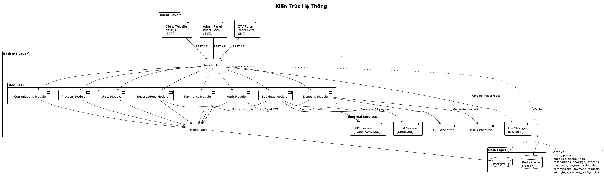
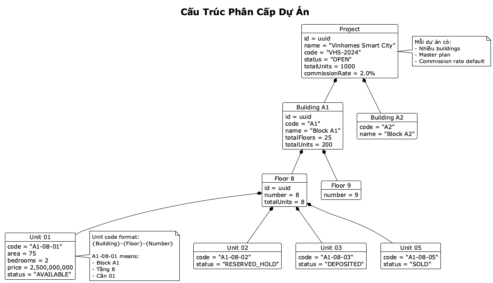

# Tổng quan dự án Batdongsan

## 📋 Thông tin dự án

**Tên dự án:** Batdongsan - Nền tảng quản lý bán nhà & hoa hồng CTV

**Phiên bản:** 1.0.0

**Ngày bắt đầu:** Tháng 10, 2025

**Loại hình:** Nền tảng quản lý inventory bất động sản, assignment CTV, tracking lead & commission

## 🎯 Mục tiêu dự án

### Mục tiêu kinh doanh
1. Quản lý inventory nhà bán của công ty một cách tập trung
2. Hệ thống phân công và tracking Cộng tác viên (CTV) bán hàng
3. Theo dõi lead, tiến độ bán hàng và tính hoa hồng tự động
4. Tối ưu hiệu suất bán hàng và quản lý commission minh bạch

### Mục tiêu kỹ thuật
1. Xây dựng hệ thống monorepo với kiến trúc microservices-ready
2. Tách biệt rõ ràng: Admin panel, CTV portal, Client website
3. API RESTful chuẩn với role-based access control (RBAC)
4. Commission tracking & payment workflow tự động
5. Audit log đầy đủ cho mọi thay đổi quan trọng
6. Performance tốt, scalable, bảo mật cao

## 👥 Stakeholders

### Người dùng chính

**1. Super Admin**
- Quản lý tất cả users (Admin, CTV)
- Cấu hình hệ thống (commission rates, categories)
- Phê duyệt tin đăng (nếu cần moderation)
- Xem toàn bộ báo cáo, analytics

**2. Admin / Agent Nội bộ**
- Đăng tin bán nhà (inventory công ty)
- Chỉnh sửa, xóa tin
- **Gán tin cho CTV** hoặc để CTV đăng ký
- Xem dashboard: tin active, leads, CTV performance
- Xác nhận giao dịch hoàn tất
- Duyệt yêu cầu thanh toán hoa hồng

**3. Cộng tác viên (CTV)**
- Xem danh sách tin được phân hoặc có thể nhận
- **Đăng ký nhận tin** để bán
- **Cập nhật tiến độ lead** (Liên hệ → Xem nhà → Đàm phán → Chốt)
- Chat/ghi chú với khách hàng
- Xem hoa hồng của mình
- **Yêu cầu thanh toán** khi đủ điều kiện
- Upload chứng từ giao dịch

**4. Khách hàng (Public Users)**
- Tìm kiếm nhà bán
- Xem chi tiết tin đăng
- Liên hệ qua form (không cần login)
- Lưu tin yêu thích (optional login)

## 🏗️ Kiến trúc hệ thống

### Tổng quan



### Cấu trúc dự án



### Text version:
```
┌─────────────────────────────────────────────────────────┐
│                    BATDONGSAN PLATFORM                   │
├─────────────────────────────────────────────────────────┤
│                                                           │
│  ┌──────────────┐  ┌──────────────┐  ┌──────────────┐  │
│  │   CLIENT     │  │    ADMIN     │  │   BACKEND    │  │
│  │  (Next.js)   │  │ (React+Vite) │  │   (NestJS)   │  │
│  │              │  │              │  │              │  │
│  │ Port: 3000   │  │ Port: 5173   │  │ Port: 3001   │  │
│  └──────┬───────┘  └──────┬───────┘  └──────┬───────┘  │
│         │                  │                  │          │
│         └──────────────────┴──────────────────┘          │
│                            │                             │
│                    ┌───────▼────────┐                    │
│                    │   REST API     │                    │
│                    │  /api/...      │                    │
│                    └───────┬────────┘                    │
│                            │                             │
│                    ┌───────▼────────┐                    │
│                    │    DATABASE    │                    │
│                    │ SQLite/PgSQL   │                    │
│                    └────────────────┘                    │
│                                                           │
│  ┌──────────────────────────────────────────────────┐   │
│  │            SHARED PACKAGE                        │   │
│  │  Types, Constants, Utils                         │   │
│  └──────────────────────────────────────────────────┘   │
│                                                           │
└─────────────────────────────────────────────────────────┘
```

### Tech Stack

**Backend**
- Framework: NestJS 10
- ORM: Prisma 5
- Database: SQLite (dev) / PostgreSQL (production)
- Authentication: JWT + Passport
- Validation: class-validator

**Admin Panel**
- Framework: React 18
- Build: Vite 5
- UI: Tailwind CSS 3, shadcn/ui, Preline UI
- Routing: React Router 6
- State: React Query

**Client Website**
- Framework: Next.js 14 (App Router)
- UI: Tailwind CSS 3, shadcn/ui
- State: React Query
- SSR/SSG: Next.js features

**Shared**
- Language: TypeScript 5 (strict mode)
- Monorepo: Turborepo
- Package Manager: npm workspaces

## 📊 Scope dự án

### Phase 1 - MVP (Current)

**Core Features:**
- ✅ Authentication & Authorization (4 roles: SUPER_ADMIN, ADMIN, CTV, USER)
- ✅ Property Management (CRUD - chỉ Admin/Super Admin)
- ✅ **Property Assignment** (Admin gán tin cho CTV)
- ✅ **CTV Registration** (CTV đăng ký nhận tin)
- ✅ **Lead Management** (CTV cập nhật trạng thái lead)
- ✅ **Commission Tracking** (custom % per property)
- ✅ **Payment Request** (CTV yêu cầu, Admin duyệt)
- ✅ Category & Amenity Management
- ✅ Property Search & Filter (public)
- ✅ Audit Log cơ bản

**Admin Panel:**
- ✅ Dashboard: tin active, leads, CTV performance
- ✅ CRUD bất động sản (với commission %)
- ✅ Gán/Quản lý CTV assignments
- ✅ Xem & cập nhật leads
- ✅ Xác nhận giao dịch hoàn tất
- ✅ Duyệt payment requests
- ✅ Quản lý users & categories

**CTV Portal:**
- ✅ Dashboard: tin được gán, tin có thể nhận
- ✅ Đăng ký nhận tin bán
- ✅ Quản lý leads của mình
- ✅ Cập nhật trạng thái lead (chat/notes)
- ✅ Xem hoa hồng & lịch sử
- ✅ Tạo payment request

**Client Website:**
- ✅ Trang chủ (featured properties)
- ✅ Danh sách nhà bán
- ✅ Chi tiết tin (ảnh, map, specs)
- ✅ Tìm kiếm & bộ lọc mạnh
- ✅ Liên hệ (form → tạo lead)

### Phase 2 - Enhancement (Future)

**Advanced Features:**
- 📋 Hệ thống duyệt tin (moderation + spam detection)
- 📋 Tích hợp Google Maps / Mapbox (interactive map)
- 📋 Email & Push notifications (new assignment, lead updates)
- 📋 Hợp đồng điện tử & chữ ký số
- 📋 Ví điện tử tích hợp cho CTV
- 📋 Referral system & lead source tracking
- 📋 Elasticsearch full-text search
- 📋 Video virtual tours
- 📋 Multi-language support

**Admin Panel:**
- 📋 Advanced analytics & reports
- 📋 Revenue forecasting
- 📋 CTV performance ranking
- 📋 Automated commission calculation rules
- 📋 Bulk operations (import/export)

**CTV Portal:**
- 📋 Mobile app (React Native)
- 📋 Real-time chat với khách
- 📋 Calendar appointment booking
- 📋 Document e-signing

**Client Website:**
- 📋 Property comparison tool
- 📋 Mortgage calculator
- 📋 Saved searches & alerts
- 📋 3D virtual tours

### Phase 3 - Enterprise (Future)

**Enterprise Features:**
- 📋 Multi-language support
- 📋 Multi-currency
- 📋 White-label solution
- 📋 API for third-party integration
- 📋 Advanced SEO optimization
- 📋 Mobile-first PWA

## 🎨 Design Principles

### UI/UX
1. **Consistency**: Tất cả trang phải dùng component library chuẩn
2. **Responsive**: Mobile-first approach
3. **Accessibility**: WCAG 2.1 Level AA
4. **Performance**: Page load < 3s, FCP < 1.5s
5. **Modern**: Clean, minimal, professional design

### Code Quality
1. **Type Safety**: TypeScript strict mode, no `any` type
2. **Modularity**: Component-based architecture
3. **Reusability**: Shared package cho common code
4. **Testing**: Unit tests cho business logic
5. **Documentation**: Code comments, README files

### Security
1. **Authentication**: JWT với refresh token
2. **Authorization**: Role-based access control (RBAC)
3. **Input Validation**: Validate tất cả input từ client
4. **SQL Injection**: Prisma ORM ngăn chặn
5. **XSS Protection**: Sanitize output
6. **CORS**: Whitelist allowed origins

## 📈 Success Metrics

### Technical KPIs
- API Response Time: < 200ms (p95)
- Page Load Time: < 3s
- Uptime: > 99.5%
- Error Rate: < 0.1%
- Test Coverage: > 80%

### Business KPIs
- Monthly Active Users (MAU)
- Property Listings Count
- Search Conversion Rate
- User Engagement Rate
- Property View to Contact Ratio

## 🗓️ Timeline (Estimate)

| Phase | Duration | Deliverables |
|-------|----------|--------------|
| **Planning & BA** | 1 week | BA Documents, Design mockups |
| **MVP Development** | 6-8 weeks | Core features, Admin, Client |
| **Testing & QA** | 2 weeks | Bug fixes, Performance tuning |
| **Deployment** | 1 week | Production setup, Go-live |
| **Phase 2** | 8-10 weeks | Advanced features |

## 📄 Tài liệu liên quan

1. [Business Requirements](./01-BUSINESS-REQUIREMENTS.md)
2. [Functional Requirements](./02-FUNCTIONAL-REQUIREMENTS.md)
3. [User Stories](./03-USER-STORIES.md)
4. [Database Design](./04-DATABASE-DESIGN.md)
5. [API Specifications](./05-API-SPECIFICATIONS.md)
6. [UI/UX Requirements](./06-UI-UX-REQUIREMENTS.md)
7. [Technical Architecture](./07-TECHNICAL-ARCHITECTURE.md)
8. [Testing Strategy](./08-TESTING-STRATEGY.md)
9. [Deployment Guide](./09-DEPLOYMENT-GUIDE.md)

## 📞 Liên hệ

**Project Manager:** TBD
**Tech Lead:** TBD
**Business Analyst:** TBD

---

**Document Version:** 1.0  
**Last Updated:** October 2025  
**Status:** Draft

