# Functional Requirements Document (FRD)

## 📋 Thông tin

**Dự án:** Batdongsan - Hệ thống Bán Căn Hộ  
**Phiên bản:** 3.0  
**Purpose:** Chi tiết TỪNG tính năng với use cases, validation, rules

---

> **Lưu ý:** File này chứa CHI TIẾT use cases, validation rules cho developers.  
> Sơ đồ (activity diagrams, sequence diagrams) → Xem [DIAGRAMS.md](./DIAGRAMS.md)

---

## MODULE 1: AUTHENTICATION

### FR-AUTH-001: Đăng ký bằng SĐT + OTP

**Actors:** Guest (CTV chưa có tài khoản)

**Preconditions:**
- SĐT chưa được đăng ký
- Có kết nối internet

**Main Flow:**
1. User nhập SĐT
2. System validate SĐT (format Việt Nam, chưa tồn tại)
3. System gửi OTP (6 số) qua SMS
4. System tạo OTP record (expiresAt = now() + 5 phút)
5. User nhập OTP
6. System verify OTP (code match, chưa expire, attempts < 3)
7. User nhập: Họ tên, Mật khẩu
8. System validate: fullName >= 2 chars, password >= 6 chars
9. System hash password (bcrypt)
10. System create User (role = CTV, isActive = true)
11. System generate JWT token
12. Response: user + accessToken
13. Auto redirect → Dashboard

**Validation Rules:**
- **SĐT:**
  - Format: `0[3|5|7|8|9][0-9]{8}` (VN mobile)
  - Unique trong DB
  - Length: 10 digits
  
- **OTP:**
  - Length: 6 digits
  - Expires: 5 phút
  - Max attempts: 3 lần
  - Resend cooldown: 60 giây
  - Rate limit: 3 OTP/giờ/SĐT

- **Họ tên:**
  - Min: 2 chars
  - Max: 100 chars
  - Không chứa ký tự đặc biệt (chỉ chữ, số, khoảng trắng)

- **Mật khẩu:**
  - Min: 6 chars
  - Max: 50 chars
  - Required: Chữ + số (recommended)

**Alternative Flows:**

**A1: OTP sai**
- User nhập sai OTP
- System tăng attempts += 1
- If attempts >= 3 → Block OTP này, yêu cầu resend
- Show error: "OTP không đúng, còn X lần thử"

**A2: OTP hết hạn**
- User nhập OTP sau 5 phút
- System check: expiresAt < now()
- Show error: "OTP đã hết hạn, vui lòng gửi lại"
- Button "Gửi lại OTP"

**A3: SĐT đã tồn tại**
- System check: User với SĐT này exists
- Show error: "SĐT đã được đăng ký, vui lòng đăng nhập"
- Link to Login page

**Error Responses:**
```json
// SĐT đã tồn tại
{
  "statusCode": 409,
  "message": "Phone number already exists",
  "error": "Conflict"
}

// OTP sai
{
  "statusCode": 400,
  "message": "Invalid OTP. 2 attempts remaining",
  "error": "Bad Request"
}

// OTP hết hạn
{
  "statusCode": 400,
  "message": "OTP expired. Please request a new one",
  "error": "Bad Request"
}
```

**Sequence Diagram:**

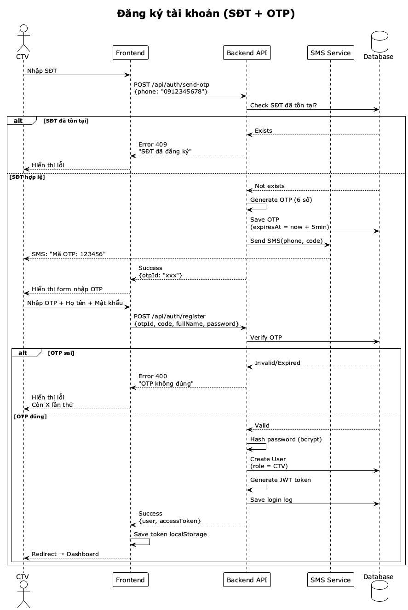

**OTP Validation Activity:**

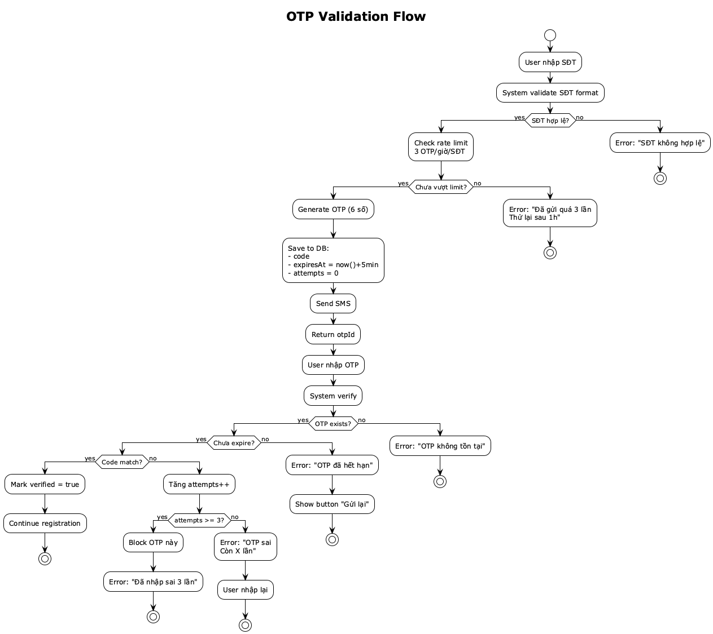

**BPMN - Quy Trình Giữ Chỗ (Overview):**

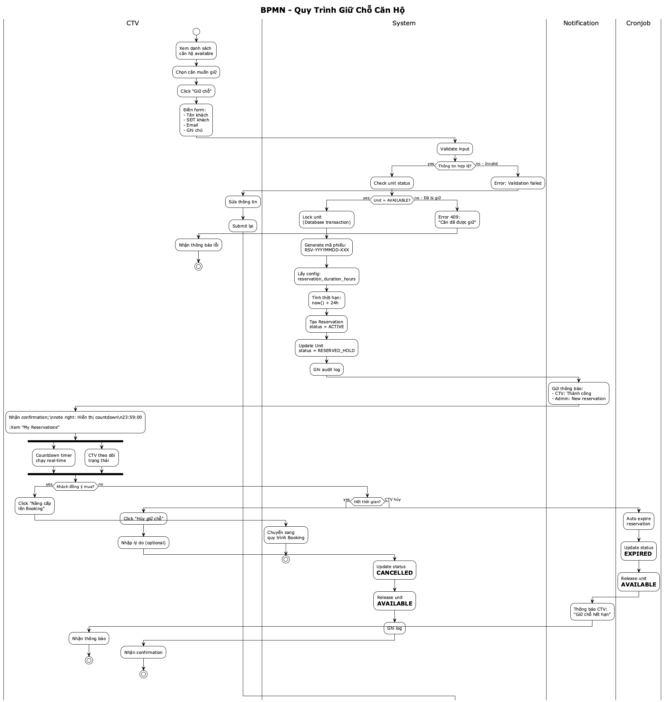

---

### FR-AUTH-002: Đăng nhập CTV (SĐT + OTP + Password)

**Actors:** CTV đã có tài khoản

**Main Flow:**
1. User nhập SĐT
2. System check: SĐT tồn tại?
3. System gửi OTP
4. User nhập OTP + Mật khẩu
5. System verify OTP
6. System verify password (bcrypt compare)
7. System generate JWT token
8. System log login (IP, device, timestamp)
9. Response: user + accessToken

**Alternative Flows:**

**A1: SĐT không tồn tại**
- Show error: "SĐT chưa đăng ký"
- Link to Register

**A2: Password sai**
- Show error: "Mật khẩu không đúng"
- Link "Quên mật khẩu?"

**A3: Account bị khóa**
- If user.isActive = false
- Show error: "Tài khoản đã bị khóa, liên hệ admin"

---

### FR-AUTH-003: Đăng nhập Admin (Email + Password)

**Actors:** Admin/Super Admin

**Main Flow:**
1. Admin nhập Email + Password
2. System validate email format
3. System find user by email với role = ADMIN/SUPER_ADMIN
4. System verify password
5. System generate JWT token
6. System log login
7. Response: user + accessToken

**Validation:**
- Email: Valid format
- Password: Required
- Role: Phải là ADMIN hoặc SUPER_ADMIN

**No OTP:** Admin không dùng OTP (traditional login)

---

### FR-AUTH-004: Quên mật khẩu (Reset qua OTP)

**Actors:** CTV/User

**Main Flow:**
1. User click "Quên mật khẩu"
2. Nhập SĐT
3. System gửi OTP
4. User nhập OTP
5. System verify OTP
6. User nhập mật khẩu mới (2 lần)
7. System validate: match, >= 6 chars
8. System hash & update password
9. System invalidate all existing tokens (logout all devices)
10. Success message → Redirect to Login

---

## MODULE 2: PROFILE MANAGEMENT

### FR-PROF-001: CTV xem & edit profile

**Actors:** CTV

**View:**
- GET /api/users/me
- Response: id, phone, fullName, avatar, role, createdAt

**Edit:**
- PATCH /api/users/me
- Editable: fullName, avatar
- **Không edit được:** phone, role

**Validation:**
- fullName: 2-100 chars
- avatar: Valid URL, max 500 chars

---

### FR-PROF-002: Admin quản lý users

**Actors:** Admin, Super Admin

**List users:**
- GET /api/users?role=CTV&status=active&page=1
- Filter: role, isActive, createdAt
- Search: fullName, phone, email
- Sort: createdAt DESC, fullName ASC

**View user detail:**
- GET /api/users/:id
- Include: profile + stats (số transaction, commission)

**Edit user:**
- PATCH /api/users/:id
- Admin có thể edit: fullName, role, isActive
- Super Admin có thể edit: anything

**Reset password:**
- POST /api/users/:id/reset-password
- Admin set new password for user
- Send SMS notification to user

---

## MODULE 3: PROJECT MANAGEMENT

### FR-PROJ-001: CRUD Projects

**Create Project:**

**Actors:** Admin, Super Admin

**Request:**
```json
POST /api/projects
{
  "name": "Vinhomes Smart City",
  "code": "VHS-2024",
  "status": "UPCOMING",
  "developer": "Vingroup",
  "location": "Nam Từ Liêm, Hà Nội",
  "address": "Đại lộ Thăng Long",
  "district": "Nam Từ Liêm",
  "city": "Hà Nội",
  "latitude": 21.028,
  "longitude": 105.804,
  "totalArea": 100000,
  "totalBuildings": 10,
  "totalUnits": 1000,
  "priceFrom": 2000000000,
  "priceTo": 5000000000,
  "description": "Mô tả dự án...",
  "amenities": ["Hồ bơi", "Gym", "Công viên"],
  "images": ["url1", "url2"],
  "masterPlan": "master-plan.jpg",
  "floorPlan": "floor-plan.jpg",
  "openDate": "2025-01-01",
  "commissionRate": 2.0
}
```

**Validation:**
- name: 5-200 chars, required
- code: 3-20 chars, unique, uppercase, required
- status: enum, required
- developer: required
- location, address, district, city: required
- commissionRate: 0.1-10.0 (%)
- priceFrom <= priceTo
- totalUnits > 0

**Business Rules:**
- Code unique globally
- Cannot delete project nếu có units với status != AVAILABLE
- Change status OPEN → CLOSED: Confirm dialog (warning về units đang giữ/cọc)

---

### FR-PROJ-002: Update project status

**Flow:**
```
UPCOMING → OPEN → CLOSED
```

**Rules:**
- UPCOMING → OPEN: Cho phép bất kỳ lúc nào
- OPEN → CLOSED: 
  - Warning nếu còn units RESERVED/DEPOSITED
  - Require confirmation
  - Auto release tất cả reservations
- Cannot revert CLOSED → OPEN

---

## MODULE 4: BUILDING/FLOOR/UNIT MANAGEMENT

### FR-UNIT-001: Bulk Import Units

**Actors:** Admin

**Flow:**
1. Admin download Excel template
2. Fill data:
```
| Building | Floor | Unit | Type | Area | Bedrooms | Bathrooms | Price | Direction | ... |
|----------|-------|------|------|------|----------|-----------|-------|-----------|-----|
| A1       | 8     | 01   | 2PN  | 75   | 2        | 2         | 2.5tỷ | Đông Nam  | ... |
| A1       | 8     | 02   | 2PN  | 80   | 2        | 2         | 2.7tỷ | Nam       | ... |
```
3. Upload Excel
4. System parse & validate
5. System preview: Show table với data + auto-generated codes
6. Admin review & confirm
7. System create records:
   - Buildings (if not exists)
   - Floors (if not exists)
   - Units với codes (A1-08-01, A1-08-02...)
8. Show success: "Đã import 200 căn"

**Validation:**
- Building code: 2-10 chars
- Floor number: 1-99
- Unit number: 01-99 (zero-padded)
- Price: > 0
- Area: > 0
- All required fields present

**Error Handling:**
- Row có lỗi → Show row number + error message
- Có thể skip row lỗi hoặc cancel toàn bộ
- Transaction: All or nothing (nếu 1 row lỗi → không import gì)

**Activity Diagram:**

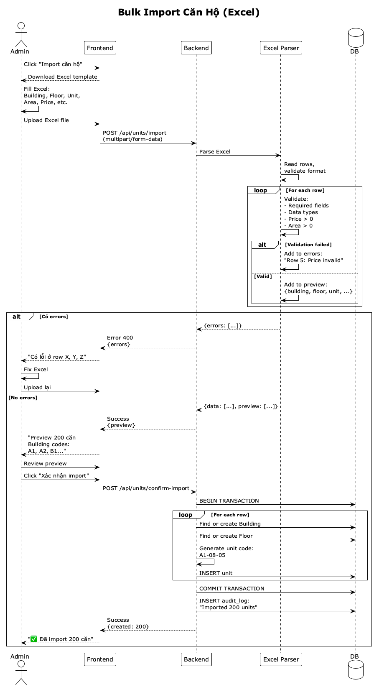

**BPMN - Admin Quản Lý Units:**

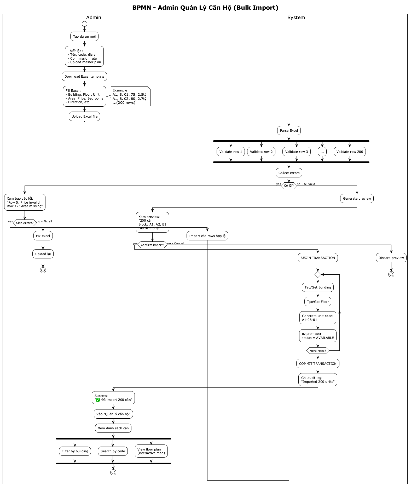

---

### FR-UNIT-002: Search & Filter Units

**Endpoint:** GET /api/units

**Filters:**
- projectId (required hoặc optional)
- buildingId
- floorId
- status: AVAILABLE, RESERVED_*, DEPOSITED, SOLD
- priceMin, priceMax
- areaMin, areaMax
- bedrooms
- bathrooms
- unitType (Studio, 1PN, 2PN...)
- direction

**Search:**
- code (exact match: A1-08-05)
- Fuzzy search: building + floor + unit number

**Sort:**
- price ASC/DESC
- area ASC/DESC
- code ASC
- createdAt DESC

**Response:**
```json
{
  "data": [
    {
      "id": "uuid",
      "code": "A1-08-05",
      "status": "AVAILABLE",
      "price": 2500000000,
      "area": 75,
      "bedrooms": 2,
      "bathrooms": 2,
      "building": { "name": "Block A1" },
      "floor": { "number": 8 },
      "project": { "name": "Vinhomes SC" }
    }
  ],
  "meta": {
    "total": 1000,
    "available": 650,
    "reserved": 100,
    "deposited": 150,
    "sold": 100
  }
}
```

---

## MODULE 5: RESERVATION (Giữ Chỗ)

### ⚠️ BUSINESS LOGIC QUAN TRỌNG:
1. Giữ chỗ chỉ cho căn **UPCOMING** (sắp mở bán)
2. **NHIỀU CTV có thể giữ chỗ CÙNG 1 căn** (không độc quyền)
3. Có **queue/priority** theo thứ tự tạo (first-come-first-served)
4. Khi project **OPEN** → CTV theo thứ tự được quyền đặt cọc
5. CTV không đặt cọc khi đến lượt → Status = MISSED → Chuyển sang CTV tiếp theo

### FR-RSV-001: Tạo phiếu giữ chỗ

**Actors:** CTV

**Preconditions:**
- CTV đã login
- Unit status = AVAILABLE
- Project status = **UPCOMING** (chưa mở bán)

**Main Flow:**
1. CTV xem unit detail (Project status = UPCOMING)
2. CTV click "Giữ chỗ"
3. System show form:
   ```
   Tên khách hàng: [_____]
   SĐT:            [_____]
   Email:          [_____] (optional)
   Ghi chú:        [_____]
   
   ⚠️ Lưu ý: Nhiều CTV có thể giữ chỗ cùng 1 căn.
   Bạn sẽ được xếp hàng theo thứ tự.
   Khi dự án mở bán, bạn sẽ được thông báo khi đến lượt.
   
   [Hủy] [Xác nhận Giữ Chỗ]
   ```
4. CTV điền & submit
5. System validate input
6. System check: 
   - Project status = UPCOMING? ✅
   - Unit status = AVAILABLE? ✅
7. System count existing ACTIVE reservations for this unit
8. System create Reservation:
   - Generate code: RSV-YYYYMMDD-XXX
   - status = ACTIVE
   - **priority = count + 1** (thứ tự trong queue)
   - reservedUntil = project.openDate (hết hạn khi dự án mở bán)
   - extendCount = 0
9. System **KHÔNG** update Unit status (vẫn = AVAILABLE, cho phép CTV khác giữ chỗ)
10. System send notification: 
    - CTV: "Giữ chỗ thành công! Bạn đang ở vị trí #X trong hàng chờ"
    - Admin: "CTV X đã giữ chỗ căn Y (Queue: Z người)"
11. System create audit log
12. Response: Reservation object with queue position
13. Show success: "Bạn đang ở vị trí #X trong hàng chờ. Sẽ thông báo khi đến lượt."

**Validation:**
- customerName: 2-100 chars, required
- customerPhone: VN phone format, required
- customerEmail: valid email or empty
- notes: max 1000 chars

**Business Rules:**
- Reservation code format: `RSV-{YYYYMMDD}-{counter}`
  - Counter reset về 001 mỗi ngày
- Chỉ CTV role mới được tạo
- 1 CTV có thể có nhiều reservations active
- 1 Unit chỉ có 1 reservation active

**Error Cases:**

```typescript
// Project không phải UPCOMING
{
  statusCode: 400,
  message: "Chỉ có thể giữ chỗ cho dự án UPCOMING (sắp mở bán)",
  error: "Bad Request"
}

// Unit không available
{
  statusCode: 400,
  message: "Căn này đã có người đặt cọc (status: DEPOSITED)",
  error: "Bad Request"
}

// CTV đã giữ chỗ căn này rồi
{
  statusCode: 409,
  message: "Bạn đã giữ chỗ căn này rồi",
  error: "Conflict"
}
```

**Sequence Diagram:**

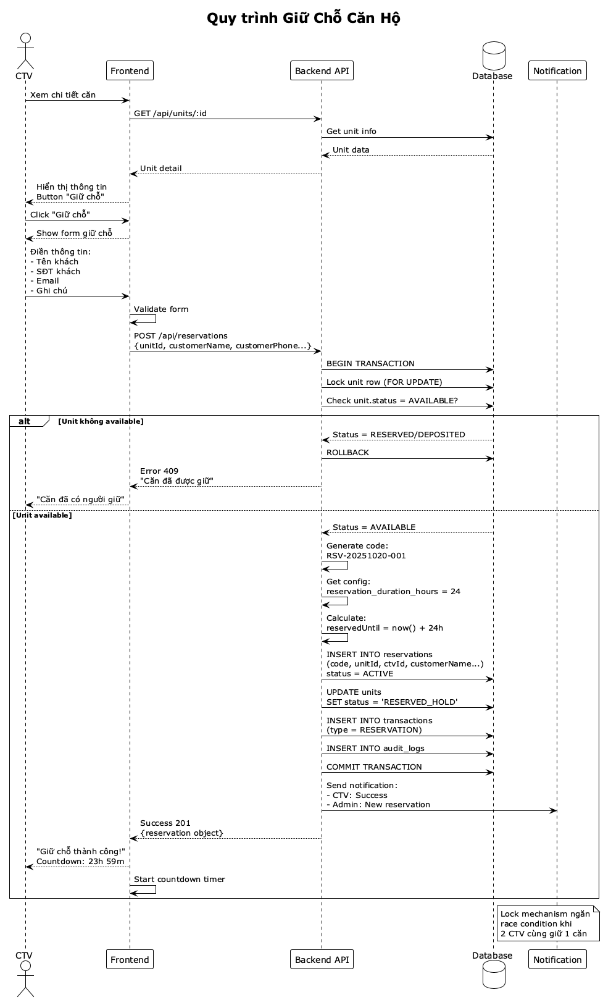

**Race Condition Prevention:**

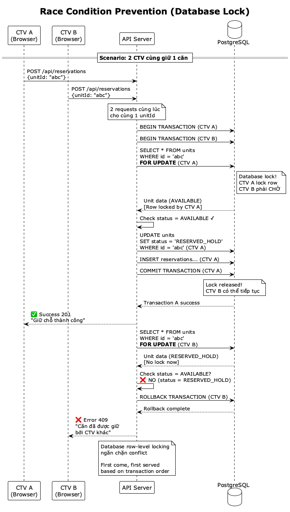

---

### FR-RSV-002: Gia hạn reservation

**Actors:** CTV (owner)

**Preconditions:**
- Reservation status = ACTIVE
- Chưa expire
- extendCount < maxExtends (config, default 1)

**Main Flow:**
1. CTV view "My Reservations"
2. See countdown timer
3. If remaining < 2h → Show "Gia hạn" button
4. CTV click "Gia hạn"
5. System check: extendCount < 1?
6. System update:
   - reservedUntil += 24h
   - extendCount += 1
7. System notification
8. Show new countdown

**Validation:**
- Can only extend when < 2h remaining
- Max 1 extend

**Error:**
```json
{
  "statusCode": 403,
  "message": "Đã hết lượt gia hạn",
  "error": "Forbidden"
}
```

---

### FR-RSV-003: Hủy reservation

**Actors:** CTV (owner), Admin

**Main Flow:**
1. User click "Hủy giữ chỗ"
2. System show confirm dialog: "Lý do hủy (optional)"
3. User confirm
4. System update:
   - reservation.status = CANCELLED
   - reservation.cancelledBy = userId
   - reservation.cancelledReason = reason
   - unit.status = AVAILABLE
5. System notification
6. System audit log

**Rules:**
- CTV chỉ hủy reservation của mình
- Admin hủy được tất cả
- No penalty khi hủy

---

### FR-RSV-004: Auto expire reservation (Cronjob)

**Trigger:** Cronjob mỗi 15 phút

**Flow:**
```sql
-- Find expired reservations
SELECT id, unitId, ctvId FROM reservations
WHERE status = 'ACTIVE' AND reservedUntil < NOW();

-- For each:
UPDATE reservations SET status = 'EXPIRED' WHERE id = :id;
UPDATE units SET status = 'AVAILABLE' WHERE id = :unitId;
-- Send notification to CTV
-- Create audit log
```

**Activity Diagram:**

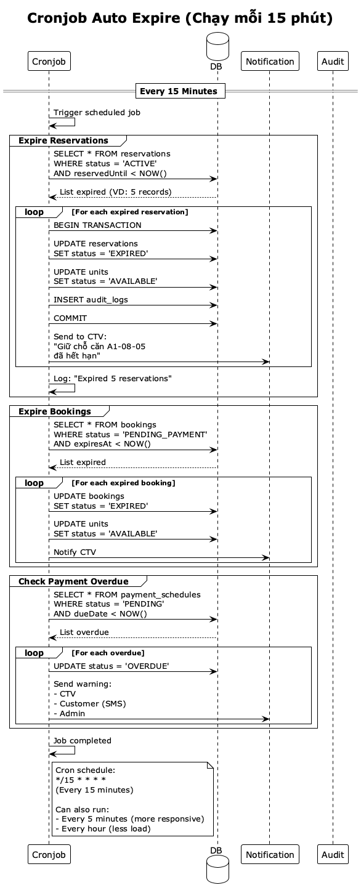

---

### FR-RSV-005: Queue Processing - Khi Project chuyển OPEN

**Trigger:** Admin thay đổi Project status: UPCOMING → OPEN

**Auto Flow:**
1. System find all units with status = AVAILABLE trong project
2. For each unit:
   ```sql
   SELECT * FROM reservations
   WHERE unitId = 'unit-id'
     AND status = 'ACTIVE'
   ORDER BY priority ASC, createdAt ASC
   LIMIT 1;
   ```
3. Get first CTV in queue (priority = 1)
4. System update reservation:
   - status = YOUR_TURN
   - notifiedAt = now()
   - depositDeadline = now() + config.your_turn_deadline (VD: 48h)
5. System send notification:
   - SMS/Push: "Dự án X đã mở bán! Đến lượt bạn đặt cọc căn Y. Hạn: DD/MM/YYYY HH:MM"
   - Email với link trực tiếp đến form đặt cọc
6. CTV có X giờ (config) để:
   - **Option A:** Đặt cọc → Create Deposit → reservation.status = COMPLETED
   - **Option B:** Không action → Auto status = MISSED sau X giờ
7. If MISSED → Move to next CTV in queue (priority = 2)
8. Repeat until:
   - Có CTV đặt cọc thành công, HOẶC
   - Hết queue (tất cả MISSED/CANCELLED)

**Cronjob:**
- Chạy mỗi 15 phút
- Check reservations với status = YOUR_TURN và depositDeadline < NOW()
- Update status = MISSED
- Trigger next CTV in queue

---

### FR-RSV-006: CTV đặt cọc khi đến lượt

**Actors:** CTV (có reservation status = YOUR_TURN)

**Preconditions:**
- Reservation status = YOUR_TURN
- depositDeadline chưa quá hạn

**Main Flow:**
1. CTV nhận notification "Đến lượt bạn!"
2. CTV click link → Redirect to "Đặt cọc" form (pre-filled)
3. CTV điền đầy đủ thông tin + upload chứng từ
4. Submit → Create Deposit (See FR-DEP-001)
5. System update:
   - reservation.status = COMPLETED
   - unit.status = DEPOSITED
   - Các reservation khác của unit → status = MISSED
6. Notification: "Bạn đã đặt cọc thành công!"

**Alternative Flow:**
- CTV không đặt cọc trong thời hạn
- Cronjob auto: reservation.status = MISSED
- System move to next CTV

---

## MODULE 6: BOOKING (Đặt chỗ có thanh toán)

### FR-BOK-001: Tạo phiếu Booking

**Actors:** CTV, Admin

**Preconditions:**
- Unit status = AVAILABLE hoặc có Reservation ACTIVE của CTV
- Project status = OPEN

**Main Flow:**
1. CTV click "Tạo Booking" (hoặc upgrade từ Reservation)
2. System show form:
   ```
   === Thông tin khách hàng ===
   Họ tên: [_____]
   SĐT:    [_____]
   Email:  [_____]
   CMND:   [_____] (bắt buộc)
   Địa chỉ: [_____]
   
   === Thanh toán ===
   Số tiền booking: 10,000,000 VNĐ (readonly, from config)
   Phương thức: [Chuyển khoản ▼]
   
   [Hiển thị QR Code]
   
   Upload chứng từ: [Chọn file...]
   
   [Hủy] [Xác nhận]
   ```
3. CTV điền form & upload chứng từ
4. System validate
5. System generate booking code: BOK-YYYYMMDD-XXX
6. System create Booking:
   - status = PENDING_APPROVAL
   - bookingAmount = config value
   - expiresAt = now() + 48h
7. System update Unit status = RESERVED_BOOKING
8. If có Reservation → Update reservation.status = UPGRADED
9. System send notification: CTV (success), Admin (cần duyệt)
10. System create audit log
11. Response: Booking object
12. Show success + "Chờ admin duyệt"

**Validation:**
- customerName: 2-100 chars, required
- customerPhone: VN format, required
- customerIdCard: 9 or 12 digits (CMND/CCCD)
- customerAddress: 10-500 chars, required
- paymentProof: Min 1 file, max 5 files, each < 5MB

**Business Rules:**
- Booking code format: `BOK-{YYYYMMDD}-{counter}`
- bookingAmount lấy từ SystemConfig (key: `booking_amount`)
- Nếu không upload chứng từ → Status = PENDING_PAYMENT
- Có upload → Status = PENDING_APPROVAL

**Error Cases:**
```json
// Thiếu chứng từ
{
  "statusCode": 400,
  "message": "Vui lòng upload chứng từ thanh toán",
  "error": "Bad Request"
}

// Unit đã bị booking
{
  "statusCode": 409,
  "message": "Căn đã có booking khác đang chờ duyệt",
  "error": "Conflict"
}
```

---

### FR-BOK-002: Admin duyệt Booking

**Actors:** Admin, Super Admin

**Main Flow:**
1. Admin vào "Quản lý Booking"
2. Filter: status = PENDING_APPROVAL
3. Click view booking detail
4. Review: Thông tin khách, chứng từ thanh toán
5. Admin click "Duyệt" hoặc "Từ chối"

**If Duyệt:**
6. System update:
   - booking.status = CONFIRMED
   - booking.approvedBy = adminId
   - booking.approvedAt = now()
7. Unit status vẫn = RESERVED_BOOKING
8. Send notification: CTV, Customer (SMS)
9. CTV có thể upgrade lên Cọc

**If Từ chối:**
6. Admin nhập lý do
7. System update:
   - booking.status = CANCELLED
   - booking.cancelledReason = reason
   - unit.status = AVAILABLE
8. Refund logic (if already paid)
9. Send notification: CTV, Customer

**Sequence Diagram:**

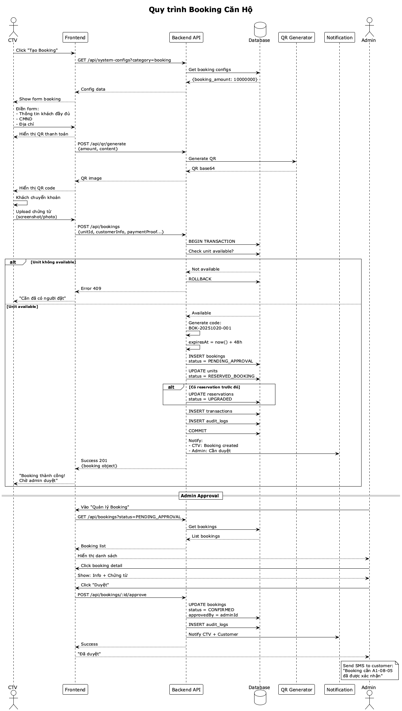

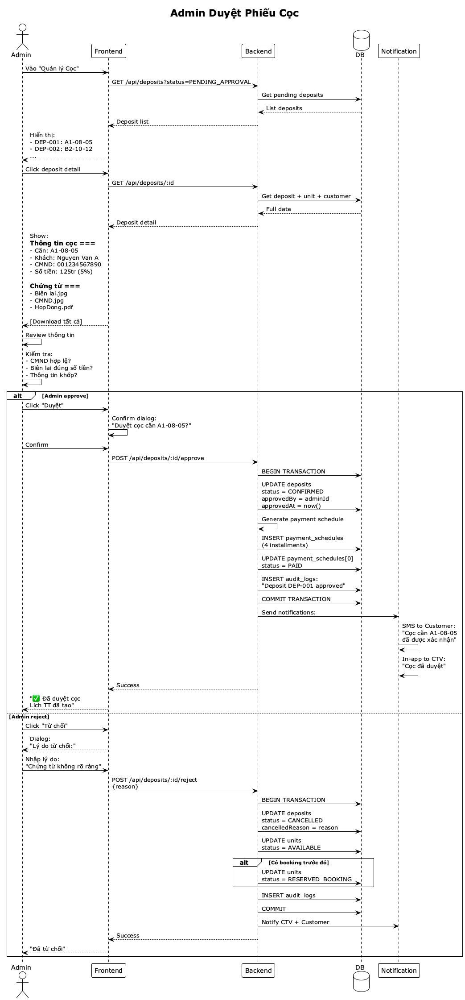

---

### FR-BOK-003: Hủy Booking

**Actors:** CTV (owner), Admin

**Cancellation Rules:**

**CTV tự hủy:**
- Chỉ hủy được booking của mình
- Nếu status = PENDING_* → Hủy free
- Nếu status = CONFIRMED → Apply penalty

**Penalty Logic:**
```typescript
if (booking.status === 'CONFIRMED') {
  refundAmount = booking.bookingAmount × config.booking_refund_percentage / 100;
  // VD: 10,000,000 × 50% = 5,000,000 hoàn lại
} else {
  refundAmount = booking.bookingAmount; // Full refund
}
```

**Flow:**
1. Click "Hủy booking"
2. System show confirm:
   ```
   Bạn có chắc muốn hủy?
   Số tiền hoàn lại: 5,000,000 VNĐ (50%)
   Lý do (bắt buộc): [_____]
   [Không] [Xác nhận hủy]
   ```
3. User confirm
4. System update booking.status = CANCELLED
5. System update unit.status = AVAILABLE
6. System create refund record (if applicable)
7. Notification + Audit log

---

### FR-BOK-004: Export Booking PDF

**Flow:**
1. CTV/Admin click "Xuất phiếu"
2. System generate PDF từ template:
   - Header: Logo, company info
   - Mã booking: BOK-xxx
   - Thông tin dự án, căn hộ
   - Thông tin khách hàng
   - Số tiền booking, QR code
   - Thời hạn
   - Footer: Điều khoản
3. System save PDF to storage
4. Return PDF URL → Download

**Template PDF (Customizable):**

**Admin có thể:**
- Upload template PDF mới
- Customize: Logo, màu sắc, font
- Edit text, điều khoản
- Set variables position

**Template structure:**
```
┌──────────────────────────────────────────┐
│ {{logo}}        PHIẾU BOOKING            │
│                 Mã: {{bookingCode}}      │
├──────────────────────────────────────────┤
│ Dự án: {{projectName}}                   │
│ Căn hộ: {{unitCode}} • {{area}}m² • {{beds}}PN │
│ Giá: {{price}} VNĐ                       │
│                                          │
│ Khách hàng: {{customerName}}             │
│ SĐT: {{customerPhone}}                   │
│ CMND: {{customerIdCard}}                 │
│                                          │
│ Số tiền booking: {{bookingAmount}} VNĐ   │
│ {{qrCode}}                               │
│                                          │
│ Thông tin chuyển khoản:                  │
│ STK: {{bankAccount}}                     │
│ Ngân hàng: {{bankName}}                  │
│ Nội dung: {{transferContent}}            │
│                                          │
│ Thời hạn: {{expiresAt}}                  │
│                                          │
│ CTV: {{ctvName}} • {{ctvPhone}}          │
│ Ngày tạo: {{createdAt}}                  │
│                                          │
│ {{terms_and_conditions}}                 │
│ {{company_signature_section}}            │
└──────────────────────────────────────────┘
```

**PDF Templates table:**
```typescript
model PdfTemplate {
  id: uuid;
  type: 'RESERVATION' | 'BOOKING' | 'DEPOSIT_CONTRACT';
  name: string;                // "Mẫu booking V1"
  templateUrl: string;         // Upload HTML/PDF template
  variables: json;             // List variables: {name, type, description}
  isDefault: boolean;
  isActive: boolean;
  createdAt: DateTime;
  updatedAt: DateTime;
}
```

---

## MODULE 7: DEPOSIT (Cọc chính thức)

### FR-DEP-001: Tạo phiếu cọc

**Actors:** CTV, Admin

**Preconditions:**
- Unit AVAILABLE hoặc có Booking CONFIRMED
- CTV có quyền (nếu upgrade từ booking của mình)

**Main Flow:**
1. CTV click "Tạo cọc" (hoặc upgrade từ Booking)
2. System show form (pre-filled nếu có booking):
   ```
   === Thông tin khách ===
   Tất cả fields bắt buộc
   
   === Cọc ===
   Giá căn: 2,500,000,000 VNĐ
   % cọc min: 5% (125,000,000 VNĐ)
   
   Số tiền cọc: [___________] VNĐ
   (Tối thiểu 125,000,000 VNĐ)
   
   Phương thức: [Chuyển khoản ▼]
   
   === Upload giấy tờ ===
   CMND/CCCD:     [Upload...]
   Biên lai:      [Upload...]
   Hợp đồng ký:   [Upload...] (optional, admin sẽ gen)
   
   [Hủy] [Tạo cọc]
   ```
3. System validate
4. System generate:
   - Deposit code: DEP-YYYYMMDD-XXX
   - Contract PDF (template + data)
5. System create Deposit (status = PENDING_APPROVAL)
6. System update Unit status = DEPOSITED
7. If có Booking → booking.status = UPGRADED
8. System create Payment Schedule:
   ```
   Đợt 1: Cọc - 5% - Đã thanh toán
   Đợt 2: 30% - Hạn: 30 days from now
   Đợt 3: 30% - Hạn: 60 days
   Đợt 4: 35% - Khi bàn giao
   ```
9. Notification: CTV, Admin, Customer (SMS)
10. Audit log
11. Response: Deposit + Contract URL
12. Show success + payment schedule

**Validation:**
- depositAmount >= unit.price × config.deposit_min_percentage / 100
- depositAmount <= unit.price
- customerIdCard: 9 or 12 digits
- paymentProof: Min 1 file uploaded

**Business Rules:**
- Deposit code: `DEP-{YYYYMMDD}-{counter}`
- Contract template: PDF với placeholder variables
- Payment schedule: Auto generate based on config
- Admin must approve deposit

**Contract Generation:**
```typescript
// Template variables
{
  projectName: string,
  unitCode: string,
  customerName: string,
  customerIdCard: string,
  customerAddress: string,
  unitPrice: number,
  depositAmount: number,
  depositDate: Date,
  paymentSchedule: Array<{installment, amount, dueDate}>,
  ctvName: string,
  companyName: string,
  companyAddress: string
}

// Replace in template.pdf
// Save as: deposits/{depositId}/contract.pdf
// Return URL
```

**PDF Generation Flow:**

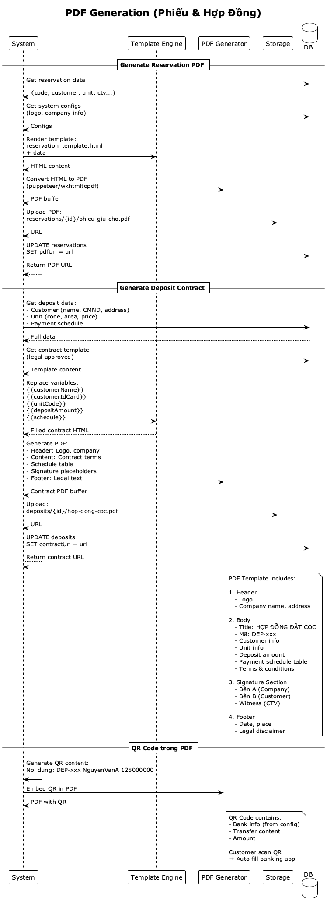

**BPMN - Complete Flow (Booking → Deposit → Sold):**

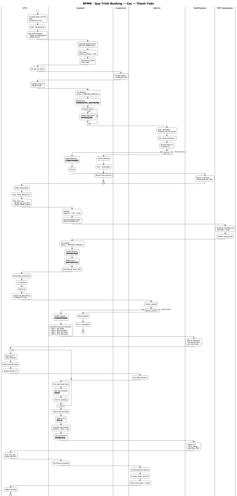

---

### FR-DEP-002: Admin duyệt Deposit

**Actors:** Admin, Super Admin

**Flow:**
1. Admin view "Quản lý Cọc"
2. Filter: PENDING_APPROVAL
3. Click view deposit detail
4. Review: Customer info, proof documents, contract
5. Download & check documents
6. Admin decide: Duyệt hoặc Từ chối

**If Duyệt:**
6. Click "Duyệt"
7. System update:
   - deposit.status = CONFIRMED
   - deposit.approvedBy = adminId
   - deposit.approvedAt = now()
8. Payment schedule activated
9. Send notification: CTV, Customer
10. Audit log

**If Từ chối:**
6. Admin nhập lý do
7. System update:
   - deposit.status = CANCELLED
   - deposit.cancelledReason
   - unit.status = AVAILABLE (hoặc back to RESERVED_BOOKING nếu có booking)
8. Refund flow (if paid)
9. Notification
10. Audit log

---

### FR-DEP-003: Hủy Deposit

**Rules:**

**Khách hàng hủy:**
- Admin thực hiện thay mặt
- Phạt: Mất 50% tiền cọc (config)
- Refund: 50%
- Update status = CANCELLED
- Unit = AVAILABLE

**Công ty hủy:**
- Admin cancel với lý do
- Refund: 100% tiền cọc
- Compensation (optional)

**Flow:**
1. Admin click "Hủy cọc"
2. Select reason:
   - [ ] Khách hàng yêu cầu
   - [ ] Công ty hủy
   - [ ] Khác: [_____]
3. System calculate refund:
   ```typescript
   if (reason === 'Khách hàng yêu cầu') {
     refund = depositAmount × 0.5;
   } else if (reason === 'Công ty hủy') {
     refund = depositAmount × 1.0;
   }
   ```
4. Show confirm: "Hoàn lại: XXX VNĐ"
5. Confirm → Update deposit, unit, create refund record
6. Notification + Audit

---

## MODULE 8: PAYMENT MANAGEMENT

### FR-PAY-001: Tạo Payment Schedule

**Trigger:** Khi deposit CONFIRMED

**Auto-generate:**
```typescript
const schedule = [
  {
    installment: 1,
    name: "Tiền cọc",
    percentage: deposit.depositPercentage,
    amount: deposit.depositAmount,
    dueDate: deposit.depositDate,
    status: 'PAID'
  },
  {
    installment: 2,
    name: "Đợt 2",
    percentage: 30,
    amount: unit.price × 0.3,
    dueDate: addDays(deposit.depositDate, 30),
    status: 'PENDING'
  },
  {
    installment: 3,
    name: "Đợt 3",
    percentage: 30,
    amount: unit.price × 0.3,
    dueDate: addDays(deposit.depositDate, 60),
    status: 'PENDING'
  },
  {
    installment: 4,
    name: "Thanh toán cuối (Bàn giao)",
    percentage: 100 - deposit.depositPercentage - 30 - 30,
    amount: unit.price × (remaining percentage / 100),
    dueDate: null, // Khi bàn giao
    status: 'PENDING'
  }
];
```

---

### FR-PAY-002: Ghi nhận thanh toán

**Actors:** CTV (input), Admin (confirm)

**Flow:**
1. CTV/Admin view payment schedule
2. Select đợt thanh toán (status = PENDING)
3. Click "Ghi nhận thanh toán"
4. Form:
   ```
   Đợt: 2 - 30% (750,000,000 VNĐ)
   
   Số tiền thực tế: [___________] VNĐ
   Ngày thanh toán: [DD/MM/YYYY]
   Phương thức: [Chuyển khoản ▼]
   Upload chứng từ: [Files...]
   Ghi chú: [_____]
   
   [Hủy] [Ghi nhận]
   ```
5. CTV submit
6. System create Payment record (status = PENDING_CONFIRMATION)
7. Admin review & confirm
8. System update:
   - payment.status = CONFIRMED
   - paymentSchedule.status = PAID
   - paymentSchedule.paidAmount += amount
9. Calculate % complete:
   ```typescript
   const totalPaid = sum(payments.amount);
   const percentComplete = (totalPaid / unit.price) × 100;
   ```
10. If percentComplete >= 100%:
    - Unit status = SOLD
    - Trigger commission calculation
11. Notification + Audit

**Validation:**
- amount > 0
- amount <= scheduled amount
- paymentProof: Min 1 file

**Business Rules:**
- Có thể thanh toán từng phần (partial payment)
- Có thể thanh toán trước hạn
- Quá hạn → Auto warning (SMS/Email)

**Complete Flow (Deposit → Payment → Sold):**

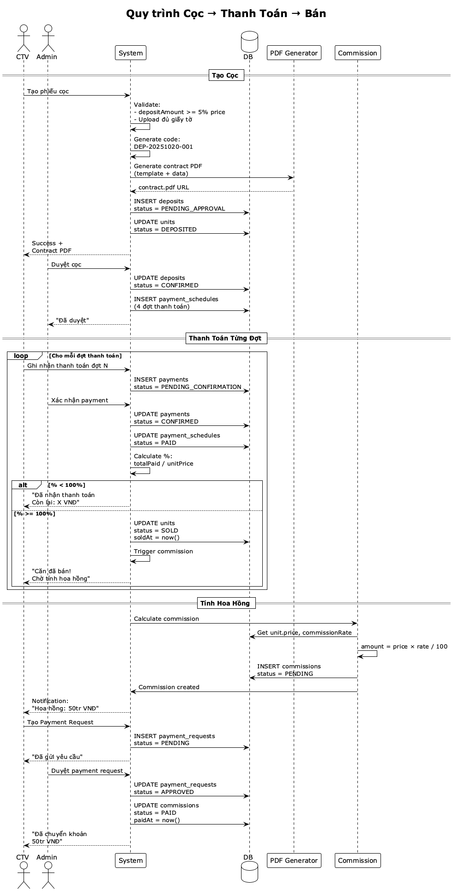

**Payment Schedule Detail:**

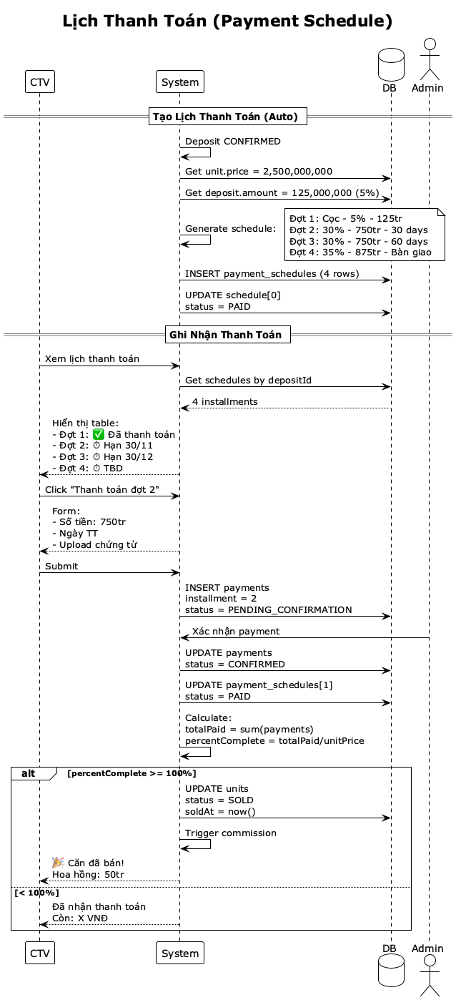

---

### FR-PAY-003: QR Code Generation

**Dynamic QR for each transaction:**

**Content:**
```
Nội dung: {BookingCode} {CustomerName} {Amount}
VD: "BOK20251020001 NguyenVanA 10000000"
```

**Generation:**
- Use library: qrcode, node-qrcode
- Embed bank info from SystemConfig
- Return base64 image hoặc URL

**Display:**
- Show QR trong booking/deposit form
- Download QR image
- Include in PDF phiếu

---

## MODULE 9: COMMISSION SYSTEM

### FR-COMM-001: Auto calculate commission

**Trigger:** Unit status = SOLD

**Flow:**
1. System check: Unit sold?
2. Find related deposit
3. Get CTV from deposit.ctvId
4. Calculate:
   ```typescript
   const rate = unit.commissionRate || project.commissionRate;
   const amount = unit.price × rate / 100;
   ```
5. Create Commission:
   - unitId, ctvId, depositId
   - amount
   - status = PENDING
6. Notification: CTV "Bạn có hoa hồng mới: XXX VNĐ"
7. Audit log

**Business Rules:**
- 1 unit = 1 commission (cho CTV đầu tiên sold)
- Commission rate: Unit override hoặc Project default
- Status: PENDING → APPROVED → PAID

**Activity Diagram:**

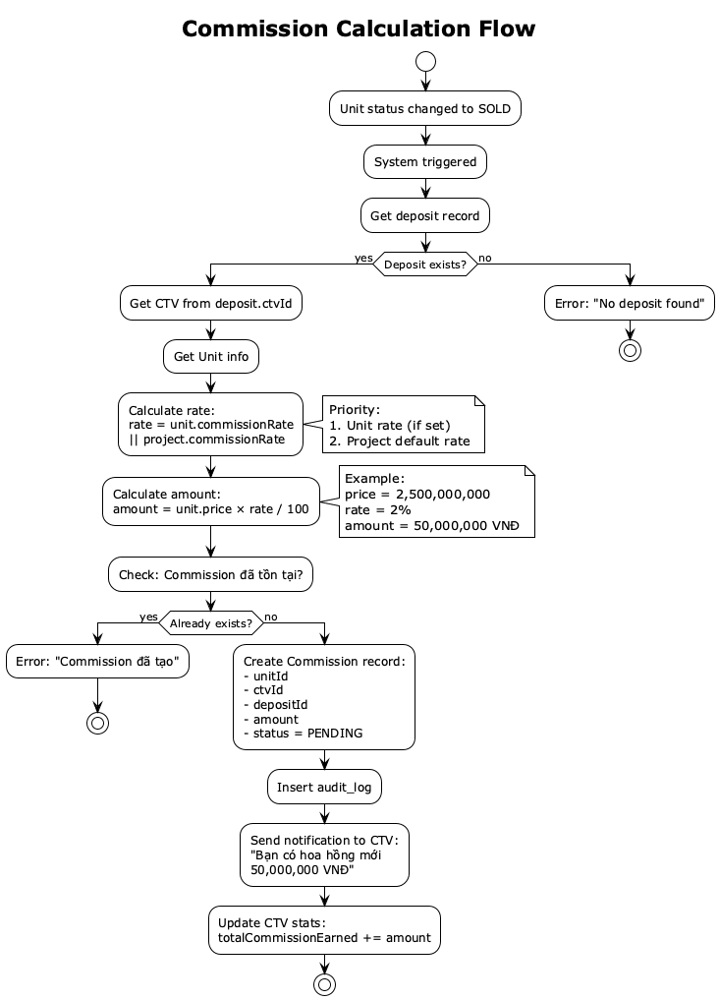

---

### FR-COMM-002: CTV xem commission

**Endpoint:** GET /api/commissions/my-commissions

**Response:**
```json
{
  "summary": {
    "totalEarned": 150000000,
    "pending": 50000000,
    "approved": 0,
    "paid": 100000000
  },
  "data": [
    {
      "id": "uuid",
      "unit": {
        "code": "A1-08-05",
        "price": 2500000000
      },
      "amount": 50000000,
      "status": "PENDING",
      "createdAt": "2025-10-20"
    }
  ]
}
```

---

### FR-COMM-003: Payment Request (Rút hoa hồng)

**Flow:**
1. CTV view "Hoa hồng của tôi"
2. Select commissions (status = PENDING, có thể chọn nhiều)
3. Click "Yêu cầu thanh toán"
4. System tạo PaymentRequest:
   - Tổng số tiền
   - List commission IDs
   - status = PENDING
5. Admin duyệt
6. Admin chuyển khoản → Mark PAID
7. Update commissions.status = PAID
8. Notification CTV

**Sequence Diagram:**

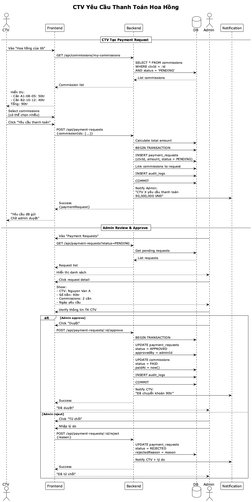

---

## MODULE 10: ADMIN FEATURES

**Role Permissions Matrix:**

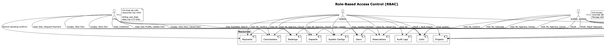

**Unit Status State Machine:**

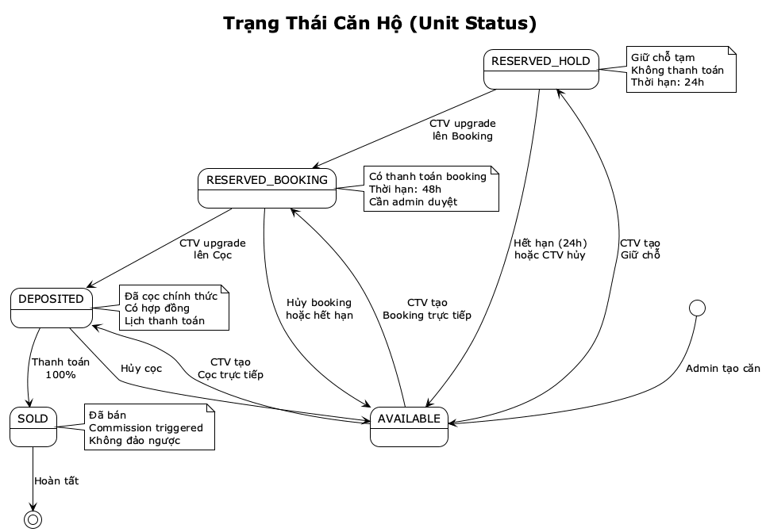

**BPMN - Exception Handling:**

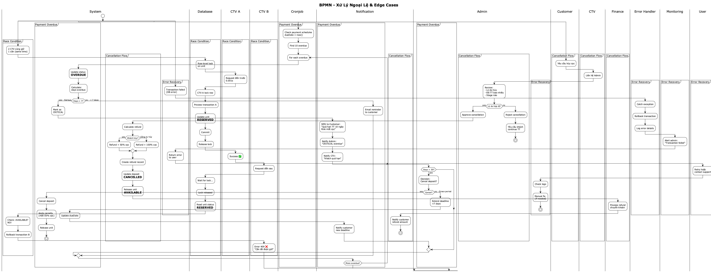

### FR-ADM-001: Dashboard & Reports

**Dashboard components:**

1. **Stats Cards:**
   - Total projects, units, transactions
   - Total revenue
   - Total commission paid

2. **Charts:**
   - Pie: Unit status distribution
   - Bar: Sales by month
   - Line: Revenue trend

3. **Tables:**
   - Recent transactions
   - Top CTVs
   - Pending approvals

**Reports:**
- Filter by: Date range, Project, CTV
- Export: Excel, PDF
- Include: Details, summary, charts

---

### FR-ADM-002: Quản lý System Config

**Config Categories:**

**General:**
- logo_url
- company_name
- contact_phone
- contact_email

**Bank:**
- bank_account_number
- bank_account_name
- bank_name
- bank_qr_code

**Reservation:**
- reservation_duration_hours: 24
- reservation_max_extends: 1

**Booking:**
- booking_amount: 10000000
- booking_duration_hours: 48
- booking_refund_percentage: 50

**Deposit:**
- deposit_min_percentage: 5
- deposit_payment_deadline_days: 30
- deposit_penalty_percentage: 50

**OTP:**
- otp_length: 6
- otp_expiry_minutes: 5
- otp_retry_limit: 3
- otp_resend_cooldown_seconds: 60

**Commission:**
- default_commission_rate: 2.0

**CRUD:**
- GET /api/system-configs?category=booking
- PATCH /api/system-configs/:key with new value
- Validate: Type matching (number, string, boolean)
- Apply immediately (no restart needed)

---

### FR-ADM-003: Audit Log Viewer

**View logs:**
- Filter: Date range, User, Action, Entity type
- Search: Entity ID
- Export: CSV

**Log detail:**
- Timestamp
- User (name, role)
- Action
- Entity (type, ID, name)
- Changes (diff view: old → new)
- IP, User agent

---

## MODULE 11: NOTIFICATIONS

### FR-NOTIF-001: Notification Events

| Event | CTV | Admin | Customer |
|-------|-----|-------|----------|
| Reservation created | ✅ Creator | ✅ | - |
| Reservation expiring (2h) | ✅ Owner | - | - |
| Reservation expired | ✅ Owner | - | - |
| Booking created | ✅ Creator | ✅ Need approval | - |
| Booking approved | ✅ Owner | - | ✅ SMS |
| Booking rejected | ✅ Owner | - | - |
| Deposit created | ✅ Creator | ✅ Need approval | ✅ SMS |
| Deposit approved | ✅ Owner | - | ✅ SMS+Email |
| Payment overdue | ✅ Owner | ✅ | ✅ SMS |
| Payment confirmed | ✅ Owner | - | ✅ |
| Unit sold | ✅ Seller | ✅ | ✅ |
| Commission created | ✅ Earner | - | - |
| Payment request approved | ✅ Requester | - | - |

**Channels:**
- In-app: Toast, Bell icon
- SMS: For customers (Twilio, AWS SNS)
- Email: For all (SendGrid)

---

## VALIDATION SUMMARY

### Reservation
- customerName: 2-100 chars, required
- customerPhone: VN phone, required, unique per unit
- Duration: From config, max 24h default
- Can extend: 1 time

### Booking
- customerIdCard: 9 or 12 digits, required
- customerAddress: 10-500 chars, required
- bookingAmount: From config (fixed amount)
- paymentProof: Min 1 file, max 5 files
- Duration: 48h from config

### Deposit
- depositAmount: >= 5% unit price
- contractUrl: Auto-generated PDF
- paymentProof: Multiple files required
- Payment schedule: Auto-generate 4 installments

### Unit
- code: Unique, format XX-YY-ZZ
- price: > 0, <= 100,000,000,000
- area: > 0, <= 1000
- status: Enum, required

---

**Tất cả activity diagrams, sequence diagrams → Xem [DIAGRAMS.md](./DIAGRAMS.md)**

**Database schema cho các tables → Xem [04-DATABASE-DESIGN.md](./04-DATABASE-DESIGN.md)**

**API endpoints chi tiết → Xem [05-API-SPECIFICATIONS.md](./05-API-SPECIFICATIONS.md)**

---

**Document Version:** 3.0  
**Status:** Complete  
**Last Updated:** October 2025
