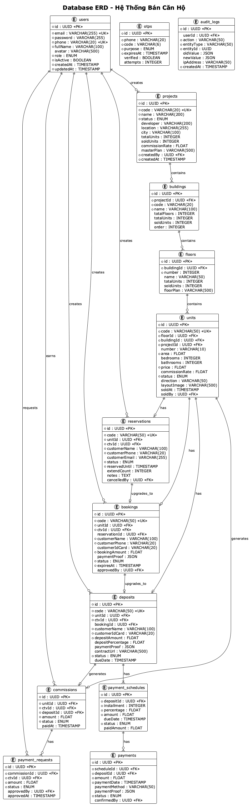

# Database Design Document

## 📋 Thông tin tài liệu

**Dự án:** Batdongsan Platform (CTV Commission System)  
**Phiên bản:** 2.0  
**Database:** SQLite (dev) / PostgreSQL (production)  
**ORM:** Prisma 5

## 1. Entity Relationship Diagram (ERD)



### Detailed ERD (Text version):

```
┌──────────────────┐                    ┌──────────────────┐
│      User        │                    │    Property      │
├──────────────────┤                    ├──────────────────┤
│ id (PK)          │                    │ id (PK)          │
│ email (UNIQUE)   │────────1:N────────>│ createdBy (FK)   │
│ password         │                    │ title            │
│ fullName         │                    │ description      │
│ phone            │                    │ slug (UNIQUE)    │
│ avatar           │                    │ status (ENUM)    │
│ role (ENUM)*     │                    │ price            │
│ isActive         │                    │ commissionRate*  │
│ createdAt        │                    │ area             │
│ updatedAt        │                    │ address          │
└──────────────────┘                    │ ward             │
         │                              │ district         │
         │                              │ city             │
         │ 1:N                          │ latitude         │
         │                              │ longitude        │
         │                              │ bedrooms         │
         └──────────────────────────────│ bathrooms        │
                                        │ floors           │
┌──────────────────┐                    │ direction        │
│   Assignment*    │                    │ legalDoc         │
├──────────────────┤                    │ featured         │
│ id (PK)          │                    │ views            │
│ propertyId (FK)──┼───────────────────>│ categoryId (FK)  │
│ ctvId (FK)───────┼──────┐             │ soldAt           │
│ assignedBy (FK)  │      │             │ createdAt        │
│ status (ENUM)    │      │             │ updatedAt        │
│ assignedAt       │      │             └──────────────────┘
│ notes            │      │                      │
│ createdAt        │      │                      │
└──────────────────┘      │                      │ 1:N
                          │                      │
┌──────────────────┐      │             ┌────────▼──────────┐
│      Lead*       │      │             │  PropertyImage    │
├──────────────────┤      │             ├───────────────────┤
│ id (PK)          │      │             │ id (PK)           │
│ propertyId (FK)──┼──────┼────────┐    │ propertyId (FK)   │
│ ctvId (FK)───────┼──────┘        │    │ url               │
│ customerName     │               │    │ caption           │
│ customerPhone    │               │    │ order             │
│ customerEmail    │               │    │ createdAt         │
│ status (ENUM)    │               │    └───────────────────┘
│ source (ENUM)    │               │
│ notes            │               │    ┌───────────────────┐
│ createdAt        │               │    │ PropertyAmenity   │
│ updatedAt        │               │    ├───────────────────┤
└──────────────────┘               │    │ propertyId (FK)   │
         │                         │    │ amenityId (FK)    │
         │ 1:1                     │    └───────────────────┘
         │                         │             │
┌────────▼──────────┐              │             │
│   Commission*     │              │    ┌────────▼──────────┐
├───────────────────┤              │    │     Amenity       │
│ id (PK)           │              │    ├───────────────────┤
│ propertyId (FK)───┼──────────────┘    │ id (PK)           │
│ ctvId (FK)────────┼──────┐            │ name (UNIQUE)     │
│ leadId (FK)       │      │            │ slug (UNIQUE)     │
│ amount            │      │            │ description       │
│ status (ENUM)     │      │            │ icon              │
│ paidAt            │      │            │ createdAt         │
│ createdAt         │      │            │ updatedAt         │
│ updatedAt         │      │            └───────────────────┘
└───────────────────┘      │
         │                 │            ┌───────────────────┐
         │ 1:N             │            │    Category       │
         │                 │            ├───────────────────┤
┌────────▼──────────┐      │            │ id (PK)           │
│ PaymentRequest*   │      │            │ name (UNIQUE)     │
├───────────────────┤      │            │ slug (UNIQUE)     │
│ id (PK)           │      │            │ description       │
│ commissionId (FK) │      │            │ icon              │
│ ctvId (FK)────────┼──────┘            │ order             │
│ amount            │                   │ createdAt         │
│ status (ENUM)     │                   │ updatedAt         │
│ requestedAt       │                   └───────────────────┘
│ approvedBy (FK)   │
│ approvedAt        │                   ┌───────────────────┐
│ rejectedReason    │                   │   AuditLog*       │
│ createdAt         │                   ├───────────────────┤
│ updatedAt         │                   │ id (PK)           │
└───────────────────┘                   │ userId (FK)       │
                                        │ action            │
                                        │ entityType        │
* New/Modified Tables                   │ entityId          │
                                        │ oldValue          │
                                        │ newValue          │
                                        │ ipAddress         │
                                        │ userAgent         │
                                        │ createdAt         │
                                        └───────────────────┘
```

## 2. Table Specifications

### 2.1 users (Modified)

**Mô tả:** Lưu thông tin người dùng

| Column | Type | Constraints | Description |
|--------|------|-------------|-------------|
| id | UUID | PRIMARY KEY | User ID (auto-generated) |
| email | VARCHAR(255) | UNIQUE, NOT NULL | Email đăng nhập |
| password | VARCHAR(255) | NOT NULL | Password đã hash (bcrypt) |
| fullName | VARCHAR(100) | NOT NULL | Họ tên đầy đủ |
| phone | VARCHAR(20) | NULL | Số điện thoại |
| avatar | VARCHAR(500) | NULL | URL avatar |
| **role** | **ENUM** | **NOT NULL, DEFAULT 'USER'** | **SUPER_ADMIN, ADMIN, CTV, USER** |
| isActive | BOOLEAN | NOT NULL, DEFAULT true | Trạng thái active |
| createdAt | TIMESTAMP | NOT NULL, DEFAULT NOW() | Ngày tạo |
| updatedAt | TIMESTAMP | NOT NULL, DEFAULT NOW() | Ngày cập nhật |

**Indexes:**
- PRIMARY KEY: id
- UNIQUE: email
- INDEX: role
- INDEX: isActive

**Role Descriptions:**
- `SUPER_ADMIN`: Quản lý toàn hệ thống
- `ADMIN`: Đăng tin, gán CTV, duyệt commission
- `CTV`: Cộng tác viên bán hàng
- `USER`: Khách hàng xem tin (optional)

**Sample Data:**
```sql
INSERT INTO users (id, email, password, fullName, role) VALUES
('uuid-sa', 'superadmin@example.com', '$2b$10$...', 'Super Admin', 'SUPER_ADMIN'),
('uuid-ad', 'admin@example.com', '$2b$10$...', 'Admin User', 'ADMIN'),
('uuid-ctv1', 'ctv1@example.com', '$2b$10$...', 'CTV Nguyen Van A', 'CTV'),
('uuid-ctv2', 'ctv2@example.com', '$2b$10$...', 'CTV Tran Thi B', 'CTV'),
('uuid-user', 'user@example.com', '$2b$10$...', 'Normal User', 'USER');
```

---

### 2.2 properties (Modified)

**Mô tả:** Lưu thông tin bất động sản (chỉ BÁN nhà)

| Column | Type | Constraints | Description |
|--------|------|-------------|-------------|
| id | UUID | PRIMARY KEY | Property ID |
| title | VARCHAR(200) | NOT NULL | Tiêu đề tin đăng |
| description | TEXT | NOT NULL | Mô tả chi tiết |
| slug | VARCHAR(255) | UNIQUE, NOT NULL | SEO-friendly URL |
| **~~type~~** | - | **REMOVED** | **Chỉ bán, không cần type** |
| status | ENUM | NOT NULL, DEFAULT 'AVAILABLE' | **DRAFT, AVAILABLE, ASSIGNED, SOLD** |
| price | FLOAT | NOT NULL | Giá bán (VND) |
| **commissionRate** | **FLOAT** | **NOT NULL, DEFAULT 2.0** | **% hoa hồng (VD: 2.0 = 2%)** |
| area | FLOAT | NOT NULL | Diện tích (m²) |
| address | VARCHAR(255) | NOT NULL | Địa chỉ cụ thể |
| ward | VARCHAR(100) | NOT NULL | Phường/Xã |
| district | VARCHAR(100) | NOT NULL | Quận/Huyện |
| city | VARCHAR(100) | NOT NULL | Tỉnh/Thành phố |
| latitude | FLOAT | NULL | Vĩ độ |
| longitude | FLOAT | NULL | Kinh độ |
| bedrooms | INTEGER | NULL | Số phòng ngủ |
| bathrooms | INTEGER | NULL | Số phòng tắm |
| floors | INTEGER | NULL | Số tầng |
| direction | VARCHAR(50) | NULL | Hướng nhà |
| legalDoc | VARCHAR(100) | NULL | Giấy tờ pháp lý |
| featured | BOOLEAN | NOT NULL, DEFAULT false | Tin nổi bật |
| views | INTEGER | NOT NULL, DEFAULT 0 | Lượt xem |
| **createdBy** | UUID | FK → users(id) | **Admin tạo tin** |
| categoryId | UUID | FK → categories(id) | Danh mục |
| **soldAt** | TIMESTAMP | NULL | **Ngày bán được** |
| createdAt | TIMESTAMP | NOT NULL | Ngày tạo |
| updatedAt | TIMESTAMP | NOT NULL | Ngày cập nhật |

**Status Flow:**
- `DRAFT`: Nháp, chưa publish
- `AVAILABLE`: Đang bán, chưa gán CTV
- `ASSIGNED`: Đã gán cho CTV, đang process
- `SOLD`: Đã bán

**Indexes:**
- PRIMARY KEY: id
- UNIQUE: slug
- INDEX: status
- INDEX: city, district (composite)
- INDEX: createdBy
- INDEX: categoryId
- INDEX: createdAt DESC
- INDEX: price
- INDEX: area
- INDEX: featured
- INDEX: commissionRate

**Foreign Keys:**
- createdBy REFERENCES users(id) ON DELETE CASCADE
- categoryId REFERENCES categories(id) ON DELETE RESTRICT

---

### 2.3 property_images

**Mô tả:** Lưu ảnh của bất động sản

| Column | Type | Constraints | Description |
|--------|------|-------------|-------------|
| id | UUID | PRIMARY KEY | Image ID |
| propertyId | UUID | FK → properties(id) | Property liên quan |
| url | VARCHAR(500) | NOT NULL | URL ảnh |
| caption | VARCHAR(255) | NULL | Mô tả ảnh |
| order | INTEGER | NOT NULL, DEFAULT 0 | Thứ tự hiển thị |
| createdAt | TIMESTAMP | NOT NULL | Ngày upload |

**Indexes:**
- PRIMARY KEY: id
- INDEX: propertyId
- INDEX: propertyId, order (composite)

**Foreign Keys:**
- propertyId REFERENCES properties(id) ON DELETE CASCADE

---

### 2.4 categories

**Mô tả:** Danh mục bất động sản

| Column | Type | Constraints | Description |
|--------|------|-------------|-------------|
| id | UUID | PRIMARY KEY | Category ID |
| name | VARCHAR(100) | UNIQUE, NOT NULL | Tên danh mục |
| slug | VARCHAR(100) | UNIQUE, NOT NULL | URL-friendly name |
| description | TEXT | NULL | Mô tả |
| icon | VARCHAR(50) | NULL | Icon name |
| order | INTEGER | NOT NULL, DEFAULT 0 | Thứ tự hiển thị |
| createdAt | TIMESTAMP | NOT NULL | Ngày tạo |
| updatedAt | TIMESTAMP | NOT NULL | Ngày cập nhật |

**Indexes:**
- PRIMARY KEY: id
- UNIQUE: name
- UNIQUE: slug
- INDEX: order

**Sample Data:**
```sql
INSERT INTO categories (id, name, slug, order) VALUES
('cat-1', 'Căn hộ/Chung cư', 'can-ho-chung-cu', 1),
('cat-2', 'Nhà riêng', 'nha-rieng', 2),
('cat-3', 'Văn phòng', 'van-phong', 3),
('cat-4', 'Đất nền', 'dat-nen', 4);
```

---

### 2.5 amenities

**Mô tả:** Tiện ích của bất động sản

| Column | Type | Constraints | Description |
|--------|------|-------------|-------------|
| id | UUID | PRIMARY KEY | Amenity ID |
| name | VARCHAR(100) | UNIQUE, NOT NULL | Tên tiện ích |
| slug | VARCHAR(100) | UNIQUE, NOT NULL | URL-friendly name |
| description | TEXT | NULL | Mô tả |
| icon | VARCHAR(50) | NULL | Icon name |
| createdAt | TIMESTAMP | NOT NULL | Ngày tạo |
| updatedAt | TIMESTAMP | NOT NULL | Ngày cập nhật |

**Indexes:**
- PRIMARY KEY: id
- UNIQUE: name
- UNIQUE: slug

**Sample Data:**
```sql
INSERT INTO amenities (id, name, slug) VALUES
('ame-1', 'Điều hòa', 'dieu-hoa'),
('ame-2', 'Nóng lạnh', 'nong-lanh'),
('ame-3', 'Giường', 'giuong'),
('ame-4', 'Tủ lạnh', 'tu-lanh'),
('ame-5', 'Ban công', 'ban-cong'),
('ame-6', 'Thang máy', 'thang-may'),
('ame-7', 'Bảo vệ 24/7', 'bao-ve-24-7'),
('ame-8', 'Hồ bơi', 'ho-boi');
```

---

### 2.6 property_amenities

**Mô tả:** Many-to-Many relationship giữa properties và amenities

| Column | Type | Constraints | Description |
|--------|------|-------------|-------------|
| propertyId | UUID | FK → properties(id) | Property |
| amenityId | UUID | FK → amenities(id) | Amenity |

**Indexes:**
- PRIMARY KEY: (propertyId, amenityId)
- INDEX: propertyId
- INDEX: amenityId

**Foreign Keys:**
- propertyId REFERENCES properties(id) ON DELETE CASCADE
- amenityId REFERENCES amenities(id) ON DELETE CASCADE

---

### 2.7 favorites

**Mô tả:** Danh sách yêu thích của user

| Column | Type | Constraints | Description |
|--------|------|-------------|-------------|
| id | UUID | PRIMARY KEY | Favorite ID |
| userId | UUID | FK → users(id) | User |
| propertyId | UUID | FK → properties(id) | Property |
| createdAt | TIMESTAMP | NOT NULL | Ngày thêm |

**Indexes:**
- PRIMARY KEY: id
- UNIQUE: (userId, propertyId)
- INDEX: userId
- INDEX: propertyId

**Foreign Keys:**
- userId REFERENCES users(id) ON DELETE CASCADE
- propertyId REFERENCES properties(id) ON DELETE CASCADE

---

### 2.8 assignments (NEW)

**Mô tả:** Phân công CTV cho property

| Column | Type | Constraints | Description |
|--------|------|-------------|-------------|
| id | UUID | PRIMARY KEY | Assignment ID |
| propertyId | UUID | FK → properties(id) | Property được gán |
| ctvId | UUID | FK → users(id) | CTV được gán |
| assignedBy | UUID | FK → users(id) | Admin gán |
| status | ENUM | NOT NULL, DEFAULT 'ACTIVE' | ACTIVE, COMPLETED, CANCELLED |
| assignedAt | TIMESTAMP | NOT NULL | Ngày gán |
| notes | TEXT | NULL | Ghi chú |
| createdAt | TIMESTAMP | NOT NULL | Ngày tạo |
| updatedAt | TIMESTAMP | NOT NULL | Ngày cập nhật |

**Status:**
- `ACTIVE`: Đang active, CTV đang bán
- `COMPLETED`: Hoàn thành (đã bán)
- `CANCELLED`: Hủy gán

**Indexes:**
- PRIMARY KEY: id
- INDEX: propertyId
- INDEX: ctvId
- INDEX: assignedBy
- INDEX: status
- INDEX: assignedAt DESC
- UNIQUE: (propertyId, ctvId) - 1 CTV chỉ nhận 1 lần/property

**Foreign Keys:**
- propertyId REFERENCES properties(id) ON DELETE CASCADE
- ctvId REFERENCES users(id) ON DELETE CASCADE
- assignedBy REFERENCES users(id) ON DELETE SET NULL

**Business Rules:**
- Nhiều CTV có thể được gán cho cùng 1 property
- 1 CTV chỉ có thể nhận 1 assignment/property
- Admin có thể unassign bằng cách set status = CANCELLED

---

### 2.9 leads (NEW)

**Mô tả:** Khách hàng tiềm năng

| Column | Type | Constraints | Description |
|--------|------|-------------|-------------|
| id | UUID | PRIMARY KEY | Lead ID |
| propertyId | UUID | FK → properties(id) | Property quan tâm |
| ctvId | UUID | FK → users(id) | CTV phụ trách |
| customerName | VARCHAR(100) | NOT NULL | Tên khách hàng |
| customerPhone | VARCHAR(20) | NOT NULL | SĐT khách hàng |
| customerEmail | VARCHAR(255) | NULL | Email khách hàng |
| status | ENUM | NOT NULL, DEFAULT 'NEW' | NEW, CONTACTED, VIEWING, NEGOTIATING, CLOSED, LOST |
| source | ENUM | NOT NULL, DEFAULT 'MANUAL' | MANUAL, WEBSITE_FORM, REFERRAL, CALL |
| notes | TEXT | NULL | Ghi chú, lịch sử trao đổi |
| createdAt | TIMESTAMP | NOT NULL | Ngày tạo |
| updatedAt | TIMESTAMP | NOT NULL | Ngày cập nhật |

**Status Flow:**
- `NEW`: Mới tạo
- `CONTACTED`: Đã liên hệ
- `VIEWING`: Đã xem nhà
- `NEGOTIATING`: Đang đàm phán
- `CLOSED`: Chốt được (pending admin confirm)
- `LOST`: Không thành công

**Indexes:**
- PRIMARY KEY: id
- INDEX: propertyId
- INDEX: ctvId
- INDEX: status
- INDEX: createdAt DESC
- UNIQUE: (propertyId, ctvId) - 1 CTV chỉ có 1 lead/property

**Foreign Keys:**
- propertyId REFERENCES properties(id) ON DELETE CASCADE
- ctvId REFERENCES users(id) ON DELETE CASCADE

**Business Rules:**
- 1 CTV chỉ tạo 1 lead/property
- Nhiều CTV có thể có lead riêng cho cùng 1 property
- Chỉ lead status=CLOSED mới tạo commission

---

### 2.10 commissions (NEW)

**Mô tả:** Hoa hồng của CTV

| Column | Type | Constraints | Description |
|--------|------|-------------|-------------|
| id | UUID | PRIMARY KEY | Commission ID |
| propertyId | UUID | FK → properties(id) | Property đã bán |
| ctvId | UUID | FK → users(id) | CTV nhận hoa hồng |
| leadId | UUID | FK → leads(id) | Lead thành công |
| amount | FLOAT | NOT NULL | Số tiền hoa hồng (VND) |
| status | ENUM | NOT NULL, DEFAULT 'PENDING' | PENDING, APPROVED, PAID |
| paidAt | TIMESTAMP | NULL | Ngày thanh toán |
| createdAt | TIMESTAMP | NOT NULL | Ngày tạo |
| updatedAt | TIMESTAMP | NOT NULL | Ngày cập nhật |

**Calculation:**
```
amount = property.price × property.commissionRate / 100
```

**Status:**
- `PENDING`: Chờ CTV tạo payment request
- `APPROVED`: Admin đã duyệt payment request
- `PAID`: Đã thanh toán

**Indexes:**
- PRIMARY KEY: id
- INDEX: propertyId
- INDEX: ctvId
- INDEX: leadId
- INDEX: status
- INDEX: createdAt DESC
- UNIQUE: leadId - 1 lead chỉ tạo 1 commission

**Foreign Keys:**
- propertyId REFERENCES properties(id) ON DELETE CASCADE
- ctvId REFERENCES users(id) ON DELETE CASCADE
- leadId REFERENCES leads(id) ON DELETE CASCADE

**Business Rules:**
- Chỉ lead status=CLOSED mới tạo commission
- Admin phải confirm deal trước khi tạo commission
- Một property chỉ có 1 commission (CTV chốt đầu tiên)

---

### 2.11 payment_requests (NEW)

**Mô tả:** Yêu cầu thanh toán của CTV

| Column | Type | Constraints | Description |
|--------|------|-------------|-------------|
| id | UUID | PRIMARY KEY | Payment Request ID |
| commissionId | UUID | FK → commissions(id) | Commission được yêu cầu |
| ctvId | UUID | FK → users(id) | CTV yêu cầu |
| amount | FLOAT | NOT NULL | Số tiền yêu cầu |
| status | ENUM | NOT NULL, DEFAULT 'PENDING' | PENDING, APPROVED, REJECTED |
| requestedAt | TIMESTAMP | NOT NULL | Ngày yêu cầu |
| approvedBy | UUID | FK → users(id) | Admin duyệt |
| approvedAt | TIMESTAMP | NULL | Ngày duyệt |
| rejectedReason | TEXT | NULL | Lý do từ chối |
| createdAt | TIMESTAMP | NOT NULL | Ngày tạo |
| updatedAt | TIMESTAMP | NOT NULL | Ngày cập nhật |

**Status:**
- `PENDING`: Chờ duyệt
- `APPROVED`: Đã duyệt, chuẩn bị thanh toán
- `REJECTED`: Bị từ chối

**Indexes:**
- PRIMARY KEY: id
- INDEX: commissionId
- INDEX: ctvId
- INDEX: approvedBy
- INDEX: status
- INDEX: requestedAt DESC

**Foreign Keys:**
- commissionId REFERENCES commissions(id) ON DELETE CASCADE
- ctvId REFERENCES users(id) ON DELETE CASCADE
- approvedBy REFERENCES users(id) ON DELETE SET NULL

**Business Rules:**
- CTV chỉ request payment khi commission.status = PENDING
- Admin approve → commission.status = APPROVED
- Admin reject → CTV có thể tạo request mới

---

### 2.12 audit_logs (NEW)

**Mô tả:** Lịch sử thay đổi (audit trail)

| Column | Type | Constraints | Description |
|--------|------|-------------|-------------|
| id | UUID | PRIMARY KEY | Log ID |
| userId | UUID | FK → users(id) | User thực hiện |
| action | VARCHAR(50) | NOT NULL | CREATE, UPDATE, DELETE, APPROVE, REJECT |
| entityType | VARCHAR(50) | NOT NULL | PROPERTY, LEAD, COMMISSION, etc. |
| entityId | UUID | NOT NULL | ID của entity bị thay đổi |
| oldValue | JSON | NULL | Giá trị cũ (JSON) |
| newValue | JSON | NULL | Giá trị mới (JSON) |
| ipAddress | VARCHAR(50) | NULL | IP address |
| userAgent | VARCHAR(500) | NULL | User agent |
| createdAt | TIMESTAMP | NOT NULL | Ngày thực hiện |

**Indexes:**
- PRIMARY KEY: id
- INDEX: userId
- INDEX: entityType, entityId (composite)
- INDEX: action
- INDEX: createdAt DESC

**Foreign Keys:**
- userId REFERENCES users(id) ON DELETE SET NULL

**Tracked Actions:**
- Properties: CREATE, UPDATE, DELETE, PUBLISH
- PropertyHolds: CREATE, EXTEND, CANCEL, EXPIRE
- Assignments: CREATE, CANCEL
- Leads: CREATE, UPDATE_STATUS, CLOSE
- Commissions: CREATE, APPROVE, PAY
- Payment Requests: CREATE, APPROVE, REJECT

---

### 2.13 property_holds (NEW)

**Mô tả:** Giữ căn - CTV độc quyền bán trong thời gian nhất định

| Column | Type | Constraints | Description |
|--------|------|-------------|-------------|
| id | UUID | PRIMARY KEY | Hold ID |
| propertyId | UUID | FK → properties(id) | Property được giữ |
| ctvId | UUID | FK → users(id) | CTV giữ căn |
| status | ENUM | NOT NULL, DEFAULT 'ACTIVE' | ACTIVE, EXPIRED, CANCELLED, CANCELLED_BY_ADMIN, AUTO_CANCELLED |
| holdUntil | TIMESTAMP | NOT NULL | Thời điểm hết hạn |
| reason | TEXT | NULL | Lý do giữ (CTV nhập) |
| extendCount | INTEGER | NOT NULL, DEFAULT 0 | Số lần đã gia hạn |
| cancelledBy | UUID | FK → users(id) | Admin hủy (nếu có) |
| cancelledReason | TEXT | NULL | Lý do hủy |
| createdAt | TIMESTAMP | NOT NULL | Ngày tạo |
| updatedAt | TIMESTAMP | NOT NULL | Ngày cập nhật |

**Status:**
- `ACTIVE`: Đang giữ, có hiệu lực
- `EXPIRED`: Hết hạn (auto by cronjob)
- `CANCELLED`: CTV tự hủy
- `CANCELLED_BY_ADMIN`: Admin hủy
- `AUTO_CANCELLED`: Tự động hủy (khi unassign)

**Indexes:**
- PRIMARY KEY: id
- INDEX: propertyId
- INDEX: ctvId
- INDEX: status
- INDEX: holdUntil
- INDEX: createdAt DESC

**Foreign Keys:**
- propertyId REFERENCES properties(id) ON DELETE CASCADE
- ctvId REFERENCES users(id) ON DELETE CASCADE
- cancelledBy REFERENCES users(id) ON DELETE SET NULL

**Business Rules:**
1. Một property tại 1 thời điểm chỉ có **1 hold ACTIVE**
2. CTV phải có assignment mới được hold
3. Thời gian hold: Admin config (default 48h)
4. Gia hạn tối đa: 2 lần (config)
5. First come, first served nếu nhiều CTV cùng bấm

**Query để check hold:**
```sql
SELECT * FROM property_holds
WHERE propertyId = 'uuid'
  AND status = 'ACTIVE'
  AND holdUntil > NOW()
LIMIT 1;
```

---

### 2.14 system_configs (NEW)

**Mô tả:** Cấu hình hệ thống (Admin customize)

| Column | Type | Constraints | Description |
|--------|------|-------------|-------------|
| id | UUID | PRIMARY KEY | Config ID |
| key | VARCHAR(100) | UNIQUE, NOT NULL | Config key (e.g., 'hold_duration_hours') |
| value | TEXT | NOT NULL | Giá trị (string, number, json) |
| type | VARCHAR(20) | NOT NULL | Data type: 'number', 'string', 'boolean', 'json' |
| label | VARCHAR(255) | NOT NULL | Label hiển thị |
| category | VARCHAR(50) | NOT NULL | Nhóm config: 'hold', 'commission', 'notification' |
| description | TEXT | NULL | Mô tả chi tiết |
| createdAt | TIMESTAMP | NOT NULL | Ngày tạo |
| updatedAt | TIMESTAMP | NOT NULL | Ngày cập nhật |

**Indexes:**
- PRIMARY KEY: id
- UNIQUE: key
- INDEX: category

**Sample Data (50+ configs):**
```sql
INSERT INTO system_configs (key, value, type, label, category, editable_by) VALUES
-- General
('company_name', 'Công ty ABC', 'string', 'Tên công ty', 'general', 'SUPER_ADMIN'),
('company_logo_url', '', 'string', 'Logo URL', 'general', 'ADMIN'),

-- Bank
('bank_account_number', '1234567890', 'string', 'Số TK', 'bank', 'ADMIN'),
('bank_account_name', 'CONG TY ABC', 'string', 'Tên TK', 'bank', 'ADMIN'),
('bank_name', 'Vietcombank', 'string', 'Ngân hàng', 'bank', 'ADMIN'),
('bank_qr_code_url', '', 'string', 'QR Code URL', 'bank', 'ADMIN'),

-- Reservation
('reservation_duration_hours', '24', 'number', 'Thời gian giữ chỗ (giờ)', 'reservation', 'ADMIN'),
('reservation_max_extends', '1', 'number', 'Số lần gia hạn tối đa', 'reservation', 'ADMIN'),
('reservation_extend_before_hours', '2', 'number', 'Gia hạn khi còn (giờ)', 'reservation', 'ADMIN'),
('reservation_require_approval', 'false', 'boolean', 'Cần admin duyệt', 'reservation', 'ADMIN'),

-- Booking
('booking_amount_type', 'fixed', 'string', 'Loại booking: fixed/percentage', 'booking', 'ADMIN'),
('booking_amount_fixed', '10000000', 'number', 'Số tiền booking cố định', 'booking', 'ADMIN'),
('booking_amount_percentage', '0.5', 'number', 'Booking % giá bán', 'booking', 'ADMIN'),
('booking_duration_hours', '48', 'number', 'Thời hạn booking (giờ)', 'booking', 'ADMIN'),
('booking_require_approval', 'true', 'boolean', 'Cần admin duyệt', 'booking', 'ADMIN'),
('booking_refund_percentage', '50', 'number', 'Hoàn lại khi hủy (%)', 'booking', 'ADMIN'),

-- Deposit
('deposit_min_percentage', '5', 'number', 'Cọc tối thiểu (%)', 'deposit', 'ADMIN'),
('deposit_payment_deadline_days', '30', 'number', 'Hạn thanh toán đợt 1 (ngày)', 'deposit', 'ADMIN'),
('deposit_penalty_customer_percentage', '50', 'number', 'Phạt khách hủy (%)', 'deposit', 'ADMIN'),
('deposit_penalty_company_percentage', '0', 'number', 'Phạt công ty hủy (%)', 'deposit', 'ADMIN'),
('deposit_auto_generate_contract', 'true', 'boolean', 'Tự động gen hợp đồng', 'deposit', 'ADMIN'),

-- Payment Schedule (Default template)
('payment_schedule_template', 'default', 'string', 'Template thanh toán', 'payment', 'ADMIN'),
('payment_installment_1_percentage', '5', 'number', 'Đợt 1: Cọc (%)', 'payment', 'ADMIN'),
('payment_installment_2_percentage', '30', 'number', 'Đợt 2 (%)', 'payment', 'ADMIN'),
('payment_installment_2_days', '30', 'number', 'Đợt 2: Sau X ngày', 'payment', 'ADMIN'),
('payment_installment_3_percentage', '30', 'number', 'Đợt 3 (%)', 'payment', 'ADMIN'),
('payment_installment_3_days', '60', 'number', 'Đợt 3: Sau X ngày', 'payment', 'ADMIN'),
('payment_installment_4_percentage', '35', 'number', 'Đợt 4 (%)', 'payment', 'ADMIN'),

-- Overdue
('payment_grace_period_days', '7', 'number', 'Grace period (ngày)', 'payment', 'ADMIN'),
('payment_first_warning_days', '3', 'number', 'Warning 1 sau X ngày', 'payment', 'ADMIN'),
('payment_second_warning_days', '7', 'number', 'Warning 2 sau X ngày', 'payment', 'ADMIN'),
('payment_auto_cancel_days', '30', 'number', 'Tự động hủy sau X ngày', 'payment', 'ADMIN'),

-- OTP
('otp_length', '6', 'number', 'Độ dài OTP', 'otp', 'SUPER_ADMIN'),
('otp_expiry_minutes', '5', 'number', 'OTP hết hạn (phút)', 'otp', 'ADMIN'),
('otp_retry_limit', '3', 'number', 'Giới hạn retry/giờ', 'otp', 'ADMIN'),
('otp_resend_cooldown_seconds', '60', 'number', 'Cooldown gửi lại (giây)', 'otp', 'ADMIN'),
('otp_sms_provider', 'twilio', 'string', 'SMS provider', 'otp', 'SUPER_ADMIN'),

-- Commission
('commission_default_rate', '2.0', 'number', 'Hoa hồng mặc định (%)', 'commission', 'ADMIN'),
('commission_min_request_amount', '10000000', 'number', 'Min để rút (VNĐ)', 'commission', 'ADMIN'),
('commission_auto_calculate', 'true', 'boolean', 'Tự động tính', 'commission', 'ADMIN'),

-- CTV Limits
('ctv_max_reservations', '10', 'number', 'Max giữ chỗ cùng lúc', 'limits', 'ADMIN'),
('ctv_max_bookings', '5', 'number', 'Max booking cùng lúc', 'limits', 'ADMIN'),
('ctv_max_deposits', '10', 'number', 'Max cọc cùng lúc', 'limits', 'ADMIN'),

-- Notifications
('notification_sms_enabled', 'true', 'boolean', 'Bật SMS', 'notification', 'ADMIN'),
('notification_email_enabled', 'true', 'boolean', 'Bật Email', 'notification', 'ADMIN'),
('notification_customer_sms', 'true', 'boolean', 'SMS cho khách', 'notification', 'ADMIN');
```

**UI Admin:**
```
╔════════════════════════════════════════════╗
║ CẤU HÌNH HỆ THỐNG                          ║
╠════════════════════════════════════════════╣
║                                            ║
║ === Giữ Chỗ ===                            ║
║ Thời gian giữ chỗ:  [24] giờ              ║
║ Số lần gia hạn:     [1 ] lần              ║
║ Cần admin duyệt:    [☐] Không             ║
║                                            ║
║ === Booking ===                            ║
║ Loại booking:       [○ Cố định ● %]       ║
║ Số tiền/Tỷ lệ:      [10,000,000] VNĐ     ║
║ Thời hạn:           [48] giờ              ║
║ Hoàn lại khi hủy:   [50] %                ║
║                                            ║
║ === Cọc ===                                ║
║ Cọc tối thiểu:      [5 ] %                ║
║ Hạn thanh toán:     [30] ngày             ║
║ Phạt khách hủy:     [50] %                ║
║                                            ║
║ === Lịch Thanh Toán ===                    ║
║ Template: [Default ▼]                      ║
║ Đợt 1 (Cọc):       [5 ] % - Ngay          ║
║ Đợt 2:             [30] % - [30] ngày     ║
║ Đợt 3:             [30] % - [60] ngày     ║
║ Đợt 4:             [35] % - Bàn giao      ║
║                                            ║
║ [+ Thêm template mới]                      ║
║                                            ║
║ [Lưu cài đặt]                              ║
╚════════════════════════════════════════════╝
```

---

## 3. Enums

### UserRole (Updated)
```typescript
enum UserRole {
  SUPER_ADMIN = 'SUPER_ADMIN',
  ADMIN = 'ADMIN',
  CTV = 'CTV',
  USER = 'USER'
}
```

### PropertyStatus (Updated)
```typescript
enum PropertyStatus {
  DRAFT = 'DRAFT',
  AVAILABLE = 'AVAILABLE',
  ASSIGNED = 'ASSIGNED',
  SOLD = 'SOLD'
}
```

### AssignmentStatus (NEW)
```typescript
enum AssignmentStatus {
  ACTIVE = 'ACTIVE',
  COMPLETED = 'COMPLETED',
  CANCELLED = 'CANCELLED'
}
```

### LeadStatus (NEW)
```typescript
enum LeadStatus {
  NEW = 'NEW',
  CONTACTED = 'CONTACTED',
  VIEWING = 'VIEWING',
  NEGOTIATING = 'NEGOTIATING',
  CLOSED = 'CLOSED',
  LOST = 'LOST'
}
```

### LeadSource (NEW)
```typescript
enum LeadSource {
  MANUAL = 'MANUAL',
  WEBSITE_FORM = 'WEBSITE_FORM',
  REFERRAL = 'REFERRAL',
  CALL = 'CALL'
}
```

### CommissionStatus (NEW)
```typescript
enum CommissionStatus {
  PENDING = 'PENDING',
  APPROVED = 'APPROVED',
  PAID = 'PAID'
}
```

### PaymentRequestStatus (NEW)
```typescript
enum PaymentRequestStatus {
  PENDING = 'PENDING',
  APPROVED = 'APPROVED',
  REJECTED = 'REJECTED'
}
```

### PropertyHoldStatus (NEW)
```typescript
enum PropertyHoldStatus {
  ACTIVE = 'ACTIVE',
  EXPIRED = 'EXPIRED',
  CANCELLED = 'CANCELLED',
  CANCELLED_BY_ADMIN = 'CANCELLED_BY_ADMIN',
  AUTO_CANCELLED = 'AUTO_CANCELLED'
}
```

---

## 4. Database Queries Examples (Updated)

### UserRole
```typescript
enum UserRole {
  ADMIN = 'ADMIN',
  USER = 'USER',
  AGENT = 'AGENT'
}
```

### PropertyType
```typescript
enum PropertyType {
  SALE = 'SALE',
  RENT = 'RENT'
}
```

### PropertyStatus
```typescript
enum PropertyStatus {
  AVAILABLE = 'AVAILABLE',
  PENDING = 'PENDING',
  SOLD = 'SOLD',
  RENTED = 'RENTED'
}
```

---

### 4.1 Check if property is on hold

```sql
SELECT ph.*, u.fullName as ctvName
FROM property_holds ph
JOIN users u ON ph.ctvId = u.id
WHERE ph.propertyId = 'property-uuid'
  AND ph.status = 'ACTIVE'
  AND ph.holdUntil > NOW()
LIMIT 1;
```

### 4.2 Get expired holds (for cronjob)

```sql
SELECT id, propertyId, ctvId
FROM property_holds
WHERE status = 'ACTIVE'
  AND holdUntil < NOW();
```

### 4.3 CTV's active holds

```sql
SELECT ph.*, p.title, p.price, p.address
FROM property_holds ph
JOIN properties p ON ph.propertyId = p.id
WHERE ph.ctvId = 'ctv-uuid'
  AND ph.status = 'ACTIVE'
ORDER BY ph.holdUntil ASC;
```

## 5. Database Queries Examples (General)

### 5.1 Tìm kiếm bất động sản

```sql
SELECT p.*, 
       u.fullName as ownerName, 
       u.phone as ownerPhone,
       c.name as categoryName,
       COUNT(DISTINCT pi.id) as imageCount
FROM properties p
LEFT JOIN users u ON p.userId = u.id
LEFT JOIN categories c ON p.categoryId = c.id
LEFT JOIN property_images pi ON p.id = pi.propertyId
WHERE p.status = 'AVAILABLE'
  AND p.type = 'SALE'
  AND p.city = 'Hà Nội'
  AND p.price BETWEEN 2000000000 AND 5000000000
  AND p.area >= 50
GROUP BY p.id
ORDER BY p.createdAt DESC
LIMIT 10 OFFSET 0;
```

### 4.2 Lấy property với amenities

```sql
SELECT p.*, 
       json_agg(DISTINCT a.*) as amenities,
       json_agg(DISTINCT pi.* ORDER BY pi.order) as images
FROM properties p
LEFT JOIN property_amenities pa ON p.id = pa.propertyId
LEFT JOIN amenities a ON pa.amenityId = a.id
LEFT JOIN property_images pi ON p.id = pi.propertyId
WHERE p.id = 'property-uuid'
GROUP BY p.id;
```

### 4.3 Thống kê properties theo user

```sql
SELECT 
  COUNT(*) as total,
  SUM(CASE WHEN status = 'AVAILABLE' THEN 1 ELSE 0 END) as available,
  SUM(CASE WHEN status = 'SOLD' THEN 1 ELSE 0 END) as sold,
  SUM(views) as totalViews
FROM properties
WHERE userId = 'user-uuid';
```

---

## 5. Data Integrity Rules

### 5.1 Cascade Deletion
- Khi xóa User → CASCADE xóa Properties, Favorites của user đó
- Khi xóa Property → CASCADE xóa PropertyImages, PropertyAmenities, Favorites
- Khi xóa Category → RESTRICT (không xóa được nếu có properties)

### 5.2 Unique Constraints
- users.email: UNIQUE
- properties.slug: UNIQUE
- categories.name, categories.slug: UNIQUE
- amenities.name, amenities.slug: UNIQUE
- favorites(userId, propertyId): UNIQUE (1 user chỉ favorite 1 property 1 lần)

### 5.3 Default Values
- users.role: 'USER'
- users.isActive: true
- properties.status: 'AVAILABLE'
- properties.featured: false
- properties.views: 0
- property_images.order: 0
- categories.order: 0

---

## 6. Performance Optimization

### 6.1 Indexes Strategy
- Index trên foreign keys: userId, categoryId, propertyId
- Composite index: (city, district) cho location search
- Index trên: type, status, featured, createdAt
- Full-text index trên: title, description (future)

### 6.2 Query Optimization
- Use EXPLAIN để analyze queries
- Limit JOIN depth
- Use pagination (LIMIT, OFFSET)
- Cache frequent queries (Redis - future)

### 6.3 Data Archival (Future)
- Archive old SOLD/RENTED properties sau 1 năm
- Soft delete thay vì hard delete
- Backup strategy: Daily incremental, Weekly full

---

## 7. Migration Strategy

### 7.1 Initial Migration
```bash
cd apps/backend
npx prisma migrate dev --name init
```

### 7.2 Seed Data
```bash
npx prisma db seed
```

File: `prisma/seed.ts`
```typescript
import { PrismaClient } from '@prisma/client';

const prisma = new PrismaClient();

async function main() {
  // Seed categories
  await prisma.category.createMany({
    data: [
      { name: 'Căn hộ/Chung cư', slug: 'can-ho-chung-cu', order: 1 },
      { name: 'Nhà riêng', slug: 'nha-rieng', order: 2 },
      // ...
    ],
  });

  // Seed amenities
  await prisma.amenity.createMany({
    data: [
      { name: 'Điều hòa', slug: 'dieu-hoa' },
      { name: 'Nóng lạnh', slug: 'nong-lanh' },
      // ...
    ],
  });

  // Seed admin user
  await prisma.user.create({
    data: {
      email: 'admin@example.com',
      password: /* hashed */,
      fullName: 'Admin User',
      role: 'ADMIN',
    },
  });
}

main()
  .catch(console.error)
  .finally(() => prisma.$disconnect());
```

---

## 8. Backup & Recovery

### 8.1 Backup Schedule
- **SQLite (Dev):** Copy file `dev.db` daily
- **PostgreSQL (Prod):** 
  - Daily incremental backup
  - Weekly full backup
  - Keep backups for 30 days

### 8.2 Recovery Procedure
1. Stop application
2. Restore database from backup
3. Run any pending migrations
4. Verify data integrity
5. Restart application

---

**Document Version:** 1.0  
**Status:** Draft  
**Last Updated:** October 2025

